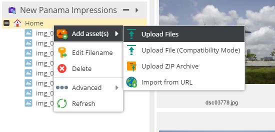

# Custom Views (ExtJS 6 only)
A custom view is an additional custom tree representing a subset of elements of the corresponing original tree.
Custom views can be configured for Documents, Assets and Objects. 

> **Security Note**    
> Perspectives and Custom Views are not intended to be used to restrict access to data

An unlimited number of custom views can be created. Specify the tree type, root node and layout settings. 
Note that the ID is mandatory and must be unique!


For an sample configuration file have a look at the [sample configuration file](https://github.com/pimcore/pimcore/blob/master/website_demo/config/customviews.example.php) 
that ships with Pimcore and its comments. 

## Advanced Features / Configurations

#### Additional object tree including condition filter
The main idea for this configuration is to
* add an additional object tree called `Articles` having its root at `/blog`
* not showing the parent folder as its root
* showing it at the right side in expanded state (there can be only one expanded tree on each side)
* do NOT show all blog articles which have the text "magnis" in their English title.

```php
<?php
// website/config/customviews.php
 
return [
    "views" => [
        [
            "treetype" => "object",
            "name" => "Articles",
            "condition" => NULL,
            "icon" => "/pimcore/static6/img/flat-color-icons/reading.svg",
            "id" => 1,
            "rootfolder" => "/blog",
            "showroot" => FALSE,
            "classes" => "",
            "position" => "right",
            "sort" => "1",
            "expanded" => TRUE,
            "having" => "o_type = \"folder\" || o5.title NOT LIKE '%magnis%'",
            "joins" => [
                array(
                    "type" => "left",
                    "name" => array("o5" => "object_localized_5_en"),
                    "condition" => "objects.o_id = o5.oo_id",
                    "columns" => array("o5" => "title")
                )
            ],
            "where" => ""
        ]
    ]
];
```


#### Additional asset tree hiding items based on a property
* use the `/examples/panama` as the root folder
* do not show the parent node
* position it on the left
* place it on the top and expand it
* hide assets which have the "HIDE" property set to true

```php
[
    "treetype" => "asset",
    "name" => "Panama Impressions",
    "condition" => NULL,
    "icon" => "/pimcore/static6/img/flat-color-icons/camera_identification.svg",
    "id" => 1,
    "rootfolder" => "/examples/panama",
    "showroot" => FALSE,
    "classes" => "",
    "position" => "left",
    "sort" => "-4",                 // the main trees have priorities -1 (objects), -2  (assets) and -3 (documents)
    "expanded" => true,
    "having" => "type = \"folder\" OR hide is NULL or hide != 1",
    "joins" => [
        array(
            "type" => "left",
            "name" => array("meta" => "properties"),
            "condition" => "(meta.cid = assets.id AND meta.ctype = 'asset' AND name = 'HIDE')",
            "columns" => array("hide" => "data")
        )
    ],
    "where" => ""
]
```


#### Document tree filtering using the where clause
The intention is to
* show the `/en/basic-examples subtree` (including the parent node on the right side)
* apply a simple filter which allows us to only show
   * folders 
   * links
   * pages which do not have the character 'g' in their key

```php
[
   "treetype" => "document",
   "name" => "Basic Page Examples",
   "condition" => NULL,
   "icon" => "/pimcore/static6/img/flat-color-icons/reading.svg",
   "id" => 3,
   "rootfolder" => "/en/basic-examples",
   "showroot" => TRUE,
   "classes" => "",
   "position" => "right",
   "sort" => "-12",
   "expanded" => TRUE,
   "having" => "",
   "joins" => "",
   "where" => "(type = 'folder' OR (type = 'page' and `key` NOT LIKE '%g%' OR type = 'link'))"
]
``` 
   
   


## Customizing the Tree Context Menu

> **Since build 3790**  
> Experimental: Subject to change without notice.

Allows you to hide certain context menu items via the customview's treeContextMenu configuration option.

```php
"treetype" => "asset",
"name" => "New Panama Impressions",
"showroot" => 1,
"classes" => "",
...
...
"treeContextMenu" => [
    "asset" => [
        "items" => [
            "add" => [
                "items" => [
                    "importFromServer" => 0
                ]
            ],
            "addFolder" => 0,
            "rename" => 1,      // optional
            "copy" => 0,
            "cut" => 0,
            "delete" => 1,      // optional
            "lock" => 0
        ]
    ]
]
```



There are keys for most of the menu items, including sub menu items. The notion is like indicated in the example configuration.

Let's assume that we want to hide the "copy" option. The short way is this one:

```php
"copy"  => 0 (the default is that all menu entries are visible)    
```

```php
"copy" => [
    "hidden" => true
]
```

