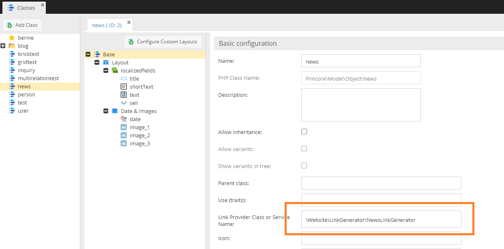
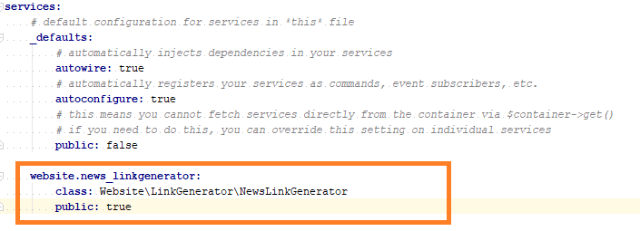
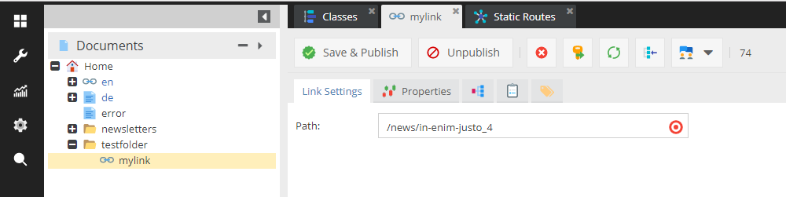

# Link Generator

### Summary

A Link Generator can be used in document link editables, link document types and object link tags to resolve links pointing to Pimcore objects.

Link generators are defined on class level, there are two ways to do this. 

Either simply specify the class name ...



... or the name of a Symfony service (notice the prefix).



### Sample Link Generator Implementation

```php
<?php

namespace Website\LinkGenerator;

use Pimcore\Model\Document;
use Pimcore\Model\Object\ClassDefinition\LinkGeneratorInterface;
use Pimcore\Model\Object\Concrete;
use Pimcore\Model\Staticroute;

class NewsLinkGenerator implements LinkGeneratorInterface {

    public function generate(Concrete $object, array $params = []): string
    {
        $prefix = '/';
        if(isset($params['document']) && $params['document'] instanceof Document) {
            $prefix = $params['document']->getFullPath();
        }

        $staticRoute = Staticroute::getByName('news');
        $path = $staticRoute->assemble([
            'prefix' => $prefix,
            'text' => $object->getTitle(),
            'id' => $object->getId()
        ]);

        return $path;
    }
}

```

The link generator will receive the referenced object and additional data depending on the context.
 This would be the document (if embedded in a document), the object if embedded in an object including the tag or field definition as context.
 
### Example Document

 
 
 ```php
 $d = Document\Link::getById(74);
 echo($d->getHref());
 ```

 would produce the following output
 
 ```
 /testfolder/mylink/In%20enim%20justo_n8
 ```
 
 
### Use in Views

```php
<ul class="foo">
    <?php foreach($this->newsList as $news) { ?>
        <a href="<?= $app->getContainer()->get('website.news_linkgenerator')->generate($news); ?>"><?= $news->getTitle() ?></a>
    <?php } ?>
</ul>
 ``` 
 
 
