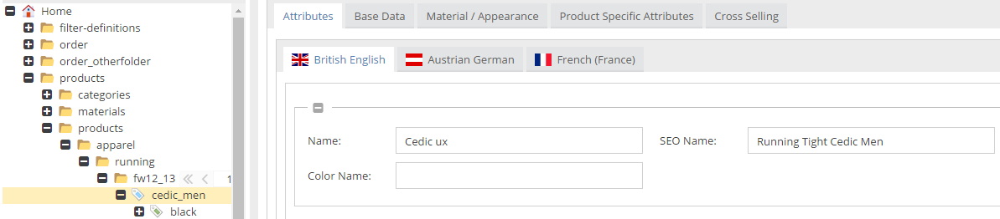
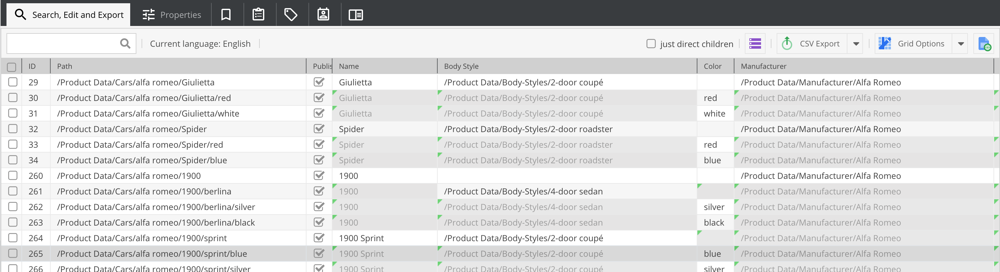

# Data Inheritance and Parent Class
  
Pimcore provides two sorts of inheritance. While data inheritance allows the inheritance of object data along the tree
 hierarchy of objects, the developer can modify the PHP class hierarchy with the parent class setting of object classes. 
   
## Data Inheritance
A very important feature in connection with PIM is data inheritance. Data inheritance means, that objects of the same 
class can inherit data from their parent objects in the object tree.

One use case is the storage of product data. Imagine, you have a group of products which have many attributes in common 
and differ in just a few attributes (for example size, color, ...). So you can create a parent product which stores all 
the common attributes. Then you add child products and specify attributes in which the products differ (size, color, ...). 
All other attributes they inherit from the common parent product.

Data inheritance has to be enabled in the class definition like in the screen below:


If data inheritance is enabled and an attribute of an object is empty, Pimcore tries to get this attribute from a parent 
object. This works only, if the parent object has the same class as the child object. Data inheritance between different 
classes is not supported.

In the Pimcore backend, inherited values are visualized as in the screen below: they are grey and a bit transparent, 
and have a green marker in the upper left corner. With a click on this corner, one can open the source object of this 
specific attribute.

> **Important Note regarding changing the inheritance flag**
> If you toggle the inheritance flag after creating objects, the *object_*_*\_query_* might contain  
> wrong values even after saving the object again. Pimcore will disable the dirty detection
> if the class is newer than the object which should fix this issue.
> However, you can still call AbstractObject::disableDirtyDetection() before saving the object
> if you want to explicitely fix that.

> **Default Values
> Make sure that you understand the impacts of defining a default value which is described
> [here](../01_Data_Types/README.md)






To get the inherited values in the backend via code, you have to use the getter-methods of the attributes. By accessing 
the attributes directly, you will not get the inherited values.

> **Bear in mind**
> The complex data type field collections does not support inheritance.


## Parent Class - Class Inheritance

Pimcore data objects support inheritance, just as any PHP object does. In Pimcore the class from which a specific data 
class inherits can be changed. By default, a data class inherits from `Pimcore\Model\DataObject\Concrete`, but if required 
otherwise, a data class can extend a different parent class. If the parent class should be changed, this needs to be 
specified in the class definition as shown in the screen below:


> **Be Careful**  
> This is a very advanced feature and should only be used by very experienced developers who know what they are doing and 
> what consequences it might have when the parent class is changed from `Pimcore\Model\DataObject\Concrete` to something else. 

In order to maintain all Pimcore functionalities, it has to be ensured that the special class used in the example 
above extends `Pimcore\Model\DataObject\Concrete` and that its methods don't override and clash in unexpected ways 
with existing methods of `Pimcore\Model\DataObject\Concrete` or any magic functions of `Pimcore\Model\DataObject\Concrete`
or its parent classes.

It is also possible to use class inheritance and traits for listing data object model.

### Hooks available when using class inheritance
Currently there's only one hook available. 
For using a hook you need to implement a certain interface in your custom parent class. 

|Interface                 |  Description |
|--------------------------|--------------|
|`PreGetValueHookInterface`| Makes it possible to modify data before returning it to the caller. Hook is called at the beginning of every getter of a field. |

##### Example:
```php
namespace Website\DataObject;

use \Pimcore\Model\DataObject;
  
class Special extends DataObject\Concrete implements DataObject\PreGetValueHookInterface {
 
   public function preGetValue(string $key) {
      if($key == "myCustomProperty") {
         return strtolower($object->myCustomProperty);
      }
   }
}
```


## Overriding Pimcore Models
In addition to parent classes, it is also possible to override Pimcore object classes with custom classes and tell Pimcore 
to use the custom classes instead of the generated object classes. This can be done by using [model overrides](../../../20_Extending_Pimcore/03_Overriding_Models.md).
