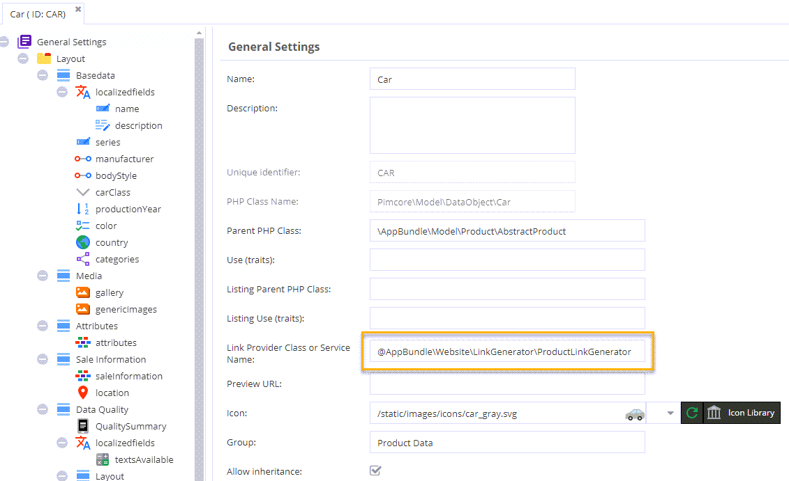
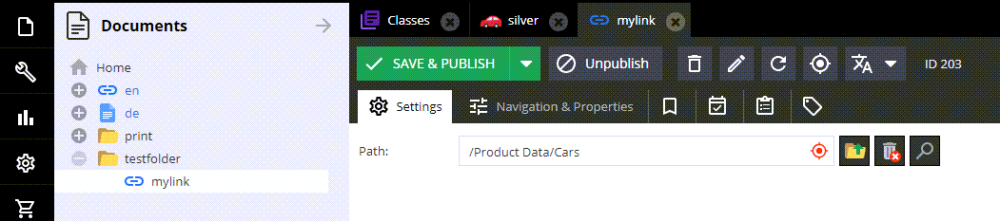

# Link Generator

### Summary
Link Generators are used to dynamically generate web-links for objects and are automatically called when objects 
are linked in document link editables, link document types and object link tags.

Additionally they are also enabling the preview tab for data objects.  

Link generators are defined on class level, there are two ways to do this. 

Either simply specify the class name or the name of a Symfony service (notice the prefix).




```yaml
services:
    # ---------------------------------------------------------
    # Link Generators for DataObjects
    # ---------------------------------------------------------
    AppBundle\Website\LinkGenerator\CategoryLinkGenerator:
        public: true

    AppBundle\Website\LinkGenerator\ProductLinkGenerator:
        public: true

    ...
```

### Sample Link Generator Implementation

```php
<?php

namespace AppBundle\Website\LinkGenerator;

use AppBundle\Model\Product\AccessoryPart;
use AppBundle\Model\Product\Car;
use AppBundle\Website\Tool\ForceInheritance;
use AppBundle\Website\Tool\Text;
use Pimcore\Bundle\EcommerceFrameworkBundle\Model\ProductInterface;
use Pimcore\Model\DataObject\ClassDefinition\LinkGeneratorInterface;
use Pimcore\Model\DataObject\Concrete;

class ProductLinkGenerator extends AbstractProductLinkGenerator implements LinkGeneratorInterface
{
    /**
     * @param Concrete $object
     * @param array $params
     *
     * @return string
     */
    public function generate(Concrete $object, array $params = []): string
    {
        if (!($object instanceof Car || $object instanceof AccessoryPart)) {
            throw new \InvalidArgumentException('Given object is no Car');
        }

        return $this->doGenerate($object, $params);
    }

    /**
     * @param ProductInterface $object
     * @param array $params
     * @return string
     */
    public function generateWithMockup(ProductInterface $object, array $params = []): string {
        return $this->doGenerate($object, $params);
    }

    /**
     * @param ProductInterface $object
     * @param array $params
     * @return string
     */
    protected function doGenerate($object, $params): string
    {
        return ForceInheritance::run(function () use ($object, $params) {
            return $this->pimcoreUrl->__invoke(
                [
                    'productname' => Text::toUrl($object->getOSName() ? $object->getOSName() : 'product'),
                    'product' => $object->getId(),
                    'path' => $this->getNavigationPath($object->getMainCategory(), $params['rootCategory'] ?? null),
                    'page' => null
                ],
                'shop-detail',
                true
            );
        });
    }
}
```

The link generator will receive the referenced object and additional data depending on the context.
This would be the document (if embedded in a document), the object if embedded in an object including the tag or field definition as context.

Example:

```php
public function generate(Concrete $object, array $params = []): string
{
    if(isset($params['document']) && $params['document'] instanceof Document) {
        // param contains context information
        $documentPath = $params['document']->getFullPath();
    }
    ...
}
```
 
### Example Document

 
 
 ```php
$d = Document\Link::getById(203);
echo($d->getHref());
```

would produce the following output
 
 ```
 /en/shop/Products/Cars/Sports-Cars/Jaguar-E-Type~p9
 ```
 
 
### Use in Views

#### path() / url()

<div class="code-section">

```php
<ul class="foo">
    <?php foreach($this->carList as $car) { ?>
        <li><a href="<?= $this->path($car); ?>"><?= $car->getName() ?></a></li>
    <?php } ?>
</ul>
```

```twig
<ul class="foo">
    
        <li><a href="{{ path(car) }}">{{ car.getName() }}</a></li>
    
</ul>
```

</div>

#### pimcoreUrl

<div class="code-section">

```php
<ul class="foo">
    <?php foreach($this->carList as $car) { ?>
        <li><a href="<?= $this->pimcoreUrl(['object' => $car]); ?>"><?= $car->getName() ?></a></li>
    <?php } ?>
</ul>
```

```twig
<ul class="foo">
    
        <li><a href="{{ pimcore_url({object: car}) }}">{{ car.getName() }}</a></li>
    
</ul>
```

</div>
