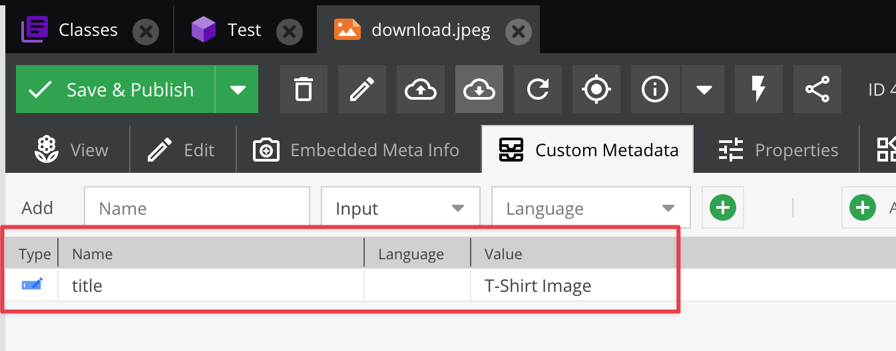
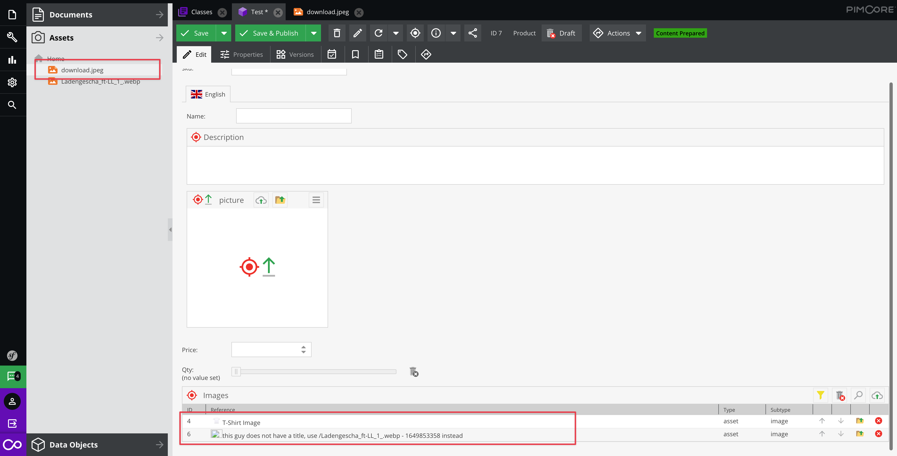
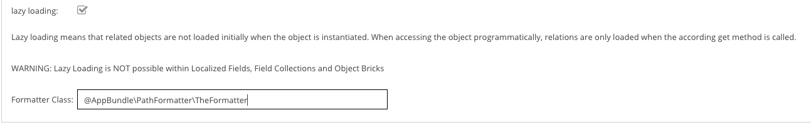

# Path Formatter  

### Summary
* Allows you to show a user friendly "object information' instead of technical path in Pimcore data types such as Many-To-One, Many-To-Many (Object) etc.
* Uses Ajax to request nice path info on demand (i.e. after rendering) 

### Example

In this example, we want to display the asset metadata title of the target asset.





### Configuration via class editor

Dependency Injection is the preferred way of using a Path Formatter:



There is still a BC layer to use class-names instead, but this is deprecated and will be removed with Pimcore 7.0.


### Sample Formatter Class

```php
<?php

namespace AppBundle\PathFormatter;

use Pimcore\Model\Asset;
use Pimcore\Model\Element\ElementInterface;
use Pimcore\Model\DataObject\BlogArticle;
use Pimcore\Model\DataObject\ClassDefinition\Data;
use Pimcore\Model\DataObject\ClassDefinition\PathFormatterInterface;
use Pimcore\Model\DataObject\Concrete;
use Pimcore\Model\DataObject\News;

class TheFormatter implements PathFormatterInterface
{
    /**
     * @param array $result containing the nice path info. Modify it or leave it as it is. Pass it out afterwards!
     * @param ElementInterface $source the source object
     * @param array $targets list of nodes describing the target elements
     * @param array $params optional parameters. may contain additional context information in the future. to be defined.
     * 
     * @return array list of display names.
     */
    public function formatPath(array $result, ElementInterface $source, array $targets, array $params): array
    {
        /** @var  $fd Data */
        $fd = $params["fd"];
        $context = $params["context"];

        foreach ($targets as $key => $item) {
            $newPath = $item["fullpath"] .  " - " . time();
            if ($context["language"]) {
                $newPath .= " " . $context["language"];
            }

            if ($item["type"] == "object") {
                $targetObject = Concrete::getById($item["id"]);
                if ($targetObject instanceof News) {
                    $newPath = $targetObject->getTitle() . " - " . $targetObject->getShortText();
                }  else if ($targetObject instanceof BlogArticle) {
                    $newPath = $targetObject->getTitle();
                }
            } elseif ($item["type"] == "asset") {
                $asset = Asset::getById($item["id"]);
                if ($asset) {
                    $title = $asset->getMetadata("title");


                    if (!$title) {
                        $title = "this guy does not have a title, use " . $newPath . " instead";
                    }
                    if ($fd instanceof Data\ManyToManyRelation) {
                        $newPath = '' . $title;
                    } else {
                        $newPath = $title;
                    }
                }
            }
                
            // don't forget to use the same key, otherwise the matching doesn't work
            $result[$key]= $newPath;
        }
        return $result;
    }
}
```

**Note regarding batch assignment**
The containerType will be `batch` and the object ID will be the folder ID.

