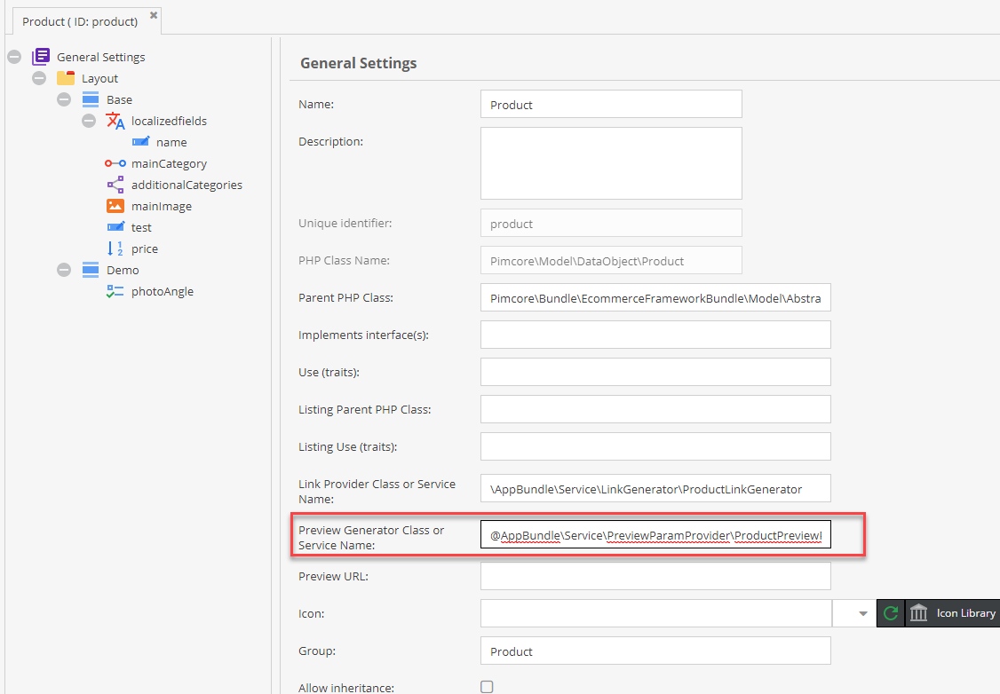

# Preview Generator

### Summary
Preview Generators provide services to get more control over the preview tab. 
They provide a UI component to pass additional parameters to a URL-generator.

Providers need to implement: `\Pimcore\Model\DataObject\ClassDefinition\PreviewGeneratorInterface`

Parameters returned in the `getParams` method will be rendered as a select box. 
Whatever the user chooses will be passed to the `generatePreviewUrl` method.

Provide a Preview Generator within the Class settings:



### Sample PreviewProvider Implementation
```php
namespace AppBundle\Service\PreviewParamProvider;

class ProductPreviewParamProvider implements \Pimcore\Model\DataObject\ClassDefinition\PreviewGeneratorInterface
{
    protected $productLinkGenerator;

    public function __construct(\AppBundle\Service\LinkGenerator\ProductLinkGenerator $productLinkGenerator)
    {
        $this->productLinkGenerator = $productLinkGenerator;
    }

    /**
     * @param \Pimcore\Model\DataObject\Concrete $object
     * @param array $params
     * @return string
     */
    public function generatePreviewUrl(\Pimcore\Model\DataObject\Concrete $object, array $params): string {
        $additionalParams = [];
        foreach($this->getPreviewConfig($object) as $paramStore) {
            $paramName = $paramStore['name'];
            if($paramValue = $params[$paramName]) {
                $additionalParams[$paramName] = $paramValue;
            }
        }

        return $this->productLinkGenerator->generate($object, $additionalParams);
    }

    /**
     * @param \Pimcore\Model\DataObject\Concrete $object
     * 
     * @return array
     */
    public function getPreviewConfig(\Pimcore\Model\DataObject\Concrete $object): array {
        return [
            [
                'name' => '_locale',
                'label' => 'Locale',
                'values' => [
                    'English' => 'en',
                    'German' => 'de'
                ]
            ],
            [
                'name' => 'otherParam',
                'label' => 'Other',
                'values' => [
                    'Label Text' => 'value',
                    'Option #2' => 2,
                    'Custom Option' => 'custom'
                ]
            ]
        ];
    }
}
```

