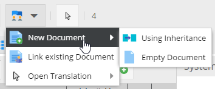

# Localize your Documents

Pimcore allows you to localize every document. You can find the setting in your document in the tab `Properties`. 
There you can choose from language which is configured in the system settings.

The selected language is registered as a property on the document, which is inherited to all of it's children. 

If you have selected a language this will be automatically set on your request object (`$request->getLocale()`) and is 
therefore automatically used for shared translations, localized object lists and all other localized kind of contents. 
 


Since the language is a simple property you can access it like every other property like:
 
 ```php
 // in your controller / action
 $locale = $request->getLocale(); 
 //or 
 $language = $this->document->getProperty("language");
  
 // in your view
 $this->getLocale():
 // or 
 $language = $this->document->getProperty("language");
  
 // any document
 $doc = \Pimcore\Model\Document::getById(234);
 $language = $doc->getProperty("language");
  
 ```
 
Once you have defined the language of your documents you can also use the [translate helper](./04_Shared_Translations) 
in your views, as described [here](./04_Shared_Translations). Pimcore uses the standard Symfony translator, 
so you can even access all the translations provided by your bundles. 


## Best practise for multi language websites
Every document has one single language/locale assigned. As a consequence of that, Pimcores best practise in terms of 
building multi language websites is to build a document subtree per language. 


This has several advantages:
* Localized document keys, URLs and navigation structures
* Clean structure about where to find which content
* Transparent permission management based on the document tree
* etc. 

Pimcore provides two additional features to support editors in translating and managing documents for several languages: 

### Localization Tool

The localization tool for Pimcore documents is a comfort tool which supports creation and management of the same document
 for multiple languages. It can be accessed in the editor button row of every document. 



Following features are supported: 
* **Creating new documents** for another language - either an empty document or and document using content inheritance (see below)
* **Link existing documents** in order to have the language link between documents
* **Open Translation** to quickly navigate to the corresponing document in another language. 


### Content Inheritance
Content inheritance is a Pimcore feature to save duplicate data maintenance within documents. This feature is quite handy
in multi language document structures in order to maintain language independent content only once. 

For details see [Document Inheritance / Content Master Document](../03_Documents/11_Inheritance.md).


## Translating terms on the website
Pimcore comes with a translation module for the website which is explained in [Shared Translations](./04_Shared_Translations.md). 
This is what needs to be done to use translations in templates and display them accordingly on the website (frontend). 
E.g. button names, labels - all the stuff that is predefined by the template and not entered by the editor.
