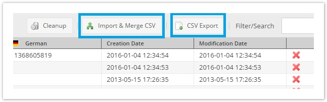
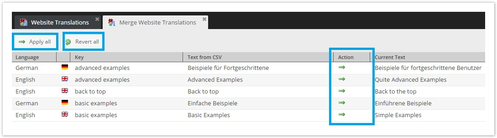

# Shared Translations 

Pimcore provides an easy way for editors to edit commonly used translation terms across the application, which can be found 
here:  `Extras` > `Translation` > `Shared Translations`.
In the background the standard Symfony Translator component is used to add the shared translation functionality to the application. 
The main benefit is that you have only one single translator for all your translations. 

It automatically uses the locale specified on a document or from a fallback mechanism. 

For more information, please also check out [Symfony's Translations Component](http://symfony.com/doc/current/translation.html). 


Available languages are defined within the system languages, see [here](./README.md).

## Translations case sensitivity

In constrast to previous Pimcore versions, starting from Pimcore 5 translations are case sensitive by default. You can
reconfigure Pimcore to handle website and admin translations as case insensitive, however as this implies a performance
hit (translations might be looked up twice) and it does not  conform with Symfony's translators you're encouraged to reference
translation keys with the same casing as they were saved.

You can turn case insensitive handling on by setting the following config setting (see [#2005](https://github.com/pimcore/pimcore/pull/2005)):
  
```yaml
pimcore:
  translations:
      case_insensitive: true
```

## Working with Shared Translations / the Translator in Code
  
#### Example in Templates / Views

```php
<div>
    <?php // there is an helper provided by Pimcore which is compatible with Pimcore 4, but interfaces the Symfony Translator component ?>
    <address>&copy; <?= $this->translate("copyright") ?></address>
    <a href="/imprint"><?= $this->translate("imprint") ?></a>
    <a href="/legal"><?= $this->translate("legal_notice") ?></a>
    
    <?php // you can also use the the Symfony helper, which is a bit longer ?>
    <address>&copy; <?= $this->translator()->trans("copyright") ?></address>
    <a href="/imprint"><?= $this->translator()->trans("imprint") ?></a>
    <a href="/legal"><?= $this->translator()->trans("legal_notice") ?></a>
</div>
```

#### Example in a Controller
 
```php
<?php

namespace AppBundle\Controller;

use Pimcore\Controller\FrontendController;

class ContentController extends FrontendController
{
    public function defaultAction()
    {
        $translation = $this->get("translator")->trans("legal_notice");
    }
}
```


## Pimcore backend functionalities

### Sorting & Filtering on language level


### Translation Export & Import

Translations can be exported to a CSV file and then re-imported later on.



Translations are still imported automatically as long as the translation key does not exist in the target system or the 
translation itself is still empty. Conflicts (i.e. the translation in the target system does not match the version of 
the source) are shown in an overview tab and then can be merged manually.


