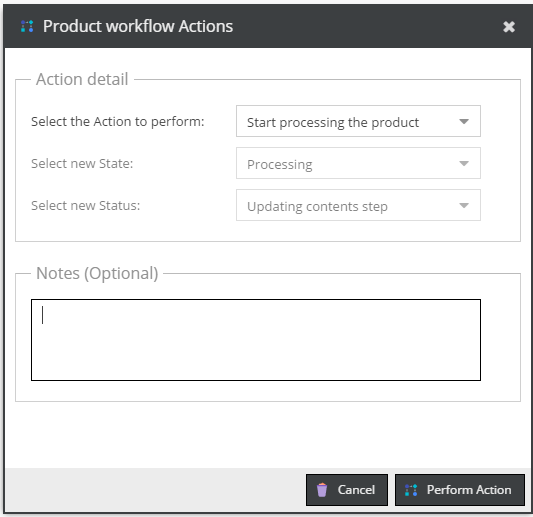
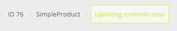
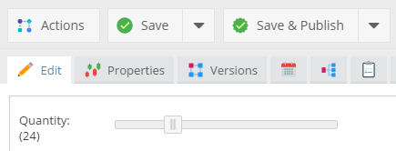
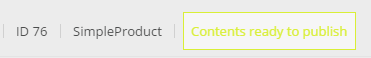
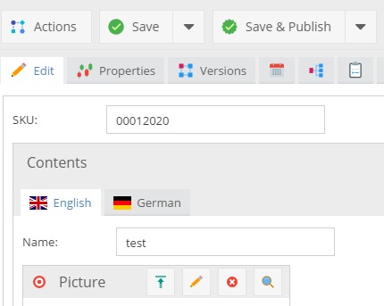
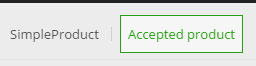

# Simple Workflow Tutorial

Let's make a one truly simple example workflow for product objects. 

## Create a class and custom layouts

I've created the really simple product class (sku, localized name, localized picture and localized description, price and quantity).
The class has ID = 13.


Next, I added four custom layouts which later I will assign to the specific statuses.

* `new_product` layout with ID = 1


* `fill_contents` layout with ID = 2 


* `update_picture` layout with ID = 3


* `validate_qty_price` layout with ID = 4


## The workflow declaration

Now create the base configuration file: `/app/config/pimcore/workflowmanagement.php`

```php
<?php
return [
    1 => [
        "name" => "Product workflow",
        "id" => 1,
        "workflowSubject" => [
          "types" => ["object"],
          "classes" => [13],
        ],
        "enabled" => true,
        "defaultState" => "", //@TODO
        "defaultStatus" => "", //@TODO
        "allowUnpublished" => true,
        "states" => [
          //@TODO
        ],
        "statuses" => [
          //@TODO
        ],
        "actions" => [
          //@TODO
        ],
        "transitionDefinitions" => [
          //@TODO
        ]
    ]
];
```

As you can see, the workflow is called **Product workflow**, we haven't added any statuses, states, actions and definitions. 
The workflow is available only for instances of class with id 13 (the `SimpleProduct` class in that case).

### Specify states

Now it's the best time to define some states for products. 

What I want to achieve? Let's suppose that our new products are integrated with an external system and new positions comes 
to Pimcore as empty objects only with SKU.

I need to have ability to decide which products would be used in Pimcore, the rest of products I want to reject.
To achieve that requirement, I have to make three states.

* Opened - for new products. Opened in my case would mean only *"new product"*
* Processing - for unfinished products
* Done - for published and rejected products. There doesn't exist any required action for that product. 

```php
...

"states" => [
    [
      "name" => "opened",
      "label" => "Unfinished product",
      "color" => "#377ea9"
    ],
    [
      "name" => "processing",
      "label" => "Processing",
      "color" => "#d9ef36"
    ],
    [
      "name" => "done",
      "label" => "Finished product",
      "color" => "#28a013"
    ]
],

...
```

### Specify the first statuses and actions

As an administrator, I can decide which product can be processed and which shouldn't be.

I need three statuses:

* new - for the newest products
* rejected - for products which I'm not going to use in the future. Also I would like to add some note with a reason here.
* update contents - for products I would like to publish


```php
...

"statuses" => [
    [
      "name" => "new",
      "label" => "New product",
      "objectLayout" => 1
    ],
    [
      "name" => "rejected",
      "label" => "Rejected product"
    ],
    [
      "name" => "update_contents",
      "label" => "Updating contents step",
    ]
],

...
```

As you can see I used `objectLayout` key to define which custom layout would be used with the *new* status.


I should also add some actions.

* reject product - to change the status for products I don't want to use
* start processing - to move the product to the processing step

```php
...

"actions" => [
    [
      "name" => "reject",
      "label" => "Reject the product",
      "transitionTo" => [
          "done" => [
              "rejected"
          ]
      ],
      "notes" => [
          "required" => false
      ]
    ],
    [
      "name" => "process",
      "label" => "Start processing the product",
      "transitionTo" => [
          "processing" => [
              "update_contents"
          ]
      ]
    ]
],

...
```

Example above shows that every action has related only one state and status, you can of course in the array specify as 
many statuses and states as you need.
 
 
### More statuses actions and definitions

The process state has 4 stages: 

* updating the content (we've already prepared statuses and the action for that)
* updating the picture
* updating the price and stock
* mark contents as a ready - move product back to the administrator


Let's add few new rows in the configuration file

```php

...
"statuses" => [
...
    [
      "name" => "update_picture",
      "label" => "Update the product picture",
      "objectLayout" => 3
    ],
    [
      "name" => "validate_stock_and_price",
      "label" => "Check the quantity and the price",
      "objectLayout" => 4
    ],
    [
      "name" => "contents_preapared",
      "label" => "Contents ready to publish"
    ]
],
...

"actions" => [
...

    [
      "name" => "contents_updated",
      "label" => "Contents up-to-date",
      "transitionTo" => [
          "processing" => [
              "update_picture"
          ]
      ]
    ],
    [
      "name" => "picture_updated",
      "label" => "Picture up-to-date",
      "transitionTo" => [
          "processing" => [
              "validate_stock_and_price"
          ]
      ]
    ],
    [
      "name" => "contents_ready",
      "label" => "Contents are ready to publish",
      "transitionTo" => [
          "processing" => ["contents_preapared"]
      ],
      "notes" => [
          "required" => false
      ]
    ]
],

...

```

### Last actions: publish or rollback

At the final stage of the workflow I would like to have three choices

* Publish the product (with additional field called *"timeWorked"*)
* Start workflow from the beginning
* Reject the product (with note)

We've already made the reject and start processing action, the last one we need is publishing (the new status and action).

Let's add the new status which requires publishing privileges from the user.

```php
[
    "name" => "accepted",
    "label" => "Accepted product",
    "elementPublished" => true
]
```

And, the action with the *"timeWorked"* field.

```php
[
    "name" => "publish",
    "label" => "Publish the product",
    "transitionTo" => [
          "done" => [
             "accepted"
          ]
    ],
    "additionalFields" => [
        [
            "name"=> "timeWorked",
            "fieldType"=> "input",
            "title"=> "Time spent",
            "blankText"=> "30m",
            "required"=> true,
            "setterFn"=> null
        ]
    ]
]
```

### Transition definitions

The last thing you have to do before start using the workflow - transition definitions.
These definitions specify which actions are available at a specific stage.

```php
...
"transitionDefinitions" => [
  "new" => [ //this is the starting status, at the moment we can only set the product as rejected or move it to the processing stage
      "validActions" => [
          "reject" => null,
          "process" => null
      ]
  ],
  "rejected" => [ //we can only mark rejected project as a new
      "validActions" => [
          "new" => null
      ]
  ],
  "update_contents" => [ // the product with update_contents status is able to use the contents_updated action
      "validActions" => [
          "contents_updated" => null
      ]
  ],
  "update_picture" => [ // the product with update_picture status is able to use the picture_updated action
      "validActions" => [
          "picture_updated" => null
      ]
  ],
  "validate_stock_and_price" => [ //here we can mark cthe product as a ready to the final validation
      "validActions" => [
          "contents_ready" => null
      ]
  ],
  "contents_preapared" => [ // accept, reject or rollback
      "validActions" => [
          "process" => null,
          "reject" => null,
          "publish" => null
      ]
  ],
  "accepted" => [
      "validActions" => [
          "reject" => null
      ]
  ]
]
...
```

Let's define the default status and state.

```php
...
"defaultState" => "opened",
"defaultStatus" => "new",
...
```

### Workflow in action

Below, you can find showcase of the workflow I've just prepared.

| Status                                                                      | Layout                                                                      | Action                                                                       |
|-----------------------------------------------------------------------------|-----------------------------------------------------------------------------|------------------------------------------------------------------------------|
|        |        |        |
|    |    |    |
|     |     |     |
|       |       |       |
|             |             |            |
|             |             |            |
|         |             |         |

### Check the history

In the *"Notes & Events"* tab, there is a list with every action used on the object via the Workflow module.


