# Simple Workflow Tutorial

Let's make a one truly simple example workflow for product objects. 

## Create a class and custom layouts

I've created the really simple product class (sku, localized name, localized picture and localized description, price and quantity).

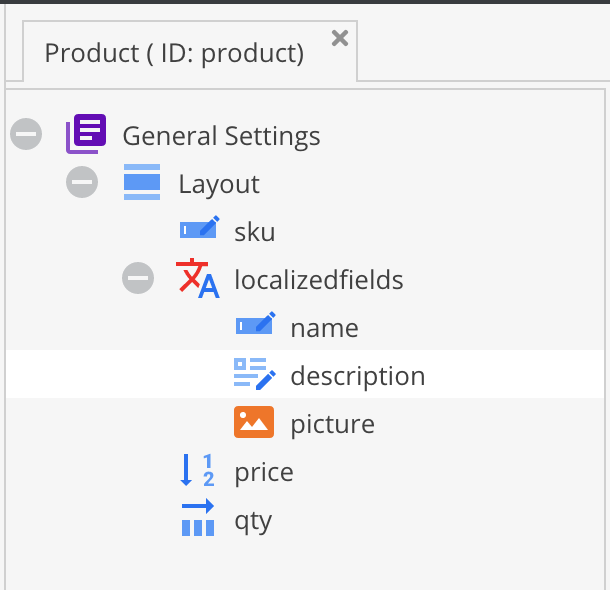

Next, I added four custom layouts which later I will assign to the specific statuses.

* `new_product` layout with ID = 3

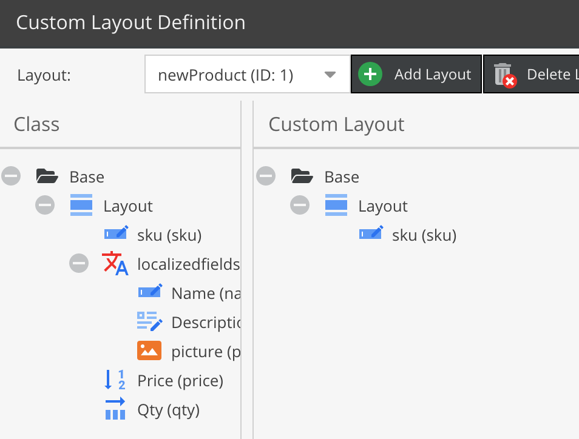

* `fill_contents` layout with ID = 4 

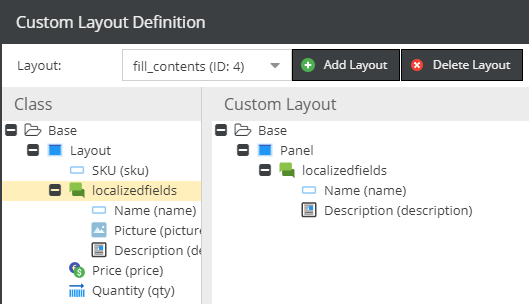

* `update_picture` layout with ID = 5

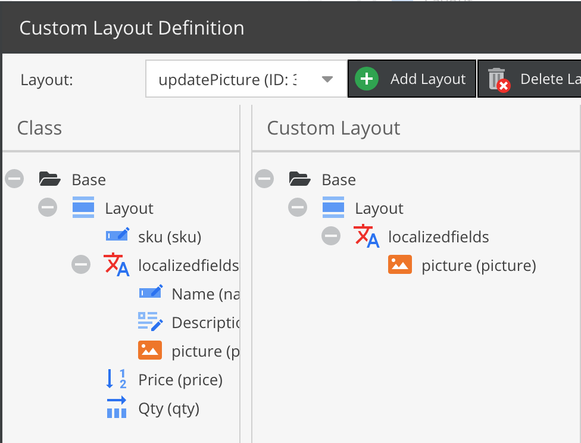

* `validate_qty_price` layout with ID = 6

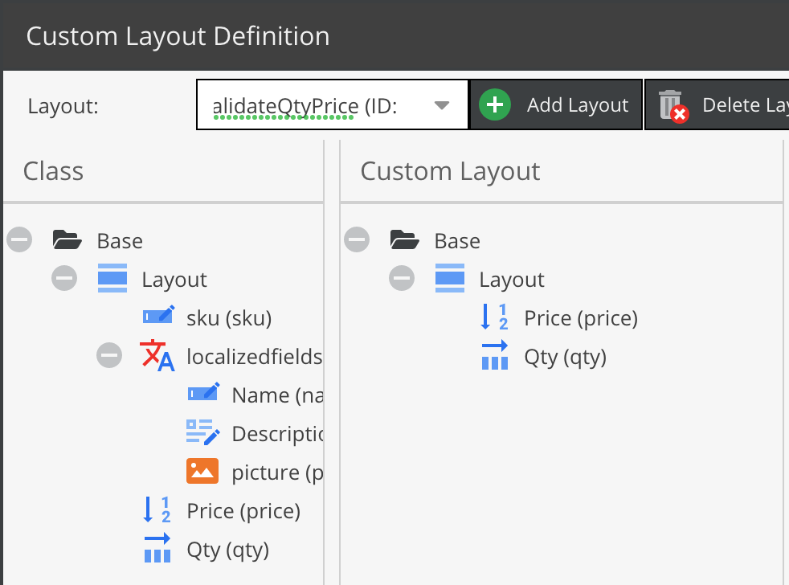


## The workflow declaration

Now create the base configuration in `/app/config/config.yml`

```yml
pimcore:
    workflows:
        workflow:
            label: 'Product Workflow'
            type: 'state_machine'
            supports:
            - 'Pimcore\Model\DataObject\SimpleProduct'
            places:
                #TODO
            transitions:
                #TODO
```

As you can see, the workflow is called **Product workflow**, we haven't added any places and transitions yet. 
The workflow is available only for instances of `Pimcore\Model\DataObject\SimpleProduct` objects. We use the workflow 
type `state_machine`, so one transition can start from multiple places.  

### Specify places

Now it's the best time to define some places for products. 

What I want to achieve? Let's suppose that our new products are integrated with an external system and new positions comes 
to Pimcore as empty objects only with SKU.

I need to have ability to decide which products would be used in Pimcore, the rest of products I want to reject.
To achieve that requirement, I have to make (at least) three places.

* new - for the newest products
* rejected - for products which I'm not going to use in the future. Also I would like to add some note with a reason here.
* update content - for products I would like to publish 

```yml
(...)
    places:
        new:
            label: 'New product'
            color: '#377ea9'
            permissions:
                - objectLayout: 3
        rejected:
            label: 'Rejected product'
            color: '#28a013'
        update_content:
            label: 'Update Content'
            title: 'Updating content step'
            color: '#d9ef36'
            permissions:
                - objectLayout: 4            

(...)
```

As you can see I used `objectLayout` key to define which custom layout would be used with the *new* status.


### Specify the first transitions

As an administrator, I can decide which product can be processed and which shouldn't be.

To do so, I need to add some actions.

* reject product - to change the status for products I don't want to use
* start processing - to move the product to the processing step

```yml
(...)
    transitions:
        reject_product:
            from: new
            to: rejected
            options:
                label: 'Reject the product'
                notes:
                    commentEnabled: true
                    commentRequired: true
        start_processing:
            from: new
            to: update_content
            options:
                label: 'Start processing the product'
(...)
```

 
### More statuses actions and definitions

Let's add 4 more places for updating content

* updating the content
* updating the picture
* updating the price and stock
* mark content as a ready - move product back to the administrator


Let's add few new rows in the configuration file

```yml

(...)
    places:
        (...)
        update_picture:
            label: 'Update Product Picture'
            title: 'Update the product picture'
            color: '#d9ef36'
            permissions:
                - objectLayout: 5            
        validate_stock_and_price:
            label: 'Validate Stock + Price'
            title: 'Check the quantity and the price'
            color: '#d9ef36'
            permissions:
                - objectLayout: 6            
        content_prepared:
            label: 'Content Prepared'
            title: 'Content ready to publish'
            color: '#28a013'
(...)

    transitions:
        (...)
        content_updated:
            from: update_content
            to: update_picture
            options:
                label: 'Content up-to-date'
                notes:
                    commentEnabled: true
                    commentRequired: false
        picture_updated:
            from: update_picture
            to: validate_stock_and_price
            options:
                label: 'Picture up-to-date'
                notes:
                    commentEnabled: true
                    commentRequired: false
        content_ready:
            from: validate_stock_and_price
            to: content_prepared
            options:
                label: 'Content is ready to publish'
(...)

```

### Last actions: publish or rollback

At the final stage of the workflow I would like to have three choices

* Publish the product (with additional field called *"timeWorked"*)
* Start workflow from the beginning
* Reject the product (with note)

We've already made the reject and start processing transition, the only thing here is to add an additional from place. 
This can be done because we have workflow type `state_machine` activated, here our modified transition definitions.

```yml

(...)
    transitions:
        reject_product:
            from: [new, content_prepared]
            to: rejected
            options:
                label: 'Reject the product'
                notes:
                    commentEnabled: true
                    commentRequired: true
        start_processing:
            from: [new, content_prepared]
            to: update_content
            options:
                label: 'Start processing the product'
                notes:
                    commentEnabled: true
                    commentRequired: false
(...)
```
 
The last one we need is publishing - place and transition - that is only allowed to a certain role.

```yml
(...)
    places:
        (...)
        accepted:
            label: 'Accepted product'
            color: '#28a013'
(...)            
```

And, the transition with a *"timeWorked"* field.

```yml
(...)
    transitions:
        (...)
        publish:
            from: content_prepared
            to: accepted
            guard: "is_fully_authenticated() and has_role('ROLE_PIMCORE_SUPERUSER')"
            options:
                label: 'Publish the product'
                notes:
                    additionalFields:
                        - name: 'timeWorked'
                          fieldType: 'input'
                          title: 'Time Spent'
                          required: true
(...)                          
```


### Workflow in action

Below, you can find showcase of the workflow I've just prepared.

| Status                                                  | Screenshot  |
| ------------------------------------------------------- | ----------- |
| Initial status when new object comes into the system    | 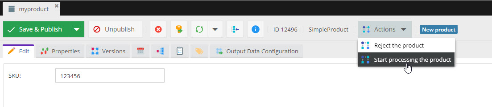 |
| Update Content                                          | 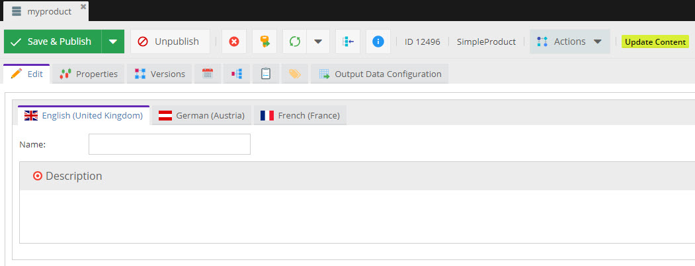|
| Update Picture                                          | 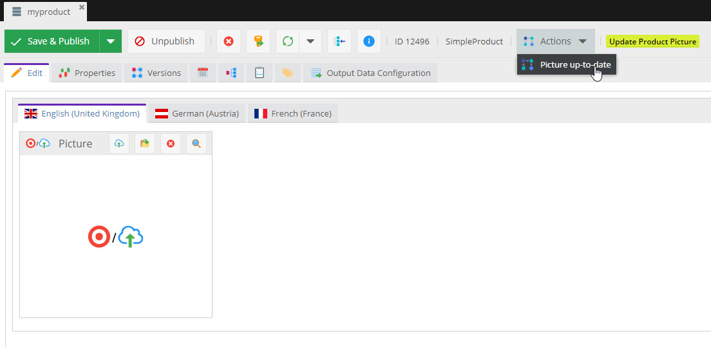|
| Validate Price and Stock                                | 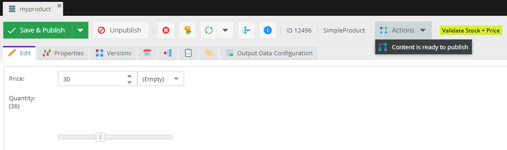|
| Content is ready                                        | 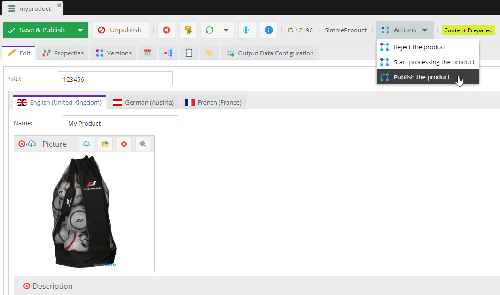|
| Publish the Product                                     | 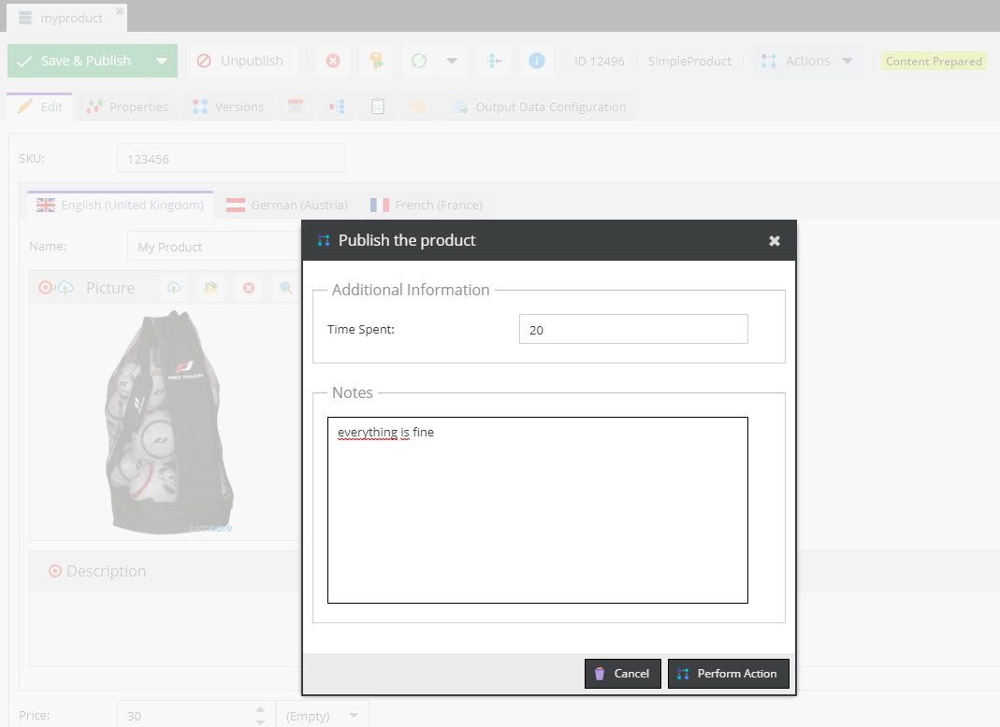 |


### Check the history

In the *"Notes & Events"* tab, there is a list with every action used on the object via the Workflow module.

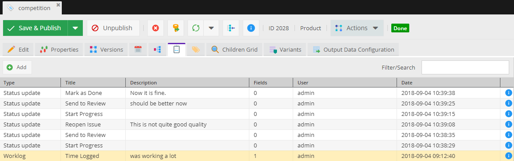
