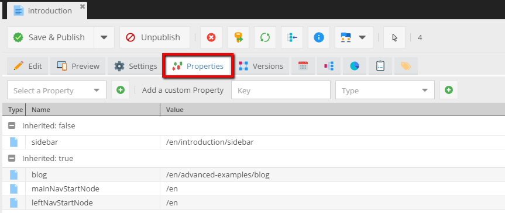
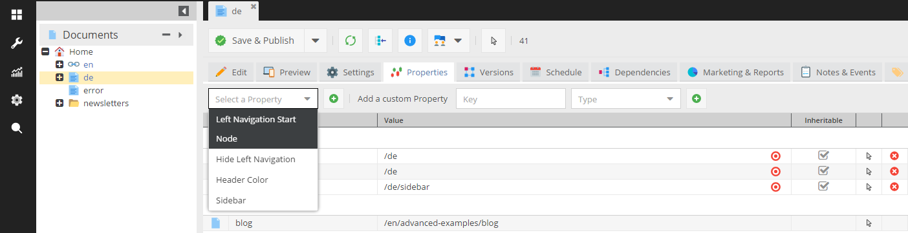
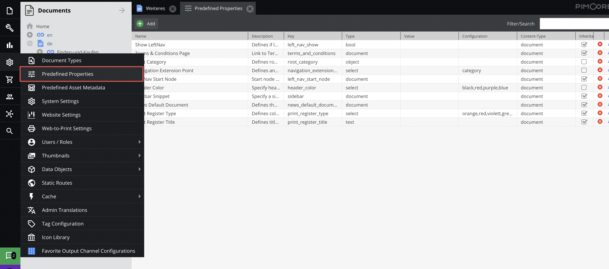

# Properties

## General

An every element can have custom properties. 
You can find these in the **Properties** tab for each type of elements (documents, assets, objects).



The properties could be used to specify some special bahavior when the document is rendered.

Have a look at, few cases below:

* Hide the main navigation
* Show the sidebar
* Use an additional stylesheet

## Get property in the template

Following example shows how you can get property value from the template:

```php
//retrieve the value of a property named "hideNavigation"
$hideNavigation = $this->document->getProperty('hideNavigation');
 
//retrieve an array with all properties for this document
$propertiesList = $this->document->getProperties();
```

## Predefined properties
With predefined properties you can help/show the editors working within your pimcore installation which properties are available for their use.
You can also define default values for each defined property to improve the productivity of your editors.

**Predefined** does not mean that the value of the predefined property is available for every document. 
To add global properties which are available everywhere use Website Settings instead.



## Configuration example

<div class="inline-imgs">

The Predefined properties configuration you can find in the  **Settings -> Predefined properties** menu.

</div>



Fields available in the properties configuration.

| Name          | Is required? | Description                                                                                                                                                                                                      |
|---------------|--------------|------------------------------------------------------------------------------------------------------------------------------------------------------------------------------------------------------------------|
| Name          | Y            | The friendly name shown in the selection.                                                                                                                                                                        |
| Description   | N            | The description would help understand a specific property meaning.                                                                                                                                               |
| Key           | Y            | This field is the key which you use in your code to retrieve the contents of the property. For example: `$document->getProperty("key");`                                                                         |
| Type          | Y            | Specifies the type of the content which is allowed in the property. <br />Available types are: text, document, asset, object, bool (checkbox), select.                                                           |
| Value         | N            | Here you can define a default value for this property which I added automatically to the property when it is added to a element. This field is optional. <br /> See the example configuration above for details. |
| Configuration | N            | This field is used to configure a property. At the moment, this is used only by the property-type *select*.                                                                                                     |
| Content-Type  | Y            | Defines for which element-type (document, asset or object) the property should be available.                                                                                                                     |

> **Note**   
> Each defined field can be overwritten in the element after it was added.
