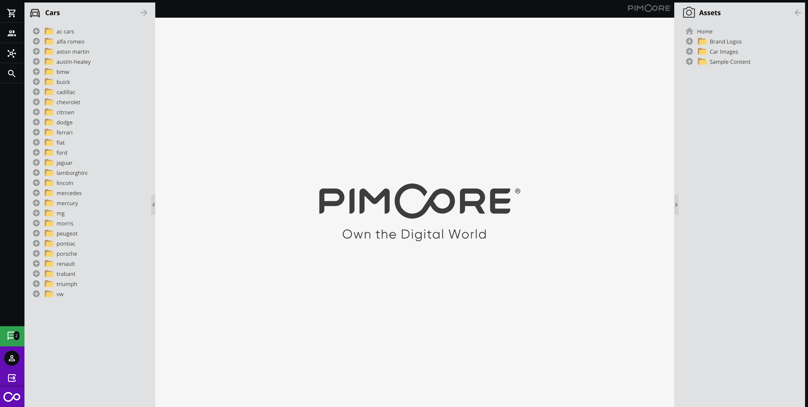

# Perspectives 

## General

Perspectives allow to create different views in the backend UI and even customize the standard perspective.
This feature could be combined with the configuration options already available for the [Custom Views](../05_Objects/01_Object_Classes/05_Class_Settings/11_Custom_Views.md).

> **Security Note**    
> Perspectives and Custom Views are not intended to be used to restrict access to data

Please be aware that if combined with custom views, the custom view settings must be defined in the `customviews.php`. 
The link is accomplished via the ID.

You can define:

* which trees you want to see
* where it is positioned (left/right)
* the order and which one should be expanded by default
* the available tree context menu items 
* the navigation menu items
* the standard elements on the welcome screen
* which portlets can be added to a dashboard


You can define an arbitrary number of perspectives and switch between them via the File menu.


You can restrict the access to certain perspectives via the user settings.


## The Configuration File

Please refer to the [Example File](https://github.com/pimcore/pimcore/blob/master/website_demo/config/perspectives.example.php) 
for further details on how this can be set up.

You can find out there how the default view is prepared and how to add a special perspective.

The table below, describes the most useful of available options in the configuration file.

| Reference                                                      | Value                                        | Description                                                                                 |
|----------------------------------------------------------------|----------------------------------------------|---------------------------------------------------------------------------------------------|
| `[perspectiveName]["icon"]`                                    | string                                       | Path to the icon file.                                                                      |
| `[parspectiveName]["iconCls"]`                                 | string                                       | The CSS class added to the icon.                                                            |
| `[perspectiveName]["elementTree"]`                             | array                                        | Array which contain the rows with configuration information like the tree type .            |
| `[perspectiveName]["elementTree"][i]["type"]`                  | string (documents,objects,assets,customview) | What type of elements will be rendered in the tree.                                         |
| `[perspectiveName]["elementTree"][i]["position"]`              | string (left,right)                          | a place, where the tree is initially generated                                              |
| `[perspectiveName]["elementTree"][i]["id"]`                    | integer                                      | The id of customview elements rendered in the tree. (works only with the *customview* type) |
| `[perspectiveName]["toolbar"]`                                 | array                                        | that option allows to add changes in the toolbar menu.                                      |
| `[perspectiveName]["toolbar"][i][menuName]["hidden"]`          | boolean                                      | ability to hide a specified menu (the available list you can find in the example below)     |
| `[perspectiveName]["toolbar"][i][menuName]["hidden"]["items"]` | array                                        | You could specify there, which submenus elements you would like to generate.                |


## Simple example

In the [Example File](https://github.com/pimcore/pimcore/blob/master/website_demo/config/perspectives.example.php) you 
can find advance usage. Below, I showed how to create the simple structure which would be use for catalog administrators.

We need only to see
* products (objects from a specific directory)
* assets
* search button

To specify the range of objects you're going to use you, you have to firstly add a customview.
See the [Custom views](../05_Objects/01_Object_Classes/05_Class_Settings/11_Custom_Views.md) section to get more details.

The custom view definition would look like that:

```php
[
    "treetype" => "object",
    "name" => "products",
    "rootfolder" => "/products-workflow",
    "id" => 1,
    "showroot" => false
]
```

Let's update the `website/config/perspectives.php` by the new perspective.

```php
"catalog_management" => [
    "toolbar" => [
        "file" => [
            "hidden" => true
        ],
        "settings" => [
            "hidden" => true
        ],
        "marketing" => [
            "hidden" => true
        ],
        "extras" => [
            "hidden" => true
        ],
        "search" => [
            "items" => [
                "documents" => false
            ]
        ]
    ],
    "elementTree" => [
        [
            "type" => "assets",
            "position" => "right",
            "expanded" => false,
            "hidden" => false,
        ],
        [
            "type" => "customview",
            "position" => "left",
            "expanded" => false,
            "hidden" => false,
            "id" => 1
        ]
    ]
]
```

I changed the number of elements rendered in the main Pimcore menu.

Also I added two trees. The first (on the right side) for assets and the second on the left side for the 
custom view with product objects.
 
The view after switch looks like in the picture.




