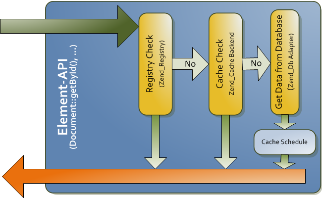

# Cache

Pimcore uses extensively caches for differently types of data. The primary cache is a pure object 
cache where every element (document, asset, object) in Pimcore is cached as it is (serialized objects). 
Every cache item is tagged with dependencies so the system is able to evict dependent objects if 
a referenced object changes.

The second cache is the output cache, which you can use either as pure page cache (configurable 
in system settings), or as in-template cache (see more at [view helpers](../../02_MVC/02_Template/02_Templating_Helpers/README.md)).

The third cache is used for add-ons like the glossary, translations, database schemes, and so on. 
The behavior of the caches is controlled by the add-on itself.

All of the described caches are utilizing the `Pimcore\Cache` interface to store their objects. 
`Pimcore\Cache` just wraps a `Zend_Cache` instance.

## Element Cache Workflow (Asset, Document, Object)




## Using the Cache for your Application

The Pimcore cache is a wrapper of the `Zend_Cache`, all functionalities are wrapped in this class
`Pimcore\Cache`.

You can use this functionality for your own application, and also to control the behavior of the 
Pimcore cache (but be careful!).
 
#### Example of custom usage in an action
```php 
$lifetime = 99999;
$uri = "http://www.pimcore.org/...";
$cacheKey = md5($uri);
if(!$data = \Pimcore\Cache::load($cacheKey)) {
 
    $httpClient = \Pimcore\Tool::getHttpClient();
    $httpClient->setUri($uri);
 
    try {
        $response = $httpClient->request();
 
        if($response->isSuccessful()) {
            $data = $response->getBody();
            \Pimcore\Cache::save(
                $data,
                $cacheKey,
                ["output","tag1","tag2"],
                $lifetime);
        }
    } catch (Exception $e) {
        die("Something went wrong, ... sorry");
    }
}
```

#### Overview of functionalities
```php 
// disable the cache globally
\Pimcore\Cache::disable();
 
// enable the cache globally
\Pimcore\Cache::enable();
 
// invalidate caches using a tag
\Pimcore\Cache::clearTag("mytag");
 
// invalidate caches using tags
\Pimcore\Cache::clearTags(["mytag","output"]);
 
// clear the whole cache
\Pimcore\Cache::clearAll();
 
// disable the queue and limit and write immediately
\Pimcore\Cache::setForceImmendiateWrite(true);
```

#### Disable the Cache for a Single Request
Sometimes it's useful to deactivate the cache for testing purposes for a single request. You 
can do this by passing the URL parameter `nocache=true`. Note: This is only possible if you have 
enabled the `DEBUG MODE` in *Settings* > *System*

For example: `http://www.pimcore.org/download?nocache=true` 

This will disable the entire cache, not only the output-cache. To disable only the output-cache 
you can add this URL parameter: `?pimcore_outputfilters_disabled=true`
Here you can find more [magic parameters](../15_Magic_Parameters.md).


If you want to disable the cache in your code, you can use: 
```php
\Pimcore\Cache::disable();
```

This will disable the entire cache, not only the output-cache. WARNING: Do not use this in production code!

It is also possible to just disable the output-cache in your code, read more [here](./03_Full_Page_Cache.md).


## Further Reading

* Setup a custom caching-backend - see [Custom Cache Backends](./01_Custom_Cache_Backends.md).
* Details about output-cache - see [Output Cache](./03_Full_Page_Cache.md).
