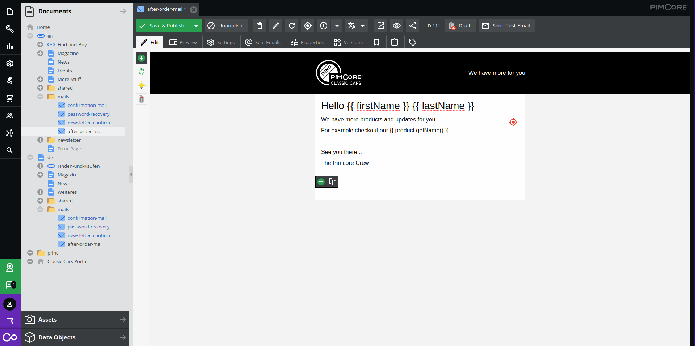

# Email Framework

## General Information
The Pimcore Email Framework provides an easy way to send/create emails with Pimcore.
  
For this you have several components:
* Document\\Email
* [Pimcore\Mail](./01_Pimcore_Mail.md)
* [Placeholder Objects](../23_Placeholders/01_Object_Placeholder.md)

Pimcore provides a `Pimcore\Mail` Class which extends the `Zend_Mail` Class. When you initialize a 
`Pimcore\Mail` object, all data from *Settings* > *System* > *Email Settings* are applied 
automatically.  

When you enable the debug mode in *Settings* > *System* > *Debug*, all emails will be sent to the 
addresses given in *Settings* > *System* > *Email Settings* > *Debug Email Addresses* and the debug 
information (to whom the email would have been sent) is automatically appended.

Pimcore provides a `Document Email` type where you can define the recipients ... (more information 
here) and `Dynamic Placeholders` (more information here). 

To send a email you just create a `Email Document` in the Pimcore Backend UI, define the subject, 
recipients, add Dynamic Placeholders... and pass this document to the `Pimcore\Mail` object. All 
nasty stuff (creating valid URLs, embedding css, compile less files, rendering the document..) is 
automatically handled by the `Pimcore\Mail` object.

## Usage Example
Lets assume that we have created a `Email Document` in the Pimcore Backen UI (`/email/myemaildocument`) 
which looks like this:



To send this document as email we just have to write the following code-snippet in our controller 
action:

```php
//dynamic parameters
$params = array('firstName' => 'Pim',
                'lastName' => 'Core',
                'product' => 73613);
 
//sending the email
$mail = new \Pimcore\Mail();
$mail->addTo('example@pimcore.org');
$mail->setDocument('/email/myemaildocument');
$mail->setParams($params);
$mail->send();
```


#### Sending a Plain Text Email:
```php
$mail = new \Pimcore\Mail();
$mail->addTo('example@pimcore.org');
$mail->setBodyText("This is just plain text");
$mail->send();
```

#### Sending a Rich Text (HTML) Email: 
```php
$mail = new \Pimcore\Mail();
$mail->addTo('example@pimcore.org');
$mail->addBcc("bcc@pimcore.org");
$mail->setBodyHtml("<b>some</b> rich text");
$mail->send();
```
