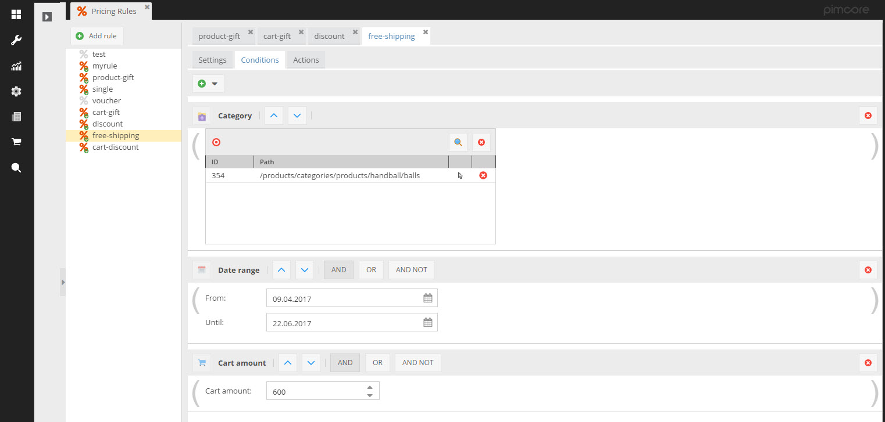

## Pricing Rules
Pricing Rules are supported by the E-Commerce Framework out of the box. The pricing rules themselves can be configured 
in the Pimcore Backend UI by putting conditions and actions together. 



Once active, all rules are checked and applied automatically by the system - including reducing product prices, adding 
price modificators to reduce cart totals, removing shipping costs and adding gift items to the cart. 

To print the applied rules in the frontend, the developer needs to add some lines of code. Depending on the location, 
following scripts can be used. 


#### Product Detail Page
```php
<?php $priceInfo = $this->product->getOSPriceInfo(); ?>
<?php if($priceInfo->getRules()) { ?>
	<div class="discounts">
		<p><strong><?= $this->translate("shop.detail.your_benefit") ?></strong></p>
		<ul>
			<?php foreach($priceInfo->getRules() as $rule ) { ?>
				<?php foreach($rule->getActions() as $action) { ?>
					<?php if($action instanceof \Pimcore\Bundle\EcommerceFrameworkBundle\PricingManager\Action\ProductDiscount) { ?>
						<?php if($action->getAmount() > 0) { ?>
							<li><?= $rule->getLabel() ?> <?= $this->translate("shop.detail.your_benefit.discount.amount", new Zend_Currency(array("value" => $action->getAmount()))) ?></li>
						<?php } else if($action->getPercent() > 0) { ?>
							<li><?= $rule->getLabel() ?> <?= $this->translate("shop.detail.your_benefit.discount.percent", $action->getPercent()) ?></li>
						<?php } ?>
					<?php } else if($action instanceof \Pimcore\Bundle\EcommerceFrameworkBundle\PricingManager\Action\IGift) { ?>
							<li>
								<?= $this->translate("shop.detail.your_benefit.discount.gift", '<a href="' . $action->getProduct()->getShopDetailLink($this, true) . '"> ' . $action->getProduct()->getName() . '</a>') ?>
							</li>
					<?php } else if($action instanceof \Pimcore\Bundle\EcommerceFrameworkBundle\PricingManager\Action\FreeShipping) { ?>
						<li>
							<?= $this->translate("shop.detail.your_benefit.discount.freeshipping") ?>
						</li>
					<?php } ?>
				<?php } ?>

			<?php } ?>
		</ul>
	</div>
<?php } ?>
```


#### Cart Product List - Printing Gift Items
```php
<?php foreach($cart->getGiftItems() as $item) { $linkDetail = $item->getProduct()->getShopDetailLink($this); ?>
	<tr>
		<td class="cart-list-items-image">
			<a href="<?= $linkDetail ?>" >
				getProduct()->getFirstImage(array('width' => 120, 'height' => 120, 'aspectratio' => true)) ?> " alt="" border="0" />
			</a>
		</td>
		<td class="cart-list-items-name" valign="top">
			<a href="<?= $linkDetail ?>" ><?= $item->getProduct()->getOSName() ?></a>
		</td>
		<td class="cart-list-items-quantity">
			<?= $item->getCount() ?>
		</td>
	</tr>
<?php } ?>
```

> All other price modifications on cart level are included as cart price modificators. 
> See [Cart manager](../11_Cart_Manager.md) for more details and how to print them. 
