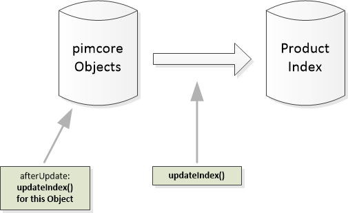

# Data Architecture and Indexing Process
Depending on the *Product Index* implementation, there are two different *Product Index* data architectures and ways for 
indexing. 

For indexing itself the helper class `\Pimcore\Bundle\EcommerceFrameworkBundle\IndexService\Tool\IndexUpdater` 
or the provided Pimcore console commands can be used. 


## Simple Mysql Architecture
- In the simple architecture, Pimcore object data is transferred directly to the Product Index. 
- After every update of a Pimcore object, the changes are directly written into the Product Index. 
- Only used for `\Pimcore\Bundle\EcommerceFrameworkBundle\IndexService\Config\DefaultMysql`

> Updates of dependent objects (like child objects, variants, related objects) are not transferred into the index 
> automatically. 




### Console Commands for Simple Mysql Architecture

- For manually updating the whole index use following command: 
```bash
php bin/console ecommerce:indexservice:bootstrap --update-index
```

- If you need to create or update the index structures you can use:
```bash
php bin/console ecommerce:indexservice:bootstrap --create-or-update-index-structure
```

- For further details (e.g. only updating certain product types, apply list conditions) see `--help` section of the 
`ecommerce:indexservice:bootstrap` command. 


## Optimized Architecture
- In the optimized architecture, object data is transferred **not** directly to the *Product Index*. 
- In this case a so called store table is between the Pimcore objects and the *Product Index*. This store table enables to ...
   - ... update the *Product Index* only if index relevant data has changed. Therefore the load on the index itself is reduced 
         and unnecessary write operations are prevented. 
   - ... update the *Product Index* asynchronously and therefore update also dependent elements (childs, variants, ...) 
         of an updated Pimcore object without impact on save performance. 
   - ... rebuilding the whole *Product Index* out of the store table much faster since no direct interaction with 
         Pimcore objects is needed. 

- After every update of a Pimcore object, the changes are written into the store table and all child objects of the 
updated object are added to the so called preparation queue (see later). As a consequence a regular full update 
should not be necessary any more.
- Used for optimized mysql, elastic search, ...


### Console Commands for Optimized Architecture

For updating data in index following commands are available. See `--help` details. 
- For process the preparation queue and update Pimcore objects to the index store table, use following command. 
This command should be executed periodically (e.g. all 10 minutes)

```bash
php bin/console ecommerce:indexservice:process-queue preparation
```

- To update the Product Index based on changes stored in the store table use the following command. 
This command should be executed periodically (e.g. all 10 minutes)

```bash
php bin/console ecommerce:indexservice:process-queue update-index
```

- For manually update all Pimcore objects to the index store use following command.  As stated before, this should only be
  necessary for an initial fill-up of the index. After that, at least Product Index Store and Pimcore objects should always 
  be in sync. It is important to execute `ecommerce:indexservice:process-queue preparation` and 
  `ecommerce:indexservice:process-queue update-index` periodically though.
```bash
php bin/console ecommerce:indexservice:bootstrap --update-index
```

- Invalidate either the preparation queue or the index-update queue. This is usually **only needed during development** when 
  the store table is out of sync. Reset the preparation queue for instance when your model (instance of `AbstractProduct`) 
  returns updated data for a field.
```bash
php bin/console ecommerce:reset-queue preparation
php bin/console ecommerce:reset-queue update-index
```

- If you need to create or update the index structures you can use:
```bash
php bin/console ecommerce:indexservice:bootstrap --create-or-update-index-structure
```


### Special Aspects for Elastic Search
It is possible that Elastic Search cannot update the mapping, e.g. if data types of attributes change. For this case, 
a reindex is necessary. If it is necessary, the E-Commerce Framework automatically switches into a reindex mode. When 
in reindex mode, all queries go to the current index but in parallel a new index is created based on the data in the 
store table. The current index is read only and all data changes that take place go directly into the new index. As a 
result, during reindex the results delivered by Product Lists can contain old data. 
 
As soon the reindex is finished, the current index is switched to the newly created index and the old index is deleted.  

### Special Aspects for Findologic Exporter
Basically findologic worker works as described in the optimized architecture. But there is an additional speciality 
with the export: 

Executing `php bin/console ecommerce:indexservice:process-queue update-index` does not write the data directly to 
Findologic, but into an extra table 
`\Pimcore\Bundle\EcommerceFrameworkBundle\IndexService\Worker\DefaultFindologic::EXPORT_TABLE_NAME` 
(default is `ecommerceframework_productindex_export_findologic`). 

Findologic then can use the endpoint `/ecommerceframework/findologic-export`, which delivers all data directly based on 
the export table. Valid parameters for this endpoint are:
- `start`: Pagination start.
- `count`: Count of delivered entries.
- `shopKey`: Shop key to identify the shop. 
