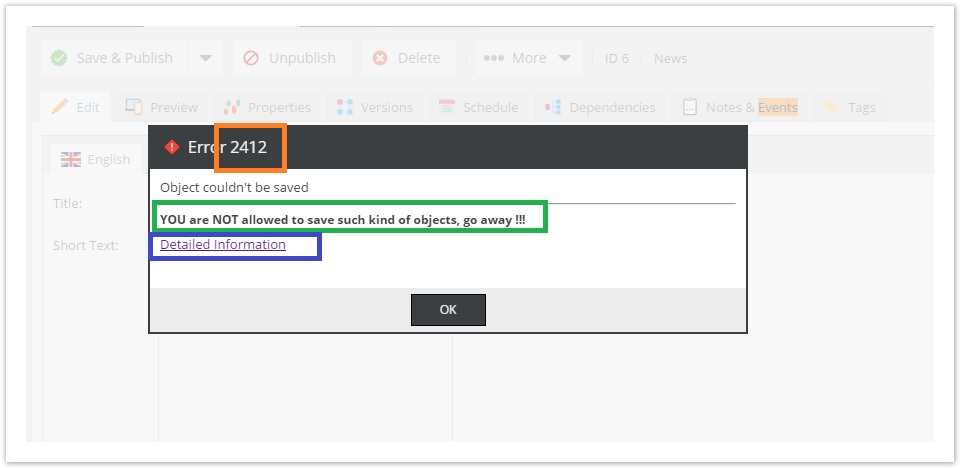

# Event API and Event Manager

## General

Pimcore provides an extensive number of events that are fired during execution of Pimcore functions. These events can be 
used to hook into many Pimcore functions such as saving an object, asset or document and can be used to change or extend 
the default behavior of Pimcore.

The most common use-case for events is using them in a [plugin](./13_Plugin_Developers_Guide/05_Plugin_Backend_UI.md), but 
of course you can use them also anywhere in your code or when hooking into the startup process. 

You can attach a handler at any time in your code by using the following code:

```php 
\Pimcore::getEventManager()->attach("object.postAdd", function (\Zend_EventManager_Event $e) {
    $object = $e->getTarget();
    $object->getId();
    // ...
});
```

The Pimcore event API is based on the ZF Event Manager. 
[Click here to learn more about attaching listeners to an event.](http://framework.zend.com/manual/1.12/de/zend.event-manager.event-manager.html)

> **IMPORTANT INFO**  
> `Pimcore::getEventManager()` returns an instance of `Zend_EventManager_EventManager` and therefore it provides the full
> set of functionalities that the ZF provides. 
> For details have a look at [http://framework.zend.com/manual/1.12/de/zend.event-manager.event-manager.html](http://framework.zend.com/manual/1.12/de/zend.event-manager.event-manager.html) 


## Examples
The following example shows how to register events for assets, documents and objects where the event-handler is in a custom class. 

```php
<?php
namespace Website\Custom;
  
use Pimcore\Model;
class Extension {
     
    public function handleCreate (\Zend_EventManager_Event $e) {
        $element = $e->getTarget();
        if($element instanceof Model\Asset) {
            // do something with the asset
        } else if ($element instanceof Model\Document) {
            // do something with the document
        } else if ($element instanceof Model\Object\AbstractObject) {
            // do something with the object
        }
    }
     
    public function handleDelete(\Zend_EventManager_Event $e) {
        $element = $e->getTarget();
        // do something with the element
    }
}
$extension = new Website_Custom_Extension();
foreach (["asset","object","document"] as $type) {
    Pimcore::getEventManager()->attach($type . ".postAdd", [$extension, "handleCreate"]);
    Pimcore::getEventManager()->attach($type . ".postDelete", [$extension, "handleDelete"]);
}
```


The following example shows how to deal with event parameters and a static callback method.
```php
<?php
namespace Website\Auth;
class Handler {
     
    public static function logout (\Zend_EventManager_Event $e) {
        $user = $e->getParam("user");
        // user is now an instance of User
         
        // do something with the user
        Logger::info("User with ID " . $user->getId() . " left the pimcore admin interface");
    }
}
\Pimcore::getEventManager()->attach("admin.login.logout", ["\Website\Auth\Handler", "logout"]);
```


This example show how to use an anonymous callback and a specific priority (87) 
```php
<?php
$myControllerPlugin = new \Website\Controller\Plugin\MyCustomPlugin();
$myControllerPlugin->someMethod();
 
\Pimcore::getEventManager()->attach("system.startup", function (\Zend_EventManager_Event $e) use ($myControllerPlugin) {
    $frontController = $e->getTarget();
    $frontController->registerPlugin($myControllerPlugin);
}, 87);
```

attach multiple events
```php
\Pimcore::getEventManager()->attach(["object.postAdd","object.postUpdate"], function (\Zend_EventManager_Event $e) {
    $object = $e->getTarget();
    $object->getId();
    // ...
});
```


## Available Events

### System / General

| Name | Target | Parameters | Description | 
| ---- | ------ | ---------- | ----------- |
| `system.startup` | `Zend_Controller_Front` | | This event is fired on startup, just before the MVC dispatch starts. |
| `system.shutdown` | | - | This event is fired on shutdown (register_shutdown_function)|
| `system.maintenance` | `Pimcore\Model\Schedule\Manager\Procedural` or `Pimcore\Model\Schedule\Manager\Daemon` | - | Use this event to register your own maintenance jobs, this event is triggered just before the jobs are executed |
| `system.console.init` | `Pimcore\Console\Application` | | See Console / CLI |
| `system.di.init` | `DI\ContainerBuilder` | | Fires when the DI is built |
| `system.maintenance.activate` | | | This event is fired on maintenance mode activation |
| `system.maintenance.deactivate` | | | This event is fired on maintenance mode deactivation |
| `system.cache.clearOutputCache` | | | This event is fired on Output Cache clear |
| `system.cache.clear` | | | This event is fired on Cache clear |
| `system.cache.clearTemporaryFiles` | | | This event is fired on Temporary Files clear |
| `system.service.preGetValidKey` | | (string) $key, (string) $type | Can be used to enforce your own key/filename policies for assets, documents and objects. To modify the key, just return the modified key in your callback function. |

### Document

| Name                               | Target                   | Parameters                                              | Description                                                                                             |
|------------------------------------|--------------------------|---------------------------------------------------------|---------------------------------------------------------------------------------------------------------|
| `document.preAdd`                  | `Pimcore\Model\Document` | -                                                       |                                                                                                         |
| `document.postAdd`                 | `Pimcore\Model\Document` | -                                                       |                                                                                                         |
| `document.preUpdate`               | `Pimcore\Model\Document` | (bool) `saveVersionOnly`                                | saveVersionOnly is set if method saveVersion() was called instead of save()                             |
| `document.postUpdate`              | `Pimcore\Model\Document` | (bool) `saveVersionOnly`                                | saveVersionOnly is set if method saveVersion() was called instead of save()                             |
| `document.preDelete`               | `Pimcore\Model\Document` | -                                                       |                                                                                                         |
| `document.postDelete`              | `Pimcore\Model\Document` | -                                                       |                                                                                                         |
| `document.print.prePdfGeneration`  | `Pimcore\Model\Document` | `Pimcore\Web2Print\Processor\{ProcessorName} processor` | processor contains the processor object used to generate the PDF                                        |
| `document.print.postPdfGeneration` | `Pimcore\Model\Document` | (string) `filename`, (string) `pdf`                     | filename contains the filename of the generated pdf on filesystem, pdf contains generated pdf as string |
| `document.postCopy`                | `Pimcore\Model\Document` | `Pimcore\Model\Document base_element`                   | base_element contains the base document used in copying process                                         |

### Object

| Name                  | Target                                  | Parameters                                         | Description                                                                   |
|-----------------------|-----------------------------------------|----------------------------------------------------|-------------------------------------------------------------------------------|
| `object.preAdd`       | `Pimcore\Model\Object\AbstractObject`   | -                                                  |                                                                               |
| `object.postAdd`      | `Pimcore\Model\Object\AbstractObject`   | -                                                  |                                                                               |
| `object.preUpdate`    | `Pimcore\Model\Object\AbstractObject`   | (bool) saveVersionOnly                             | saveVersionOnly is set if method saveVersion() was called instead of save()   |
| `object.postUpdate`   | `Pimcore\Model\Object\AbstractObject`   | (bool) saveVersionOnly                             | saveVersionOnly is set if method saveVersion() was called instead of save()   |
| `object.preDelete`    | `Pimcore\Model\Object\AbstractObject`   | -                                                  |                                                                               |
| `object.postDelete`   | `Pimcore\Model\Object\AbstractObject`   | -                                                  |                                                                               |
| `object.postCopy`     | `Pimcore\Model\Object\AbstractObject`   | `Pimcore\Model\Object\AbstractObject base_element` | base_element contains the base object used in copying process                 |


### Asset

| Name                             | Target                                        | Parameters                            | Description                                                                 |
|----------------------------------|-----------------------------------------------|---------------------------------------|-----------------------------------------------------------------------------|
| `asset.preAdd`                   | `Pimcore\Model\Asset`                         | -                                     |                                                                             |
| `asset.postAdd`                  | `Pimcore\Model\Asset`                         | -                                     |                                                                             |
| `asset.preUpdate`                | `Pimcore\Model\Asset`                         | (bool) `saveVersionOnly`              | saveVersionOnly is set if method saveVersion() was called instead of save() |
| `asset.postUpdate`               | `Pimcore\Model\Asset`                         | (bool) `saveVersionOnly`              | saveVersionOnly is set if method saveVersion() was called instead of save() |
| `asset.preDelete`                | `Pimcore\Model\Asset`                         | -                                     |                                                                             |
| `asset.postDelete`               | `Pimcore\Model\Asset`                         | -                                     |                                                                             |
| `asset.image.thumbnail`          | `Pimcore\Model\Asset\Image\Thumbnail`         | (bool) `deferred`, (bool) `generated` | fires after the thumbnail was created                                       |
| `asset.video.image-thumbnail`    | `Pimcore\Model\Asset\Video\ImageThumbnail`    | (bool) `deferred`, (bool) `generated` | fires after the image thumbnail was created                                 |
| `asset.document.image-thumbnail` | `Pimcore\Model\Asset\Document\ImageThumbnail` | (bool) `deferred`, (bool) `generated` | fires after the image thumbnail was created                                 |
| `asset.postCopy`                 | `Pimcore\Model\Asset`                         | `Pimcore\Model\Asset base_element`    | base_element contains the base asset used in copying process                |

### Object Class

| Name | Target | Parameters | Description | 
| ---- | ------ | ---------- | ----------- |
| `object.class.preAdd` | `Pimcore\Model\Object\ClassDefinition` | - |  |
| `object.class.postAdd` | `Pimcore\Model\Object\ClassDefinition` | - |  |
| `object.class.preUpdate` | `Pimcore\Model\Object\ClassDefinition` | - |  |
| `object.class.postUpdate` | `Pimcore\Model\Object\ClassDefinition` | - |  |
| `object.class.preDelete` | `Pimcore\Model\Object\ClassDefinition` | - |  |
| `object.class.postDelete` | `Pimcore\Model\Object\ClassDefinition` | - |  |


### Object KeyValue Group Configuration

| Name | Target | Parameters | Description | 
| ---- | ------ | ---------- | ----------- |
| `object.keyValue.groupConfig.preAdd` | `Pimcore\Model\Object\KeyValue\GroupConfig` | - |  |
| `object.keyValue.groupConfig.postAdd` | `Pimcore\Model\Object\KeyValue\GroupConfig` | - |  |
| `object.keyValue.groupConfig.preUpdate` | `Pimcore\Model\Object\KeyValue\GroupConfig` | - |  |
| `object.keyValue.groupConfig.postUpdate` | `Pimcore\Model\Object\KeyValue\GroupConfig` | - |  |
| `object.keyValue.groupConfig.preDelete` | `Pimcore\Model\Object\KeyValue\GroupConfig` | - |  |
| `object.keyValue.groupConfig.postDelete` | `Pimcore\Model\Object\KeyValue\GroupConfig` | - |  |


### Object KeyValue Key Configuration

| Name | Target | Parameters | Description | 
| ---- | ------ | ---------- | ----------- |
| `object.keyValue.keyConfig.preAdd` | `Pimcore\Model\Object\KeyValue\KeyConfig` | - |  |
| `object.keyValue.keyConfig.postAdd` | `Pimcore\Model\Object\KeyValue\KeyConfig` | - |  |
| `object.keyValue.keyConfig.preUpdate` | `Pimcore\Model\Object\KeyValue\KeyConfig` | - |  |
| `object.keyValue.keyConfig.postUpdate` | `Pimcore\Model\Object\KeyValue\KeyConfig` | - | |
| `object.keyValue.keyConfig.preDelete` | `Pimcore\Model\Object\KeyValue\KeyConfig` | - | |
| `object.keyValue.keyConfig.postDelete` | `Pimcore\Model\Object\KeyValue\KeyConfig` | - | |


### Object Classification Store Collection Configuration

| Name | Target | Parameters | Description | 
| ---- | ------ | ---------- | ----------- |
| `object.classificationstore.collectionConfig.preAdd` | `Pimcore\Model\Object\Classificationstore\CollectionConfig` | - |  |
| `object.classificationstore.collectionConfig.postAdd` | `Pimcore\Model\Object\Classificationstore\CollectionConfig` | - |  |
| `object.classificationstore.collectionConfig.preUpdate` | `Pimcore\Model\Object\Classificationstore\CollectionConfig` | - |  |
| `object.classificationstore.collectionConfig.postUpdate` | `Pimcore\Model\Object\Classificationstore\CollectionConfig` | - |  |
| `object.classificationstore.collectionConfig.preDelete` | `Pimcore\Model\Object\Classificationstore\CollectionConfig` | - |  |
| `object.classificationstore.collectionConfig.postDelete` | `Pimcore\Model\Object\Classificationstore\CollectionConfig` | - |  |


### Object Classification Store Group Configuration

| Name | Target | Parameters | Description | 
| ---- | ------ | ---------- | ----------- |
| `object.classificationstore.groupConfig.preAdd` | `Pimcore\Model\Object\Classificationstore\GroupConfig` | - |  |
| `object.classificationstore.groupConfig.postAdd` | `Pimcore\Model\Object\Classificationstore\GroupConfig` | - |  |
| `object.classificationstore.groupConfig.preUpdate` | `Pimcore\Model\Object\Classificationstore\GroupConfig` | - |  |
| `object.classificationstore.groupConfig.postUpdate` | `Pimcore\Model\Object\Classificationstore\GroupConfig` | - |  |
| `object.classificationstore.groupConfig.preDelete` | `Pimcore\Model\Object\Classificationstore\GroupConfig` | - |  |
| `object.classificationstore.groupConfig.postDelete` | `Pimcore\Model\Object\Classificationstore\GroupConfig` | - |  |


### Object Classification Store Key Configuration

| Name | Target | Parameters | Description | 
| ---- | ------ | ---------- | ----------- |
| `object.classificationstore.keyConfig.preAdd` | `Pimcore\Model\Object\Classificationstore\KeyConfig` | - |  |
| `object.classificationstore.keyConfig.postAdd` | `Pimcore\Model\Object\Classificationstore\KeyConfig` | - |  |
| `object.classificationstore.keyConfig.preUpdate` | `Pimcore\Model\Object\Classificationstore\KeyConfig` | - |  |
| `object.classificationstore.keyConfig.postUpdate` | `Pimcore\Model\Object\Classificationstore\KeyConfig` | - |  |
| `object.classificationstore.keyConfig.preDelete` | `Pimcore\Model\Object\Classificationstore\KeyConfig` | - |  |
| `object.classificationstore.keyConfig.postDelete` | `Pimcore\Model\Object\Classificationstore\KeyConfig` | - |  |


### Versions

| Name | Target | Parameters | Description | 
| ---- | ------ | ---------- | ----------- |
| `version.preSave` | `Pimcore\Model\Element\AbstractElement` | - |  |
| `version.postSave` | `Pimcore\Model\Element\AbstractElement` | - |  |
| `version.preDelete` | `Pimcore\Model\Element\AbstractElement` | - |  |
| `version.postDelete` | `Pimcore\Model\Element\AbstractElement` | - |  |


### Search Backend

| Name | Target | Parameters | Description | 
| ---- | ------ | ---------- | ----------- |
| `search.backend.preSave` | `Pimcore\Model\Search\Backend\Data` | - |  |
| `search.backend.postSave` | `Pimcore\Model\Search\Backend\Data` | - | | 

### Search Dialogs

Various events that can be used to manipulate a search request.

| Name | Target | Parameters | Description | 
| ---- | ------ | ---------- | ----------- |
| `admin.search.list.beforeFilterPrepare` | `Searchadmin_SearchController` | (Pimcore\Model\Tool\Admin\EventDataContainer) `requestParams` contains the request parameters. | Fired before the request params are parsed. Note that the context request parameter will contain contextual information. |
| `admin.search.list.beforeListLoad` | `Searchadmin_SearchController` | (Pimcore\Model\Tool\Admin\EventDataContainer) `list` the search backend list| Allows you to modify the search backend list before it is loaded.  | 
| `admin.search.list.afterListLoad` | `Searchadmin_SearchController` | (Pimcore\Model\Tool\Admin\EventDataContainer) `list` raw result as array | Allows you to modify the the result after the list was loaded.  |


### Users and Roles (\Pimcore\Model\User, \Pimcore\Model\User\Folder, \Pimcore\Model\User\Role, \Pimcore\Model\User\Role\Folder)

| Name | Target | Parameters | Description | 
| ---- | ------ | ---------- | ----------- |
| `user.preAdd` | `Pimcore\Model\User\AbstractUser` | - |  |
| `user.postAdd` | `Pimcore\Model\User\AbstractUser` | - |  |
| `user.preUpdate` | `Pimcore\Model\User\AbstractUser` | - |  |
| `user.postUpdate` | `Pimcore\Model\User\AbstractUser` | - |  |
| `user.preDelete` | `Pimcore\Model\User\AbstractUser` | - |  |
| `user.postDelete` | `Pimcore\Model\User\AbstractUser` | - |  |


### Admin Interface

| Name | Target | Parameters | Description | 
| ---- | ------ | ---------- | ----------- |
| `admin.asset.get.preSendData` | `Admin_AssetController` | (Pimcore\Model\Tool\Admin\EventDataContainer) `returnValueContainer`, (Pimcore\Model\Asset) `asset` | Fired at the end of Admin_AssetController::getDataById() - (since build 3874) |
| `admin.class.objectbrickList.preSendData` | `Admin_ClassController` | (Pimcore\Model\Tool\Admin\EventDataContainer) `returnValueContainer`, (int) `objectId` | Fired at the end of Admin_ClassController:objectbrickList() - (since build 3300) |
| `admin.controller.preInit` | `Zend_Controller_Action` | - | Fired at the beginning of Pimcore\Controller\Action_Admin::init() - only fired once (2.3.1) |
| `admin.controller.postInit` | `Zend_Controller_Action` | - | Fired at the end of Pimcore_Controller_Action_Admin::init() - only fired once (2.3.1) |
| `admin.document.get.preSendData` | `Admin_DocumentController` | (Pimcore\Model\Tool\Admin\EventDataContainer) `returnValueContainer`, (Pimcore\Model\Document) `document` | Fired at the end of Admin_DocumentController::getDataById() - (since build 3874) |
| `admin.login.index.authenticate` | `Zend_Controller_Action` | (string) username,(string) `password` | Fired at the beginning of /admin/login/index if there is no valid user. Use $e-getTarget()->setUser($user); if you want to login a user in your callback |
| `admin.login.login.authenticate` | `Zend_Controller_Action` | (string) username,(string) `password` | Fired at the beginning of /admin/login/login before any other authentication steps are taken. Use $e-getTarget()->setUser($user); if you want to login a user in your callback |
| `admin.login.login.failed` | `Zend_Controller_Action` | (string) `username`,(string) `password` | Use $e-getTarget()->setUser($user); if you want to login a user in your callback |
| `admin.login.login.lostpassword` | `Zend_Controller_Action` | (User) `$user`, (string) `loginUrl` | Can be used to send to the user a custom and localized email containing loginUrl for password lost (default Pimcore email is automatically disabled if this event is attached) |
| `admin.login.logout` | `Zend_Controller_Action` | (User) `$user` |
| `admin.object.get.preSendData` | `Admin_ObjectController` | (Pimcore\Model\Tool\Admin\EventDataContainer) `returnValueContainer`, (Pimcore\Model\Object\AbstractObject) `object` | Fired at the end of Admin_ObjectController::get() - (since build 3277) |
| `admin.object.treeGetChildsById.preSendData` | `Admin_ObjectController` | (Pimcore\Model\Tool\Admin\EventDataContainer) `returnValueContainer` | Fired at the end of Admin_ObjectController::treeGetChildsById() - (since build 3277) |


### Frontend

| Name | Target | Parameters | Return | Description | 
| ---- | ------ | ---------- | ------ | ----------- |
| `frontend.error` | `Zend_Controller_Action` | (Exception) `exception` | (string) will be appended to the cache key | The return values are aggregated and are added to the cache key. This allows the customization of the error page without disabling the cache. (since 4.0) |
| `frontend.controller.preInit` | `Zend_Controller_Action` |   |   | (since 4.0) |
| `frontend.controller.postInit` | `Zend_Controller_Action` |   |   | (since 4.0) |
| `frontend.path.asset.image.thumbnail` | `Pimcore\Model\Asset\Image\Thumbnail` | (string) `filesystemPath` (string)  `frontendPath` | (string) the modified path for the frontend | (since 4.0.1) |
| `frontend.path.asset.video.image-thumbnail` | `Pimcore\Model\Asset\Video\ImageThumbnail` | (string) `filesystemPath` (string)  `frontendPath` | (string) the modified path for the frontend | (since 4.0.1) |
| `frontend.path.asset.video.thumbnail` | `Pimcore\Model\Asset\Video` | (string) `filesystemPath` (string)  `frontendPath` | (string) the modified path for the frontend | (since 4.0.1) |
| `frontend.path.asset.document.image-thumbnail` | `Pimcore\Model\Asset\Document\ImageThumbnail` | (string) `filesystemPath`, (string)  `frontendPath` | (string) the modified path for the frontend | (since 4.0.1) |
| `frontend.path.asset` | `Pimcore\Model\Asset` | - | (string) the modified path for the frontend | (since 4.0.1) called at the end of getFullPath() |
| `frontend.path.document` | `Pimcore\Model\Document` | (string)  `frontendPath` | (string) the modified path for the frontend | (since 4.0.1) called at the end of getFullPath() |
| `frontend.path.staticroute` | `Pimcore\Model\Staticroute` | (string)  `frontendPath`, (array) `params`, (bool) `reset`, (bool) `encode` | (string) the modified path for the frontend | (since 4.0.1) |
| `frontend.view.helper.head-link` | `Pimcore\View\Helper\HeadLink` | (stdClass) `item` |   | Useful to do some rewriting (since 4.3.1) |
| `frontend.view.helper.head-script` | `Pimcore\View\Helper\HeadScript` | (stdClass) `item` |   | Useful to do some rewriting (since 4.3.1) |

### Workflow Management

| Name | Target | Parameters | Description | 
| ---- | ------ | ---------- | ----------- |
| `workflowmanagement.preAction` | `Pimcore\WorkflowManagement\Workflow\Manager` | (string) `actionName` | Fired BEFORE any action happens in the workflow. use this to hook into actions globally and define your own logic. i.e. validation or checks on other system vars |
| `workflowmanagement.postAction` | `Pimcore\WorkflowManagement\Workflow\Manager` | (string) `actionName` | Fired AFTER any action happens in the workflow. Use this to hook into actions globally and define your own logic. i.e. trigger an email or maintenance job. |
| `workflowmanagement.preReturnAvailableActions` | allowed actions as associated array `$actionName` => `$actionConfig` | Pimcore\WorkflowManagement\Workflow\Manager `manager` | Fired when returning the available actions to a user in the admin panel. use this to further customise what actions are available to a user. i.e. stop them logging time after 5pm ;) |
| `workflowmanagement.action.before` | `Pimcore\WorkflowManagement\Workflow\Manager` | array `actionConfig`, array `data`  | |
| `workflowmanagement.action.success` | `Pimcore\WorkflowManagement\Workflow\Manager` | array `actionConfig`, array `data`  | |
| `workflowmanagement.action.failure` | `Pimcore\WorkflowManagement\Workflow\Manager` | array `actionConfig`, array `data`, Exception `e` | |
 

## Example of custom error handling using the Event API

This will prevent the user from saving News objects.

```php
// website/var/config/startup.php
  
<?php
\Pimcore::getEventManager()->attach("object.preUpdate", function ($event) {
    $object = $event->getTarget();
    if ($object instanceof Pimcore\Model\Object\News) {
        throw new \Pimcore\Model\Element\ValidationException("YOU are NOT allowed to save such kind of objects, go away !!!", 2412);
    }
});
```

The error will be presented in a different way.



* orange: the error code
* green: error message
* blue: link to the stack trace
