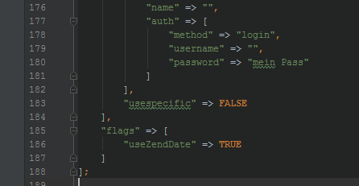

Pimcore 4 is as far as possible fully backward compatible to version 3, but it removes some features/compatibility layers which were deprecated in version 3. Please read the following notes carefully before performing the update. 

### License: GPLv3
With the upgrade to pimcore 4 you are accepting to use pimcore under the terms of the GPLv3.
Read more here: 
https://github.com/pimcore/pimcore/blob/master/LICENSE.md
https://github.com/pimcore/pimcore/blob/master/license-faq.md
https://www.pimcore.org/en/resources/blog/pimcore+4+beta_b13633 
 
### PHP Version: PHP 5.5+ 
PHP 5.4 is no longer supported. Please ensure your are using 5.5+ before you upgrade. 
 
### ExtJS 6 Interface, ExtJS 3.4 deprecated
If you are upgrading from version 3 using the live updater, pimcore will continue to use ExtJS 3.4 in the admin user interface. 
You can change to the new interface for testing purposes at any time using the parameter /admin/?extjs6=true . It's also possible to pass a parameter for ExtJS 3.4 if the standard setting is ExtJS 6: /admin/?extjs3=true 
Please keep in mind that extensions may be incompatible with ExtJS 6, especially if they are providing UI components. You can switch to ExtJS permanently in the system setting. 

**ExtJS 3.4 support will be removed im pimcore 5.** 

### Dependencies are managed by Composer
All external libraries are managed by Composer, this includes: ZF1, Symfony Components, Google Client Libraries, ... and many others. Therefore, they are now located in /vendor and loaded using the Composer autoloader. Updates of these libs are still provided directly by the pimcore Live Updater for your convenience. See also: https://github.com/pimcore/pimcore/blob/master/composer.json
 
### Old naming of "Resource" classes with the suffix "Mysql" is not supported anymore. 
```
My_Model_Resource_Mysql => My\Model\Dao
My\Model\Resource\Mysql => My\Model\Dao
```

### Data Access Object class names are now named "Dao" instead of "Resource" (deprecated) 
This is due PHP 7 reserved keywords: http://php.net/manual/en/reserved.other-reserved-words.php
Pimcore has a backward compatibility layer (will be removed in pimcore 5), so your app or plugins will remain working. 

### Core & Application Logger: PSR-3 compatible, replaced Zend_Log with Monolog
Application Logger has a new interface (and more functionalities) but is fully backward compatible:

```php
// was:
$logger->error("my error message", $myObject, $fileObject, "differnent comp.");
  
// now:
$logger->error("my error message", [
    "fileObject" => $fileObject,
    "relatedObject" => $myObject,
    "component" => "different comp."
]);
```

### Deprecated class names
```php
Pimcore\Resource => Pimcore\Db
Pimcore\Resource\Mysql => Pimcore\Db
Pimcore\Log\Log => Pimcore\Log\ApplicationLogger
Pimcore\Log\Writer\Db => Pimcore\Log\Handler\ApplicationLoggerDb
Pimcore\Model\Cache => Pimcore\Cache
```

### WebDAV Server
The new WebDAV endpoint is now https://example.com/admin/asset/webdav 
It's not necessary to have a dedicated hostname anymore.  

### CLI Scripts
Are now completely managed by Pimcore\Console (symfony/console). Run the following command to get a list of all available commands: 

```bash
php pimcore/cli/console.php list
```

There's a compatibility layer for /pimcore/cli/maintenance.php but all other scripts that were used to be in /pimcore/cli/ have no fallback. 

### PHP configuration files 
All configurations that were stored either in the database or as XML files are now stored as PHP configuration files. This ensures high performance as well as much better possibilities to deploy settings to different environments and versioning them in a VCS. https://github.com/pimcore/pimcore/tree/master/website_demo/var/config contains a list of many configurations that were changed to PHP. The legacy files and database tables are not deleted, files are moved into website/var/config/LEGACY and db tables are prefixed with PLEASE_DELETE__. 

### Document editable names
Only ASCII characters are allowed as the name for an editable. Reason: ASCII has only 1 byte per character, UTF-8 has 3 - so we can use longer names for editables, see also #421.
 
### Redirects
vsprinf() - Syntax for backreferences isn't supported anymore. 
 
### Static Routes
Support for unnamed parameters is removed. 
```php
// the following code is not supported anymore
$this->url(["value1","value2"]);
// you have to use an associative array instead
$this->url(["key1" => "value1", "key2" => "value2"]);
 ```
 
### PHP's DateTime replaces Zend_Date
The object data-types `Date` and `DateTime` and the editable `Date` returns now a `\DateTime` object instead of a `\Zend_Date` object. 
There's a backward compatibility layer which is enabled automatically if your're using the live-updater (so pimcore continues to return `\Zend_Date` objects). 
To manually enable the `\Zend_Date` compatibility layer, set the flag `useZendDate` in system.php to true: 



Don't forget to clear the cache if you're making changes to the "useZendDate" flag.

### Discontinued Cache Backends
The following cache backends were removed / replaced, please use the appropriate alternative instead: 
```php
Pimcore\Cache\Backend\MemcachedSliced => Pimcore\Cache\Backend\Memcached
Pimcore\Cache\Backend\Redis => Pimcore\Cache\Backend\Redis2
```

### Image thumbnails: default deferred rendering 
Deferred rendering of image thumbnails is now the default setting in pimcore. This means that calling the following code doesn't generate the thumbnail immediately, but returns only the path to the thumbnail: `$image->getThumbnail("myConfig");`  
The thumbnail is then generated on demand when requested by the browser. 
If you need to generate the thumbnail immediately, please set the 2nd argument to false: `$image->getThumbnail("myConfig", false);`  
or request the path of the thumbnail on the filesystem, which has exactly the same effect:  `$image->getThumbnail("myConfig")->getFilesystemPath();`

### Custom Views
Custom Views are now configured using a configuration file in /website/config/, for more details, please check the docs. 
If /website/config/ is writable for the updater, the existing custom view config will be migrated automatically. 

### Custom Object DataTypes extending Pimcore\Model\Object\ClassDefinition\Data
Method parameters in ClassDefinition\Data have changed. please make sure that any of your custom object data types extending ClassDefinition\Data are made compatible. (Incompatibility will produce a PHP fatal error)

## Live-Updater uses HTTPS
If you're limiting your outgoing traffic, you have to open port 443 and ensure PHP has configured OpenSSL support (check using system requirements check or phpinfo()). 

## Area Brick action.php classname changes
if you have custom area bricks with action.php files (for using getBrickHtmlOpenTag and getBrickHtmlCloseTag), check compatibility with the adjusted naming convention. This relates to https://github.com/pimcore/pimcore/issues/539 and may affect your templates.  

Test to make sure the class names are correct with the following (taken from core)

```php
$testClassname = "my_area_brick_class";
$actionClass = preg_replace_callback("/[\-_][a-z]/", function ($matches) {
                    $replacement = str_replace(["-", "_"], "", $matches[0]);
                    return strtoupper($replacement);
                }, ucfirst($testClassname));
echo $actionClass;
```
