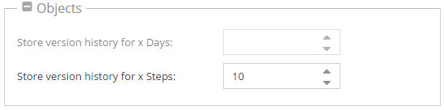

# Versioning

## General
All contents in Pimcore (documents, assets and objects) are versioned. You can have as many versions as you want.
On each change a new version of the element is created.

For example, if you would like to find the version history in objects you have to choose **Versions** tab.

There you can see a list of changes, what is the difference between revisions and you can choose which version should be published.


## Settings

<div class="inline-imgs">

You can configure the versioning behavior in the  **Settings -> System Settings -> (Documents, Assets, Objects)**

</div>




## Turn off Versioning for the Current Process

Sometimes it is very useful to just deactivate versioning for a process. For example for importers or synchronization with 3rd party systems. 
You can globally deactivate and activate the versioning with the following PHP code directly in your scripts:

```php
\Pimcore\Model\Version::disable(); // to disable versioning for the current process
\Pimcore\Model\Version::enable(); // to enable versioning for the current process
```

*Note:* With these commands you only deactivate/activate the versioning for the current PHP process. 
This setting is not saved, and only affects changes on elements which are modified within this process! 


## Working with PHP API
When working with PHP API - especially when saving elements - you need to set the `userModification` so that a proper 
user is shown in version history. 

When you set `userModification` to `0` Pimcore shows `system` as user in the version history. 


```
$object->setUserModification(0);
$object->save();
```
### Example: How to get a previous version of an object
```php
$versions = $currentObject->getVersions();
$previousVersion = $versions[count($versions)-2];
$previousObject = $previousVersion->getData();
 
Simple::log("example", "previous value: ".$previousVersion->getData()->getSomeValue());
Simple::log("example", "current value ".$currentObject->getSomeValue());
```
