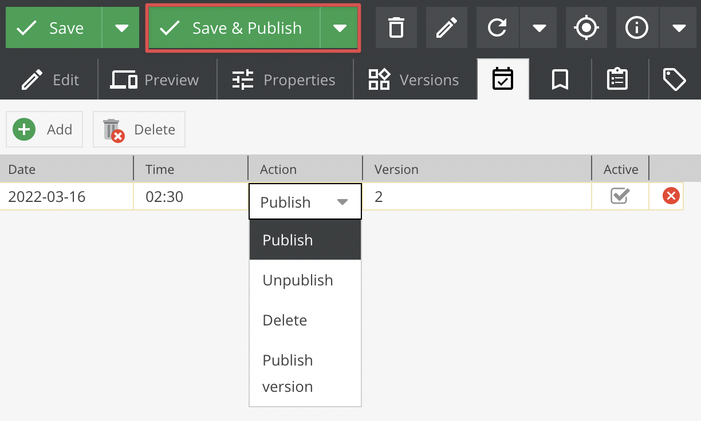
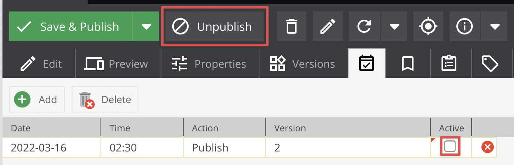

# Scheduling

## General
Every element type in Pimcore (documents, objects, assets) has implemented a scheduler which provides the ability to create tasks like:

* Publish
* Unpublish
* Delete
* Publish version - Publish a specific version (You can read more about Versions in [the Versioning section](./01_Versioning.md))

Important: If object is already published, then using `Publish` option will not publish latest version(unpublished) so it is recommended to use `Publish version` option in that case.

**Note:** To use scheduler you have to configure "cronjobs". You can find more in the [System setup section](../23_Installation_and_Upgrade/03_System_Setup_and_Hosting/README.md).


## Usage

Let's use objects as an example.
In the Pimcore backend UI find the icon: 


You can add a task by clicking on the **Add** button, which will add an empty row. 
It has some configurable options: `date`, `time` and `action` (which should run with that task). 
The `version` option will only be used if you chose the *"Publish version"* action.
The `active` checkbox will indicates that the task was not finished yet.

To make a task that automatically publishes an unpublished object just fill the values like in the picture, below:



The effect in the database will be:

```
`schedule_tasks`
# id, cid, ctype, date, action, version, active
'7', '76', 'object', '1474034700', 'publish', NULL, '1'
```

When the `./bin/console pimcore:maintenance -j scheduledtasks` script will finish processing jobs you could see the changes.

In the edit object view:



In the database:
```
`schedule_tasks`
# id, cid, ctype, date, action, version, active
'8', '76', 'object', '1474034700', 'publish', NULL, '0'
```
 
