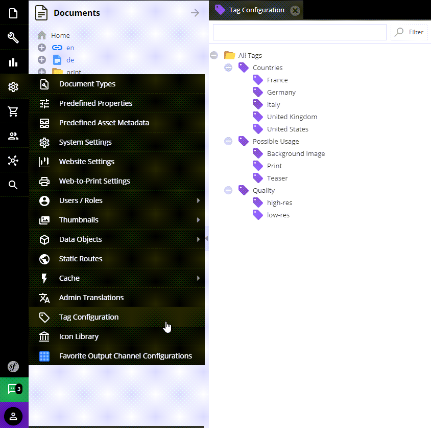
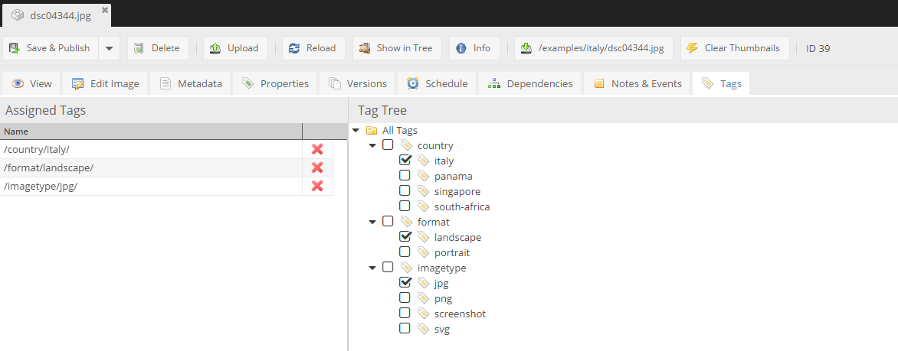
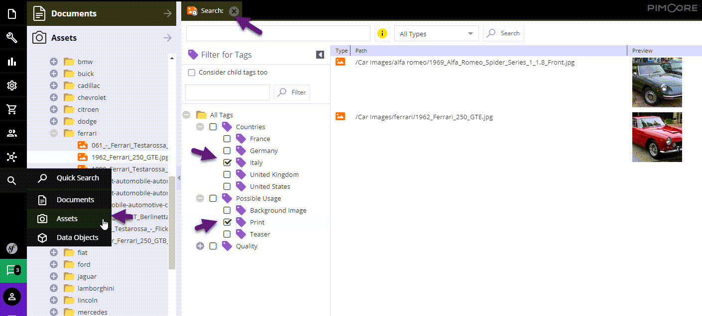

# Tags

## General

Tags provide a way to create additional taxonomies and classifications for documents, assets and objects. 

By using tags you are able to easily filter Pimcore elements (documents, objects, assets) and keep the additional 
search criteria to the application.

## Tags Definition

The available tags have to be defined centrally (user permission *tags configuration* is necessary).
 


## Tags Assignment

In document, asset or object editor there is an additional tab, 
where tags can be assigned to the current element (user permission *tags assignment* is necessary).



## Tags Usage

In Search Dialogs, tags can be selected as additional criteria for the search (user permission *tags search* necessary).



## Working with Tags via API

### Overview 

For accessing and working with tags via API, take a look into `Pimcore\Model\Element\Tag`.

```php
/**
 * returns all assigned tags for element
 *
 * @param string $cType
 * @param int $cId
 * @return Tag[]
 */
public static function getTagsForElement($cType, $cId)
{
    $tag = new Tag();

    return $tag->getDao()->getTagsForElement($cType, $cId);
}

/**
 * adds given tag to element
 *
 * @param string $cType
 * @param int $cId
 * @param Tag $tag
 */
public static function addTagToElement($cType, $cId, Tag $tag)
{
    $tag->getDao()->addTagToElement($cType, $cId);
}

/**
 * removes given tag from element
 *
 * @param string $cType
 * @param int $cId
 * @param Tag $tag
 */
public static function removeTagFromElement($cType, $cId, Tag $tag)
{
    $tag->getDao()->removeTagFromElement($cType, $cId);
}

/**
 * sets given tags to element and removes all other tags
 * to remove all tags from element, provide empty array of tags
 *
 * @param string $cType
 * @param int $cId
 * @param Tag[] $tags
 */
public static function setTagsForElement($cType, $cId, array $tags)
{
    $tag = new Tag();
    $tag->getDao()->setTagsForElement($cType, $cId, $tags);
}
```

### API Usage Examples

#### Get Tags for Element

To get all tags from the element below, 


we can use `getTagsForElement` method, in `$cType` parameter we have to specify the type of the element. 
In the case above, it's `document`. 

```php
$tags = \Pimcore\Model\Element\Tag::getTagsForElement('document', 4);
dump($tags);
```

And as an output there is an the array with `Pimcore\Model\Element\Tag` as a row.

```
array(3) {
  [0] => object(Pimcore\Model\Element\Tag)#272 (7) {
  
  ...  
```

#### Assign a New Tag to a Element

To add a new tag an element, first create the new tag and after that just use the `\Pimcore\Model\Element\Tag::addTagToElement` 
method to assign the tag to the chosen element (by element id).

```php
$tag =  new \Pimcore\Model\Element\Tag();
try {
    $tag->setName('newcontent')->save();
    \Pimcore\Model\Element\Tag::addTagToElement('document', 4, $tag);
} catch (Exception $e) {

...

```

The result:


In the same way you can use the rest of available methods. 
The type properties list is a standard. You can use: document, asset or object.
 
 