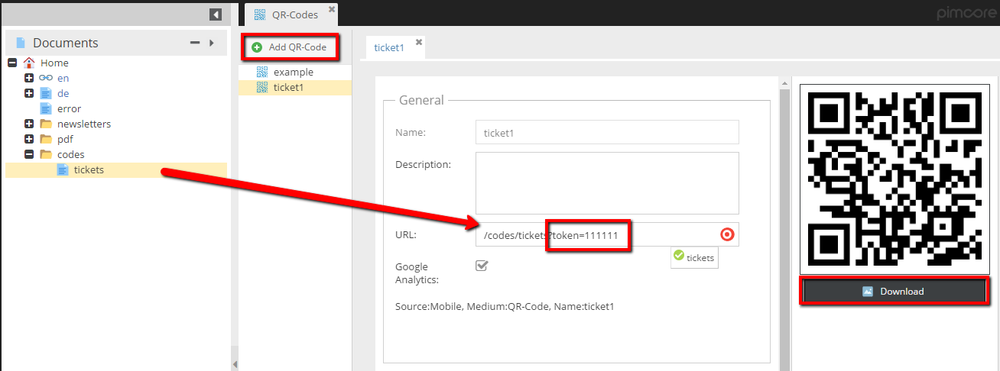
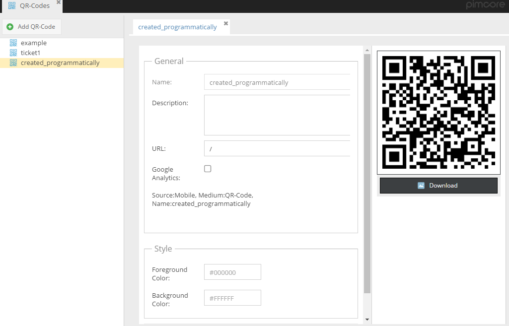

# QR codes

## General 

Pimcore provides QR-Codes feature which allows you to add qr codes for every URL (internal, external).
You're also able to tracking the efficiency of specific qr code by built-in Google Analytics tracker. 

## The Administration Panel Overview

<div class="inline-imgs">

Go to the  **Marketing -> QR-Codes** in the main menu.

</div>


## Add New QR-Code

To show the use case of the QR-codes feature, let's have a look at the example below.



The most interesting options:

* URL - here I put the document called ticket. The document is controlled by *ticket validation* action which has implemented checking for the token argument. 
As it is shown in the picture, you're able to add some suffix to the internal URL.
* Generated QR code with the download action - on the right, you can see the download option. 
The download file is not changing when you're editing values in the row. The qr code always references to the same action (`\Reports_QrcodeController::codeAction`) 
with the *name* parameter equals to the name of the qr code row. 
* There is also the Google Analytics option. If it's not needed to tracking the code, just untick it.

## Programmatically Operations

Qr-Codes data is accessible via the `\Pimcore\Model\Tool\Qrcode\Config` model. 

### Create and Update a QR-Code

```php
...

$qrCode = \Pimcore\Model\Tool\Qrcode\Config::getByName('created_programmatically') // if the row already exists
        ?: new \Pimcore\Model\Tool\Qrcode\Config();
$status = $qrCode->getName();
$qrCode
    ->setName('created_programmatically')
    ->setUrl(\Pimcore\Model\Document::getById(1)->getPath())
    ->setGoogleAnalytics(false)
    ->save()
;

...
```



### Delete a QR-Code

```php
...

/** @var \Pimcore\Model\Tool\Qrcode\Config|null $qrCode */
$qrCode = \Pimcore\Model\Tool\Qrcode\Config::getByName('created_programmatically');

if(null !== $qrCode) {
    //the code exists in the db
    $qrCode->delete();
}

...
```