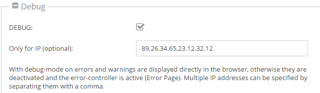
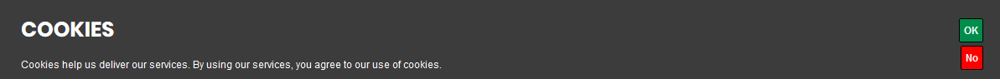
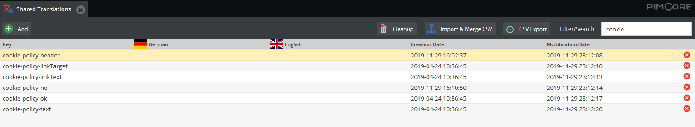

# System Settings

In system settings (*Settings* > *System Settings*) system wide settings for Pimcore can be made. Changes should 
be made with care and only by developers. 
These settings are saved in `var/config/system.yml`. 


## General 
Contains general settings about timezone, view suffix, additional path variables, default langauge, user interface etc.

 
## Localization & Internationalization (i18n/l10n) 
This settings are used in documents to specify the content language (in properties tab), for objects in localized-fields, 
for shared translations, ... simply everywhere the editor can choose or use a language for the content.
Fallback languages are currently used in object's localized fields and shared translations.

## Debug

Several debugging settings for Pimcore, like Debug Mode and Application Logger settings.

Please note that the core logger (log levels, files, ...) can now directly be configured via Symfony's Monolog configuration.
For details see:

* [Symfony Logging](https://symfony.com/doc/3.4/logging.html#handlers-writing-logs-to-different-locations)
* [Logging](../19_Development_Tools_and_Details/07_Logging.md) 

### Debug Mode
The Debug Mode is useful if you're developing an application with Pimcore.

With debug-mode on, errors and warnings are displayed directly in the browser, otherwise they are deactivated and the 
error-controller is active (Error Page).

You can restrict the debug mode to an (or multiple) IP address(es), so that it is only active for requests from a 
specific remote address.

In order to include some specific debugging tools (profiler, toolbar, ...), Pimcore implicitly sets the 
environment to `dev` when enabling the debug mode and if **no** environment is 
[defined manually by using an environment variable](../21_Deployment/03_Multi_Environment.md). 



If you are using `Pimcore\Mail` to send emails and the Debug Mode is enabled, all emails will be sent to the debug email 
receivers defined in *Settings* > *System Settings* > *Email Settings* > *Debug email addresses*. In addition a debug 
information is attached to the email which shows you to who the email would be sent if the debug mode is disabled.

To check anywhere in your own code if you are working in debug-mode, you can make use of the `PIMCORE_DEBUG` constant.

### DEV-Mode
The development mode enables some debugging features. This is useful if you're developing on the core of Pimcore or when 
creating a bundle. Please don't activate it in production systems!

What exactly does the dev mode:
* Loading the source javascript files (uncompressed & commented)
* Disables some caches (Webservice Cache, ...)
* extensive logging into log files
* ... and some more little things


## E-Mail Settings
Settings for default values of Mails sent via `Pimcore\Mail`. 


## Website
System settings about the CMS part of Pimcore.

### EU Cookie Policy Notice
Pimcore has a default implementation for EU cookie policy that looks like as follows. When the buttons are pressed the hint disappears. In the case of the OK button a reminder in the localStorage (pc-cookie-accepted = true) is set and the notice won't be displayed again. If you want to set any tracking cookies when the terms are accepted you need to customize the template as described further down.




You can specify your own texts and add your custom detail link using the "Shared Translations".
Just search for "cookie-" in Shared Translations, then you get listed the predefined keys for the cookie 
texts and links:



##### Use a Custom Template Code

You can customize the cookie notice via controller:

```php
<?php
$cookieListener = $this->get(\Pimcore\Bundle\CoreBundle\EventListener\Frontend\CookiePolicyNoticeListener::class);
$cookieListener->setTemplateCode("<b>Your Custom Template</b> ...");
// or use loadTemplateFromResource
$cookieListener->setCode("console.log('pimcore rocks')");
// or loadCodeFromResource
```

You can also customize the template by dependency injection. Add to your `services.yml`:

```yaml
    Pimcore\Bundle\CoreBundle\EventListener\Frontend\CookiePolicyNoticeListener:
        calls:
            - [loadTemplateFromResource, ['@@AppBundle/Resources/misc/cookieTemplate.html.php']]
            - [loadCodeFromResource, ['@@AppBundle/Resources/misc/cookie-policy-custom-code.js']]
            - [setTranslator, ['@translator']]
        tags:
            - { name: kernel.event_listener, event: kernel.response, method: onKernelResponse }
```
You can use the default [template](https://github.com/pimcore/pimcore/blob/master/bundles/CoreBundle/Resources/misc/cookie-policy-default-template.html) and [code](https://github.com/pimcore/pimcore/blob/master/bundles/CoreBundle/Resources/misc/cookie-policy-default-code.js) as a starting point. It is important, that the javascript file keeps the `var code = templateCodePlaceholder;` and `document.body.insertAdjacentHTML("beforeend", code);` construct, since the template code is injected into the javascript and replaces the string "templateCodePlaceholder" (Don't put templateCodePlaceholder in quotation marks). If you need to set any tracking cookies the on click listeners are a good place to call your init-script.\
e.g. Matomo/Piwik:
```javascript
    document.getElementById("pc-accept").onclick = function() {
        document.getElementById("pc-cookie-notice").style.display = "none";
        ls.setItem("pc-cookie-accepted", "true");
        //activate tracking
        _paq.push(['rememberConsentGiven'])
    };
```

If you want to do even further customization you can extend the CookiePolicyNoticeListener class and override some functions like `getTranslations()` to fetch different/more keys from "Shared Translations". You need to disable the regular CookiePolicyNoticeListener and inject your own in the `services.yml`

```yaml
Pimcore\Bundle\CoreBundle\EventListener\Frontend\CookiePolicyNoticeListener:
        calls:
            - [disable]   
                
    AppBundle\DependencyInjection\SuperWeirdCookieMonsterListener:
        calls:
            - [loadTemplateFromResource, ['@@AppBundle/Resources/misc/cookieTemplate.html.php']]
            - [loadCodeFromResource, ['@@PimcoreCoreBundle/Resources/misc/cookie-policy-default-code.js']]
            - [setTranslator, ['@translator']]
        tags:
            - { name: kernel.event_listener, event: kernel.response, method: onKernelResponse }
```
## Documents
Settings for documents like version steps, default values and URL settings. 


## Objects
Version steps for objects. 


## Assets 
Settings for assets like version steps, default color profiles for thumbnail processing and display settings.


## Google Credentials & API Keys
Google API Credentials (Service Account Client ID for Analytics, ...) is required for the Google API integrations. 
Only use a *Service Account* from the Google Cloud Console.

Google API Key (Simple API Access for CSE, ...) is e.g. required for correct display of geo data types in Pimcore ojbects. 
 
 
## Ouput-Cache
Settings for Pimcore [output cache](../19_Development_Tools_and_Details/09_Cache/README.md).


## Outputfilters
Settings for default output filters shipped with Pimcore. 


## Web Service API
Settings fpr Pimcore web service API. 


## HTTP Connectivity (direct, proxy, ...)
Settings for outbound HTTP connectivity of Pimcore - needed e.g. for Pimcore Updates or custom code using HTTP-Clients. 
 
 
## Newsletter
Possibility for configuring different newsletter delivery settings from the default e-mail settings.
 
 
