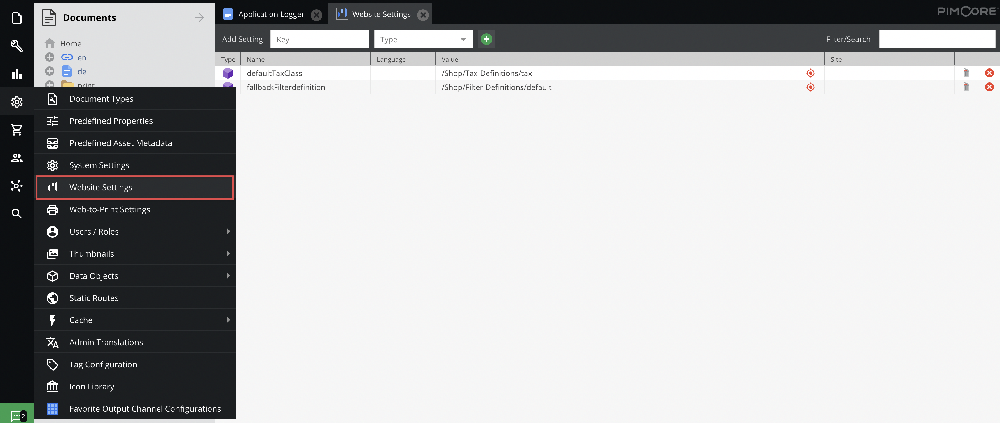

# Website Settings

The `Website Settings` give you the possibility to configure website-specific settings, which you can 
access in every controller and view.

Examples:

* ReCAPTCHA public & private key
* Locale settings
* Google Maps API key
* Defaults
* ....

### Access the Settings

In controllers and views, you can use view helpers or argument resolves to access the config. If you're not in a view or
controller you can use `Pimcore\Tool\Frontend::getWebsiteConfig();` to retrieve the configuration.

The returned configuration is a `Pimcore\Config\Config` object containing your settings.


### Example Configuration


Usage in a template:

<div class="code-section">

```php 
<?php
// access the whole configuration
$this->websiteConfig();

// or only a single value
$this->websiteConfig('googleMapsKey');

// you can pass a default value in case the value is not configured
$this->websiteConfig('googleMapsKey', 'NOT SET');
?>
```

```twig
{# access the whole configuration #}
{{ pimcore_website_config() }}

{# or only a single value #}
{{ pimcore_website_config('googleMapsKey') }}

{# you can pass a default value in case the value is not configured #}
{{ pimcore_website_config('googleMapsKey', 'NOT SET') }}
```

</div>

Usage in a controller:

```php
<?php
class TestController
{
    public function testAction(\Pimcore\Config\Config $websiteConfig)
    {
        $recaptchaKeyPublic = $websiteConfig->get('recaptchaPublic');
    }    
}
```

### Manipulate the values in a Controller

If you want to change the value of a website setting from your PHP script, for example from a controller, you can use this code.

```php
<?php
class TestController
{
    public function testAction()
    {
        $somesetting = \Pimcore\Model\WebsiteSetting::getByName('somenumber');
        $currentnumber = $somesetting->getData();
        //Now do something with the data or set new data
        //Count up in this case
        $newnumber = $currentnumber + 1;
        $somesetting->setData($newnumber);
        $somesetting->save();
    }
}
```
