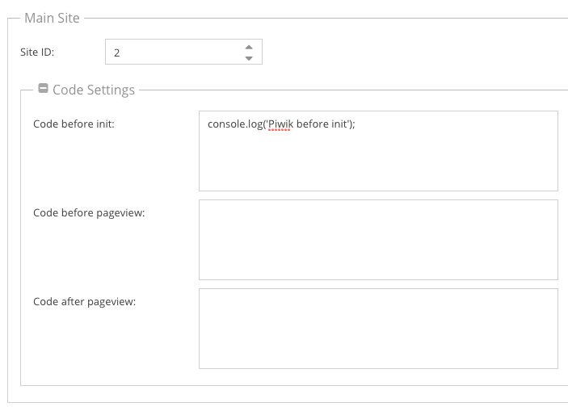
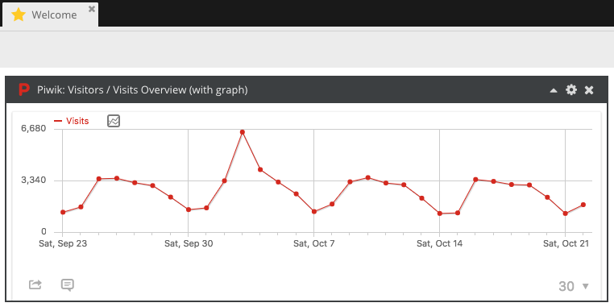
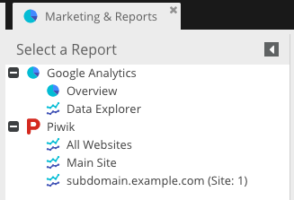
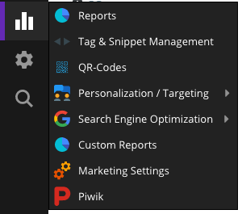

# Piwik

Similar to Google Analytics, a Piwik tracking code can be automatically injected into each response. For a basic tracking
integration you need to know the following:

* The URL to the Piwik installation you want to use
* The Piwik Site ID where you want to track your site

Similar to Google Analytics, you can configure the Site ID and optional code snippets which should be added to the tracking
code on a per-site level. All settings can be configured in the Piwik tab of the Marketing Settings panel.




## Integrating Piwik into the Admin UI

Piwik reports can be integrated into the Admin UI at several places like the dashboard, the reports panel or as full iframe
integration of the whole Piwik app. To make those features available, you need to configure a **Report Token** in the
*Authentication Tokens* Section of the settings tab. This report token will be used for authentication when integrating
report iframes.

Please see the [Piwik FAQ](https://piwik.org/faq/general/faq_114/) on how to retrieve your API token.

As soon as this token is configured, you can use Piwik's wigets in the Dashboard and the Reports panel:




**Important:** It is recommended to create a dedicated reporting user with **view only** permissions and to use this token
as report token. As the token acts like a password and can be extracted from the iframe URL, users could potentially use 
this token to change Piwik settings.


### Iframe Integration

Additionally you can integrate the whole Piwik app as iframe by using Piwik's [logme()](https://piwik.org/faq/how-to/#faq_30)
functionality. To use this integration, you need to configure the Piwik username to access to iframe and the **MD5 hash**
of its password (not the plain text password itself!). Similar to the report token, you should use a user with **view only**
permissions here. 

After the iframe integration is configured, you'll find a new menu entry in the marketing menu:




## Customizing the tracking code

If you want to influence the generated tracking code, you have multiple possibilities to do so. The tracker code is divided
into multiple code blocks which can be expanded and altered individually. As reference, please see:

* the definition of available blocks in the [Tracker implementation](https://github.com/pimcore/pimcore/blob/master/pimcore/lib/Pimcore/Analytics/Piwik/Tracker.php#L63)
* the [template](https://github.com/pimcore/pimcore/blob/master/pimcore/lib/Pimcore/Bundle/CoreBundle/Resources/views/Analytics/Tracking/Piwik/trackingCode.html.twig)
  which defines where the content of each blocks is rendered

### Adding code to a block

The central part of the Piwik tracking is the `Pimcore\Analytics\Piwik\Tracker` class which is defined as service and which
provides a `addCodePart()` method which allows you to add custom code snippets to a specific block:

```php
<?php

namespace AppBundle\Controller;

use Pimcore\Analytics\Piwik\Tracker;
use Pimcore\Analytics\SiteId\SiteId;

class ContentController
{
    public function defaultAction(Tracker $tracker)
    {
        // append a part to the default block
        $tracker->addCodePart('console.log("foo");');
        
        // append a part to a specific block
        $tracker->addCodePart('console.log("foo");', Tracker::BLOCK_BEFORE_TRACK);
        
        // prepend a part to a specific block
        $tracker->addCodePart('console.log("foo");', Tracker::BLOCK_TRACK, true);
        
        // you can also add the code only for a specific site
        // if you want to do so, you need to pass a SiteId object which identifies a tracking site
        $tracker->addCodePart('console.log("foo");', Tracker::BLOCK_TRACK, true, SiteId::forMainDomain());
    }
}
``` 

### Influencing generated code through the `CODE_TRACKING_DATA` event

Before the tracking code is generated, the `PiwikEvents::CODE_TRACKING_DATA` event is dispatched which gives you full control
over the generated code:

```php
<?php

namespace AppBundle\EventListener;

use Pimcore\Analytics\Piwik\Event\TrackingDataEvent;
use Pimcore\Analytics\Piwik\Tracker;
use Pimcore\Event\Analytics\PiwikEvents;
use Symfony\Component\EventDispatcher\EventSubscriberInterface;

class PiwikTrackingCodeListener implements EventSubscriberInterface
{
    public static function getSubscribedEvents()
    {
        return [
            PiwikEvents::CODE_TRACKING_DATA => 'onTrackingData'
        ];
    }

    public function onTrackingData(TrackingDataEvent $event)
    {
        // append data to a block
        $event->getBlock(Tracker::BLOCK_TRACK)->append([
            'console.log("foo");'
        ]);

        // completely empty the track section
        $event->getBlock(Tracker::BLOCK_TRACK)->setParts([]);

        // the data array is the data which will be passed to the template
        $data = $event->getData();
        $data['foo'] = 'bar';
        $event->setData($data);

        // you can also completely replace the rendered template
        $event->setTemplate('@App/Analytics/Tracking/Piwik/trackingCode.html.twig');
    }
}
```

### Overriding the rendered template

As you can see in the sample event listener above, you can change the template which will be used for the tracking code.
If you set a custom template, you can extend the core one and just override the blocks you want:

```twig
{# src/AppBundle/Resources/views/Analytics/Tracking/Piwik/trackingCode.html.twig #}



    {{ parent() }}

    console.log('hello world');



    {{ parent() }}

    <script type="text/javascript">
        console.log('foo bar!');
    </script>

```
