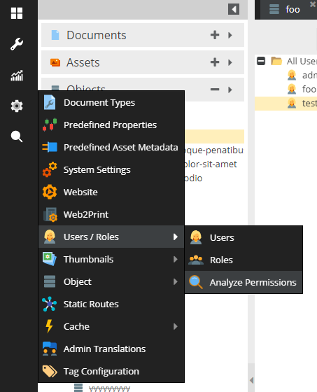
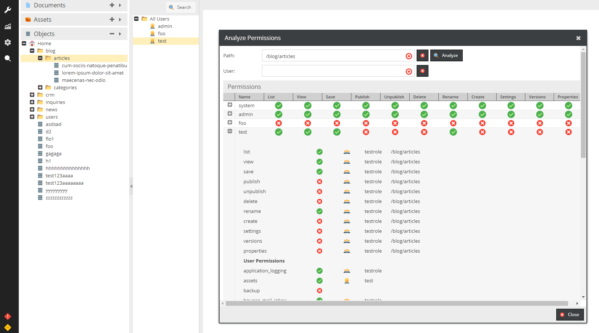

# Permission Analyzer

Allows you to drop an element (plus optionally a user) and display the calculated workspace permissions.
If no user is specified this is done for all users.
In addition, the general user permissions can be displayed.

When you expand a result row you will see a detailed overview which tells you which rule (path, user or role and which one) 
has been applied.

How to launch it:

How it looks like:

