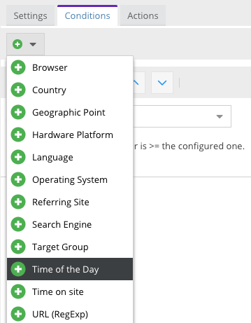

# Conditions

Conditions are logical blocks which can be combined with other conditions inside a target rule. A condition is expected
to implement `match()` method which always returns a boolean.

To implement a condition, you need to implement 2 parts:

* A PHP class implementing the [`ConditionInterface`](https://github.com/pimcore/pimcore/blob/master/lib/Targeting/Condition/ConditionInterface.php).
  Have a look at [existing implementations](https://github.com/pimcore/pimcore/tree/master/pimcore/lib/Pimcore/Targeting/Condition)
  to get an idea how to implement your own conditions.
* A frontend JS class defining the admin UI for your condition. You can have a look at [Pimcore's core conditions](https://github.com/pimcore/pimcore/blob/master/bundles/AdminBundle/Resources/public/js/pimcore/settings/targeting/conditions.js)
  for UI examples and at the [Customer Management Framework](https://github.com/pimcore/customer-data-framework/blob/master/src/Resources/public/js/pimcore/targeting/conditions.js)
  as example for a third-party integration.


## Implementing a Condition

As stated before, a condition needs to implement the [`ConditionInterface`](https://github.com/pimcore/pimcore/blob/master/lib/Targeting/Condition/ConditionInterface.php).
The most important method in the interface is the `match()` method which receives the current `VisitorInfo` instance and
is expected to return a boolean which indicates if the condition matches or not.

As an example let's build a condition which matches if the current time of the day is later than the configured one. E.g.
if configured to `15:00`, the condition would start to match at `15:00` until midnight.

Start by creating a condition class implementing the `ConditionInterface`. For simplicity's sake we just check the current
hour, not the full time.

```php
<?php

// src/AppBundle/Targeting/Condition/TimeOfTheDay.php

namespace AppBundle\Targeting\Condition;

use Pimcore\Targeting\Condition\ConditionInterface;
use Pimcore\Targeting\Model\VisitorInfo;

class TimeOfTheDay implements ConditionInterface
{
    /**
     * @var int|null
     */
    private $hour;

    public function __construct(int $hour = null)
    {
        $this->hour = $hour;
    }

    public static function fromConfig(array $config)
    {
        $hour = $config['hour'] ?? null;
        if (!empty($hour)) {
            $hour = (int)$hour;
        }

        // build an instance from the config as configured
        // in the admin UI
        return new self($hour);
    }

    public function canMatch(): bool
    {
        // basic validation if the condition is able to match
        return null !== $this->hour && $this->hour >= 0 && $this->hour <= 23;
    }

    public function match(VisitorInfo $visitorInfo): bool
    {
        $hour = (int)(new \DateTime())->format('H');

        return $hour >= $this->hour;
    }
}
```

After implementing your condition, you need to register it to the system with the following configuration. The identifier
`timeoftheday` will later be used from your JS implementation, so make sure you choose a unique name and to reuse the same
name when implementing the JS class.

```yaml
pimcore:
    targeting:
        conditions:
            timeoftheday: AppBundle\Targeting\Condition\TimeOfTheDay
```


### Building a Condition Instance

When an instance of your condition is build, by default the [`ConditionFactory`](https://github.com/pimcore/pimcore/blob/master/lib/Targeting/ConditionFactory.php)
will call the static `fromConfig()` method with the data configured in the admin UI. Avoid injecting any services or
custom data into your condition and use the data provider system instead to add data to the `VisitorInfo`. However, if
you need more control over how your condition is built you can either:

* overwrite the `ConditionFactory` service definition (not recommended) and implement your own logic instead of calling
  `fromConfig()`
* or handle the `TargetingEvents::BUILD_CONDITION` event and set an instance of your condition on the event. The `BuildConditionEvent`
  contains all the info you need to build a condition instance (type, class name, config data). If you set a condition on 
  the event via `setCondition`, the standard logic will be omitted and the event condition will be used.


## Condition Data

If your condition needs any outside data, implement the [`DataProviderDependentInterface`](https://github.com/pimcore/pimcore/blob/master/lib/Targeting/DataProviderDependentInterface.php)
and define a list of data provider keys which need to be set on the `VisitorInfo` before matching. We'll enhance our `TimeOfTheDay`
condition on the [Data Providers](./05_Data_Providers.md) chapter. For further examples, you can take a look at [existing core conditions](https://github.com/pimcore/pimcore/tree/master/pimcore/lib/Pimcore/Targeting/Condition).


## Condition Variables

An important part are [variable conditions](https://github.com/pimcore/pimcore/blob/master/lib/Targeting/Condition/VariableConditionInterface.php)
which support the `session_with_variables` rule matching scope. A condition implementing this interface is expected to return
an array of the variables which led to match the condition in the `getMatchedVariables()` method. This data will be used
to determine if the rule was already applied with the exact same data.

You should implement this interface whenever possible. To get started, you can use the [`AbstractVariableCondition`](https://github.com/pimcore/pimcore/blob/master/lib/Targeting/Condition/AbstractVariableCondition.php)
which contains helper methods to collect variable data. Make sure you build your data in a deterministic way (e.g. using 
the same order of keys in an array structure or the same format when serializing data) as a hash of this data is used to
compare it to previous evaluations in order to decide if a rule needs to be applied.

As example: the country condition sets the ISO country code which led to match as its data (based on GeoLocation). If a
rule is executed in the `session_with_variables` scope the the country condition is the only condition on that rule, it won't
be executed twice for the same resolved country.

Taking our `TimeOfTheDay` condition, it can easily be enhanced to store variables. The variable we'll store will be the 
resolved current hour.

```php
<?php

namespace AppBundle\Targeting\Condition;

use Pimcore\Targeting\Condition\AbstractVariableCondition;
use Pimcore\Targeting\Model\VisitorInfo;

class TimeOfTheDay extends AbstractVariableCondition
{
    // ...

    public function match(VisitorInfo $visitorInfo): bool
    {
        $hour = (int)(new \DateTime())->format('H');

        if ($hour >= $this->hour) {
            $this->setMatchedVariable('hour', $hour);

            return true;
        }

        return false;
    }
}
```

## Admin UI

To make your condition configurable, you need to create a JS class defining the admin interface for your condition. To do
so, create a class extending `pimcore.settings.targeting.condition.abstract` and register it to the system by calling
`pimcore.settings.targeting.conditions.register()`. 

Have a look at [Pimcore's core conditions](https://github.com/pimcore/pimcore/blob/master/web/bundles/pimcoreadmin/js/pimcore/settings/targeting/conditions.js)
and the [Customer Management Framework](https://github.com/pimcore/customer-data-framework/blob/master/src/Resources/public/js/pimcore/targeting/conditions.js)
for examples.

Start by adding a new JS file implementing the admin UI panel for your condition:

```javascript
// src/AppBundle/Resources/public/js/targeting/conditions.js

(function () {
    'use strict';

    pimcore.settings.targeting.conditions.register(
        'timeoftheday',
        Class.create(pimcore.settings.targeting.condition.abstract, {
            getName: function () {
                return 'Time of the Day';
            },

            getPanel: function (panel, data) {
                var id = Ext.id();

                var storeData = [];
                for (var i = 0; i < 24; i++) {
                    storeData.push([i, i]);
                }

                return new Ext.form.FormPanel({
                    id: id,
                    forceLayout: true,
                    style: 'margin: 10px 0 0 0',
                    bodyStyle: 'padding: 10px 30px 10px 30px; min-height:40px;',
                    tbar: pimcore.settings.targeting.conditions.getTopBar(this, id, panel, data),
                    items: [
                        {
                            name: 'hour',
                            fieldLabel: 'Hour',
                            xtype: 'combo',
                            store: storeData,
                            mode: 'local',
                            width: 300,
                            value: ('undefined' !== typeof data.hour) ? data.hour : 0,
                            editable: false,
                            triggerAction: 'all'
                        },
                        {
                            xtype: 'displayfield',
                            hideLabel: true,
                            value: 'Matches if the current hour is >= the configured one.',
                            cls: 'pimcore_extra_label'
                        },
                        {
                            xtype: 'hidden',
                            name: 'type',
                            value: 'timeoftheday' // the identifier chosen before when registering the PHP class
                        }
                    ]
                });
            }
        })
    );
}());
```

As soon as you [configured Pimcore to load the newly created file](../../20_Extending_Pimcore/13_Bundle_Developers_Guide/13_Loading_Admin_UI_Assets.md)
you should see your new condition in the list of available conditions:


