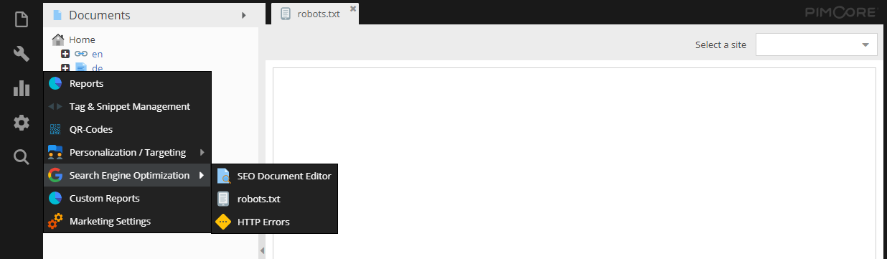

# Robots.txt

Robots.txt files can be generated on a per-site basis.



By default, if a `robots.txt` file is not configured for a given site, the following is generated upon robots.txt being requested:

```
User-agent: *
Disallow:
```

Alternatively, you can still manually create a `robots.txt` file by putting them into the document root, this will 
override all robots.txt settings made within the Pimcore admin interface. 