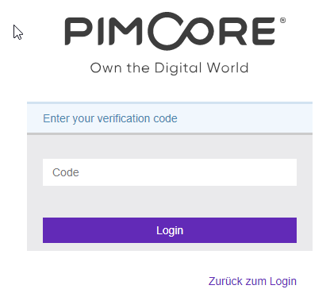

# Two Factor Authentication

since build 256

Pimcore has an integrated two factor authentication using the Google Authenticator ([Android](https://play.google.com/store/apps/details?id=com.google.android.apps.authenticator2), [iOS](https://itunes.apple.com/at/app/google-authenticator/id388497605))

## Setup
You can enable it in the profile settings menu
 
**(Settings -> My Profile)**

After enabling it a secret will be generated and you can setup your Google Authenticator App.
**Please be aware if you don't setup the App properly you will loose access to your account!**


 

After reloading you will be prompt to enter the Verification code for the first time.


 
 
## Config
If you want to change the default name / description that is displayed in the app you can do this by overwriting the following config:
 

```yaml
 scheb_two_factor:
     google:
         server_name: Pimcore                                # Server name used in QR code
         issuer: Pimcore 2 Factor Authentication             # Issuer name used in QR code
```