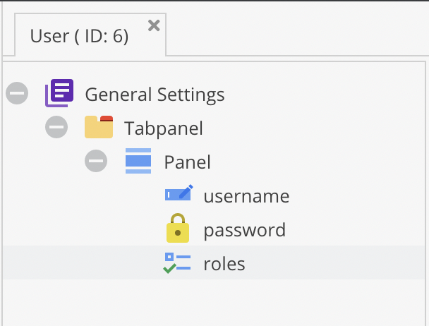

# Authenticate against Pimcore Objects

As Symfony's security component is quite complex, Pimcore provides base implementations to facilitate integrating the security
configuration with users stored as Pimcore objects.

As example, assume we have a user object which is defined in a `AppBundle\Model\Object\User` class and stores its password
in a field named `password` (field type `Password`). The password field is configured to use the `password_hash` algorithm
which is the standard way to handle passwords in PHP these days (internally it uses bcrypt). The class definition looks
like this (you can find a working example in the `demo-cms` install profile):



As a user object needs to implement the `UserInterface` provided by Symfony, we override the generated class and implement
the remaining methods which are not implemented by field getters:

```php
<?php
// src/AppBundle/Model/Object/User.php

namespace AppBundle\Model\Object;

use Pimcore\Model\Object\ClassDefinition\Data\Password;
use Pimcore\Model\Object\User as BaseUser;
use Symfony\Component\Security\Core\User\UserInterface;

/**
 * Our custom user class implementing Symfony's UserInterface.
 */
class User extends BaseUser implements UserInterface
{
    /**
     * @inheritDoc
     */
    public function getSalt()
    {
        // user has no salt as we use password_hash
        // which handles the salt by itself
        return null;
    }

    /**
     * Trigger the hash calculation to remove the plain text password from the instance. This
     * is necessary to make sure no plain text passwords are serialized.
     *
     * @inheritDoc
     */
    public function eraseCredentials()
    {
        /** @var Password $field */
        $field = $this->getClass()->getFieldDefinition('password');
        $field->getDataForResource($this->getPassword(), $this);
    }
}
```

Next, we configure Pimcore to use our overridden class:

```yaml
# src/AppBundle/Resources/config/pimcore/config.yml
pimcore:
    models:
        class_overrides:
            'Pimcore\Model\Object\User': 'AppBundle\Model\Object\User'
```


## Loading users with a User Provider

A user provider is responsible for finding matching user objects for a given username. Pimcore ships an `ObjectUserProvider`
which loads users from a defined class type and searches the username for a configured property. In our case, we want to
load users from the `AppBundle\Model\Object\User` and query the `username` field. To be able to use our user class in the
security configuration, we define a user provider service which is configured to load our user implementation (make sure
your bundle is able to load service definitions, see
[Loading Service Definitions](../../20_Extending_Pimcore/13_Bundle_Developers_Guide/01_Loading_Service_Definitions.md)):

```yaml
# src/AppBundle/Resources/config/services.yml
services:
    # The user provider loads users by Username.
    # Pimcore provides a simple ObjectUserProvider which is able to load users from a specified class by a configured
    # field. The website_demo.security.user_provider will load users from the AppBundle\Model\Object\User by looking at
    # their username field.
    website_demo.security.user_provider:
        class: Pimcore\Security\User\ObjectUserProvider
        arguments: ['AppBundle\Model\Object\User', 'username']
```

We'll use this service later in our security configuration to tell the firewall where to load its users from. For details
have a look at `ObjectUserProvider` which is basically calling `User::getByUsername($username, 1)` internally. If you have
more complex use cases you can extend the `ObjectUserProvider` or ship your completely custom implementation.

For more information see [How to Create a custom User Provider](http://symfony.com/doc/current/security/custom_provider.html)
on the Symfony docs.


## Password encoding

The standard approach of hashing and verifying a user's password in Symfony is to delegate the logic to to a `PasswordEncoderInterface`
which is responsible for calculating and verifying password hashes. As Pimcore's `Password` field definition already provides
this logic, the password encoder needs to be configured to delegate the logic to the user object.

Symfony builds and caches one encoder instance per user type (class). To be able to delegate the calculation to the user
object it is necessary to build an encoder instance which is scoped to the user object and can access the user's properties
at runtime. Pimcore adds this as additional layer of configuration which allows to specify an encoder factory per user
type which in turn can decide if it needs to build dedicated instances of encoders per user.

To be able to integrate our user object, we need 2 integration points:

* A `PasswordFieldEncoder` which has access to the user instance and delegates calculation and verification of the password
  hash to the password field definition. The encoder needs to be configured with the name of the field it should operate 
  on (`password` in our case).
* A `UserAwareEncoderFactory` which builds a dedicated instance of a `PasswordFieldEncoder` per user object.

To achieve this, we define a factory service which builds `PasswordFieldEncoder` instances as specified above:

```yaml
# The encoder factory is responsible for verifying the password hash for a given user. As we need some special
# handling to be able to work with the password field, we use the UserAwareEncoderFactory to buiild a dedicated
# encoder per user. This service is configured in pimcore.security.encoder_factories to handle our user model.
services:
    website_demo.security.password_encoder_factory:
        class: Pimcore\Security\Encoder\Factory\UserAwareEncoderFactory
        arguments:
            - Pimcore\Security\Encoder\PasswordFieldEncoder
            - ['password']
```

Now, instead of configuring the encoder in `security.encoders` as it is the standard Symfony way, configure your encoder
factory service instead in `pimcore.security.encoder_factories`. This is just an additional way of building encoders - if 
you don't need any user specific handling, just stick to the standard Symfony way.

```yaml
pimcore:
    security:
        # the encoder factory as defined in services.yml
        encoder_factories:
            AppBundle\Model\Object\User: website_demo.security.password_encoder_factory
```

When an encoder is loaded for a `AppBundle\Model\Object\User` object, the UserAwareEncoderFactory will build a dedicated
instance of `PasswordFieldEncoder` instead of always returning the same instance for all users.


## Configuring the firewall

As all our needed services are in place, we can start to use them from the firewall configuration. As an example, let's 
configure a simple firewall which authenticates via HTTP basic auth. Our final configuration looks like the following:

```yaml
pimcore:
    security:
        # the encoder factory as defined in services.yml
        encoder_factories:
            AppBundle\Model\Object\User: website_demo.security.password_encoder_factory

security:
    providers:
        # the user provider as defined in services.yml
        demo_cms_provider:
            id: website_demo.security.user_provider

    firewalls:
        # demo_cms firewall is valid for the whole site
        demo_cms_fw:
            # the provider defined above
            provider: demo_cms_provider
            http_basic: ~
```

This should get you started with a custom authentication system based on Pimcore objects. For further information see:

* The [Demo CMS profile](https://github.com/pimcore/pimcore/blob/master/install-profiles/demo-cms) which acts as base for
  this guide and implements a form/session login.
* The [Symfony Security Component documentation](http://symfony.com/doc/current/security.html)
