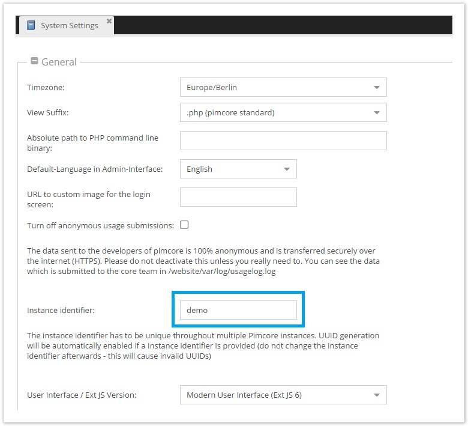

# UUID Support
Pimcore provides a toolkit for UUID-support. To activate the UUID-support, an instance identifier 
has to be set in *Settings* > *System* > *General*:



Once set, Pimcore automatically creates an UUID for each newly created document, asset and object. 
With the class `Tool\UUID` you have access to the UUIDs as follows:

```php
use Pimcore\Model\Tool;
  
//get UUID for given element (document, asset, object)
$uuid = Tool\UUID::getByItem($document);
 
//get element for given UUID
$document = Tool\UUID::getByUuid($uuid);
 
//create and save uuid for given element
$uuid = Tool\UUID::create($document);
```

