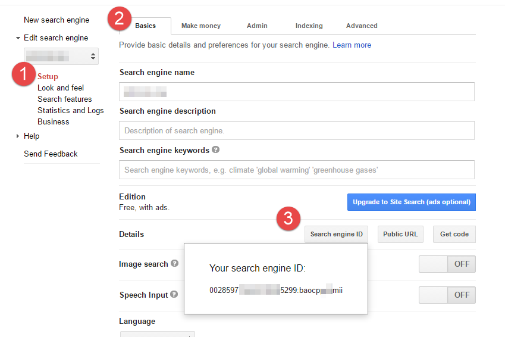
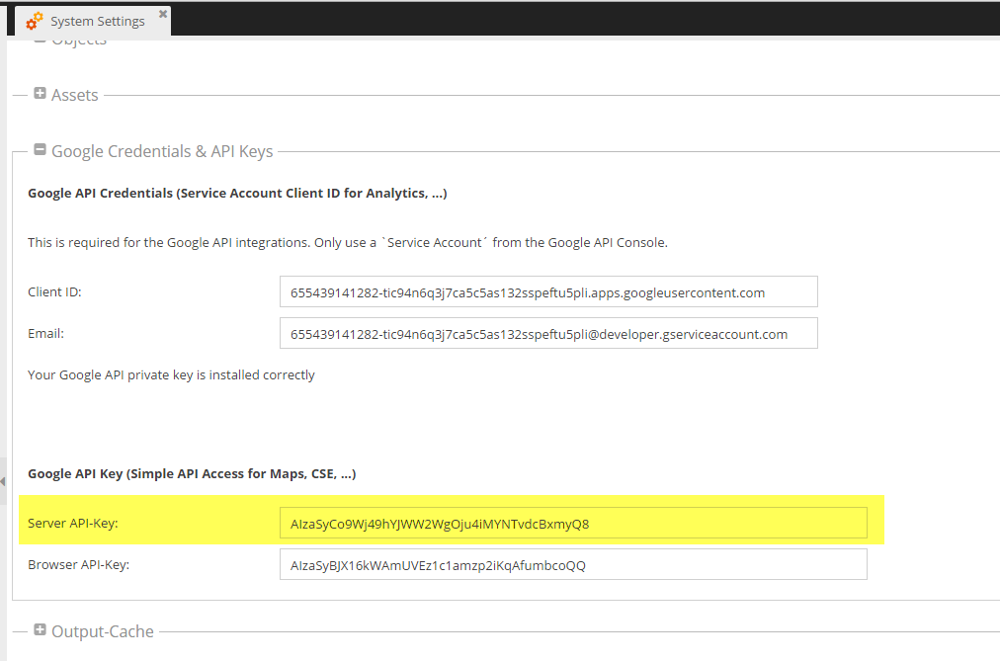

# Google Custom Search Engine (Site Search ~ CSE) Integration

## Introduction
Pimcore provides a simple interface to the Google Custom Search Engine (Site Search) which 
makes it easy to integrate a search engine into your website. 

[Further information about Google CSE/Site Search](http://www.google.com/cse/)

## Setup in CSE Control Panel and Google API Console
* Create and configure a new search engine at [http://www.google.com/cse/](http://www.google.com/cse/) - 
for more information please visit: [http://support.google.com/customsearch/](http://support.google.com/customsearch/) .
* Test your search engine first using the preview on the right hand side. 
* If your results are as expected, go back to "Setup" (-> left navigation) and note the search engine ID 
- You'll need it later in the code (parameter 'cx'  in configuration): 



* Once you are finished go to [https://console.developers.google.com/](https://console.developers.google.com/) 
create a new project, then search for `Custom Search API` and click on `Enable`.
`Custom Search API` should now be listed under `Enabled APIs` in your project overview.
* To get the necessary access keys, click on: `Credentials` -> `Create credentials` -> `API key` -> `Server key`
Complete the setup as described and note the server API key.


## Pimcore Setup
So now we got the search engine ID and a server API key which we need to finish the 
configuration in Pimcore. 

### Server API Key
Open the system settings in Pimcore and paste the API key into the marked field below and 
save. 



### Search engine ID
The search engine ID is used in your controller/action to configure the search service: 
`\Pimcore\Google\Cse::search()`.

The place of interest (parameter cx) is marked with a comment in the code example below.
 

### Code Example

#### Controller Action
```php

public function cseAction() {
 
    $this->enableLayout();
 
    if($this->_getParam("q")) {
        try {
            $page = $this->_getParam('page');
                    if(empty($page)) {
                $page = 1;
            }
            $perPage = 10;
 
            $result = \Pimcore\Google\Cse::search($this->_getParam("q"), (($page-1) * $perPage), null, [
                "cx" => "00285971xxxx30885299:baoxxxx9mii" // Search engine ID
            ], $this->_getParam("facet"));
 
            $paginator = \Zend_Paginator::factory($result);
            $paginator->setCurrentPageNumber($page);
            $paginator->setItemCountPerPage($perPage);
            $this->view->paginator = $paginator;
            $this->view->result = $result;
        } catch(Exception $e) {
            // something went wrong: eg. limit exceeded, wrong configuration, ...
            Logger::err($e);
        }
    }
}
```

#### View
```php

<div>
 
    <form action="" method="get">
        <input name="q" type="text" value="<?= htmlentities($this->getParam("q"), ENT_QUOTES) ?>" />
        <input name="submit" type="submit" value="Search" />
    </form>
 
 
    <?php if ($this->paginator) { ?>
 
 
    <?php $facets = $this->result->getFacets(); ?>
    <?php if(!empty($facets)) { ?>
        <div>
            Facets:
            <?php foreach ($facets as $label => $anchor) { ?>
                <a href="<?= $this->url(['facet' => $label, "page" => null]); ?>"><?= $anchor ?></a>
            <?php } ?>
        </div>
    <?php } ?>
 
 
        <?php foreach ($this->paginator as $item) { ?>
            <!-- see class Pimcore\Google\Cse\Item for all possible properties -->
            <div style="<?php if($item->getType() == "promotion") { ?>background:green;<?php } ?>">
                <?php if($item->getImage()) { ?>
                    <!-- if an image is present this can be simply a string or an internal asset object -->
                    <div>
                        <?php if($item->getImage() instanceof Asset) { ?>
                            getImage()->getThumbnail("contentimages") ?>" />
                        <?php } else { ?>
                            getImage() ?>" />
                        <?php } ?>
                    </div>
                <?php } ?>
                <div>
                    <h2>
                        <a href="<?= $item->getLink() ?>">
                            <!-- wrap hardlinks -->
                            <?php
                            $doc = $item->getDocument();
                            if( $item->getDocument() instanceof \Pimcore\Model\Document\Hardlink ){
                                $doc = \Pimcore\Model\Document\Hardlink\Service::wrap($item->getDocument());
                            }
                            ?>
                            <!-- if there's a document set for this result use the original title without suffixes ... -->
                            <!-- the same can be done with the description and every other element relating to the document -->
                            <?php if($doc && $doc->getTitle()) { ?>
                                <?= $doc->getTitle() ?>
                            <?php } else { ?>
                                <?= $item->getTitle() ?>
                            <?php } ?>
                        </a>
                    </h2>
                    <p>
                        <?= $item->getHtmlSnippet() ?>
                    </p>
                    <small><?= $item->getHtmlFormattedUrl(); ?></small>
                </div>
                <span></span>
            </div>
        <?php } ?>
        <?= $this->paginationControl($this->paginator, "Sliding", "includes/paging.php"); ?>
    <?php } else if ($this->getParam("q")) { ?>
        <div>
            Sorry, something seems to went wrong ...
        </div>
    <?php } else { ?>
        <div>
            Type your keyword and press search
        </div>
    <?php } ?>
</div>
```

#### Partial View Script (includes/paging.php)
```php
<div class="pagination" style="width:100%">
    <div style="float:left;width:28%">
    </div>
    <div style="float:right;width:70%;">
        <!-- First page link -->
        <?php if (isset($this->previous)): ?>
              <a href="<?= $this->url(['page' => $this->first]); ?>">Start</a> |
        <?php else: ?>
                <span class="disabled">Start</span> |
        <?php endif; ?>
 
        <!-- Previous page link -->
 
        <?php if (isset($this->previous)): ?>
              <a href="<?= $this->url(['page' => $this->previous]); ?>" rel="prev">&lt; Previous</a> |
        <?php else: ?>
            <span class="disabled">&lt; Previous</span> |
        <?php endif; ?>
        <!-- Numbered page links -->
        <?php foreach ($this->pagesInRange as $page): ?>
            <?php if ($page != $this->current): ?>
                <a href="<?= $this->url(['page' => $page]); ?>"><?= $page; ?></a>
            <?php else: ?>
                <?= $page; ?>
            <?php endif; ?>
        <?php endforeach; ?>
        <!-- Next page link -->
        <?php if (isset($this->next)): ?>
              | <a href="<?= $this->url(['page' => $this->next]); ?>" rel="next">Next &gt;</a> |
        <?php else: ?>
            | <span class="disabled">Next &gt;</span> |
        <?php endif; ?>
        <!-- Last page link -->
        <?php if (isset($this->next)): ?>
              <a href="<?= $this->url(['page' => $this->last]); ?>">End</a>
        <?php else: ?>
            <span class="disabled">End</span>
        <?php endif; ?>
        &nbsp; Page <?= $this->current; ?> of <?= $this->last; ?>
    </div>
 </div>
```
