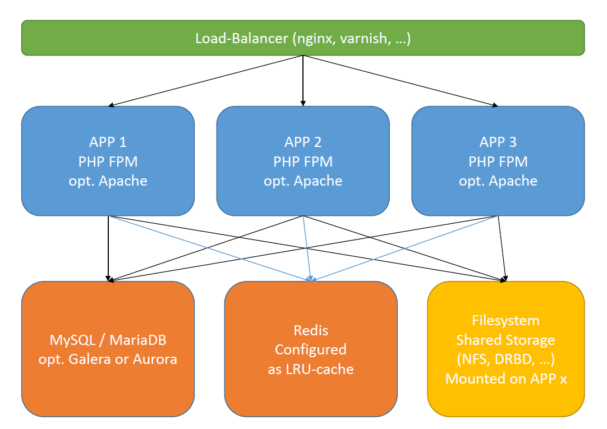

# Cluster Setup

A typical cluster setup has the following architecture: 

 

## Filesystem
It's absolutely necessary that the contents of `/web/var/` and `/var` are shared between all application servers.
Sharing has to be done using a real network filesystem (such as NFS) supporting locks and so on. 

**Do not use `rsync` or other nasty solutions to share the data between the application servers**. 

