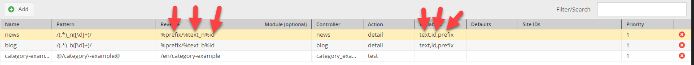

# Upgrade Notes for Pimcore 4 to Pimcore 5

## System Requirements
- PHP >= 7.0
- [intl](http://www.php.net/intl)

## Database
- Pimcore is now using [Doctrine DBAL](http://docs.doctrine-project.org/projects/doctrine-dbal/en/latest/). 
- `Zend_Db_Select` is still supported with compatibility layer. Following changes are necessary: 
  - If `$db->select()` was used to get `Zend_Db_Select` nothing has to be changed.
  - `new \Zend_Db_Select()` needs to be replaced with `new \Pimcore\Db\ZendCompatibility\QueryBuilder()`. 
  - `new \Zend_Db_Expr()` needs to be replaced `new \Pimcore\Db\ZendCompatibility\Expression()`. 
- `$db->describeTable()` not supported anymore.
- Signatures of `$db->update()` and `$this->delete()` where changed. 
  Use `$db->deleteWhere()` and `$db->updateWhere()` instead for same functionality.  
- If you experience the error "mysql server has gone away" consider using
  [this code snippet](https://gist.github.com/boekkooi/ff2ff146246d5ea20764)
- Needed SQL updates 
```sql 
ALTER TABLE `documents_page` ADD COLUMN `legacy` TINYINT(1) NULL AFTER `personas`;
ALTER TABLE `documents_snippet` ADD COLUMN `legacy` TINYINT(1) NULL AFTER `contentMasterDocumentId`;
ALTER TABLE `documents_newsletter` ADD COLUMN `legacy` TINYINT(1) NULL;
ALTER TABLE `documents_printpage` ADD COLUMN `legacy` TINYINT(1) NULL;
ALTER TABLE `documents_email` ADD COLUMN `legacy` TINYINT(1) NULL;
ALTER TABLE `translations_website` CHANGE COLUMN `key` `key` VARCHAR(190) NOT NULL DEFAULT '' COLLATE 'utf8mb4_bin';
ALTER TABLE `translations_admin` CHANGE COLUMN `key` `key` VARCHAR(190) NOT NULL DEFAULT '' COLLATE 'utf8mb4_bin'; 
```

## System Settings
- Pimcore php configuration files moved to following directories
   - `app/config/pimcore/` for files that are not editable within Pimcore admin interface. 
   - `var/config` for files that can be edited within Pimcore admin interface.
- Configuration for HTTP basic auth was removed. Please configure HTTP auth directly through your web server or use the
  [Security Configuration](../../19_Development_Tools_and_Details/10_Security_Authentication/README.md) to configure
  authentication.
- Reconfigure following things: 
  - Mail-Settings
  - HTTP Connectivity
  
## Website Config

- Website config settings are not available via `$this->config` in controllers and views anymore, but exposed through view
  a `websiteConfig()`/`pimcore_website_config()` view helper/Twig tag. In controllers, the website config can be requested
  as action argument by type hinting the argument with `\Pimcore\Config\Config $websiteConfig`. See
  [Website Settings](../../18_Tools_and_Features/27_Website_Settings.md) for details. 
  
## Objects were renamed to Data Objects
The introduction of object type hints in PHP 7.2 forced us to rename several namespaces to be compliant with the
[PHP 7 reserved words](http://php.net/manual/de/reserved.other-reserved-words.php).  
- Namespace `Pimcore\Model\Object` was renamed to `Pimcore\Model\DataObject`
    - PHP classes of Data Objects are now also in the format eg. `Pimcore\Model\DataObject\News`
- There's a compatibility autoloader which enables you to still use the former namespace (< PHP 7.2), but you should migrate asap. to the new namespaces.  
- [Object Placeholders](../../19_Development_Tools_and_Details/23_Placeholders/01_Object_Placeholder.md) syntax changed to `%DataObject()`  
  
## Cache
- Pimcore is now using a PSR-6 compatible cache. 
- The following backends are not supported any longer: 
   - MongoDB
   - Memcache 
- Pimcore uses a [different configuration](../../19_Development_Tools_and_Details/09_Cache/01_Custom_Cache_Pools.md) for the cache 
- The former get parameter `nocache` for disabling the entire cache for a certain request, was renamed to `pimcore_nocache`. 

## Model Overrides in `website/config/di.php`
`website/config/di.php` isn't supported anymore.
Custom class mappings / overrides are now configured in `app/config/config.yml`. 
Please have a look at [Overriding Models](../../20_Extending_Pimcore/03_Overriding_Models.md). 

## Logging
- PHP Errors are logged automatically to `/var/logs/ENV.log`
- Email logs, see: [http://symfony.com/doc/current/logging/monolog_email.html]
- Logging levels are specified in Symfony config
- `\Logger::log($message, $loglevel)` is not supported anymore

## Document Editables

- Areabricks have a new format and now depend on a brick class registered as service. For details see [Areabrick Documentation](../../03_Documents/01_Editables/02_Areablock/02_Bricks.md)
- Renderlet controllers do not recieve the `element`, `object`, and `document` parameters anymore (`document` is present,
  but references the content document the renderlet belongs to). To fetch the linked object, please use the `type` and 
  `id` parameters.
- Document editables now use a different naming format for nested editables. Please see the upgrade notes regarding build
  54 in the [upgrade within V5 upgrade notes](./01_Within_V5.md#page_Build_54_(2017-05-16)) documentation and add the
  configuration entry for the legacy naming to your config or execute the naming migration script. Details on the migration
  can be found in [Editable Naming Strategies](../../03_Documents/13_Editable_Naming_Strategies.md).
  
## Document Templates
- Set Layout only in view template possible and implemented with extend, details see [layout docs](../../02_MVC/02_Template/00_Layouts.md).
```php 
$this->extend('Appbundle::layout.html.php')
```
- Extend always bound to view template (cannot be switched on/off). As a result if a template 
that contains a `$this->extend` is included with `$this->template` into another template, 
that contains a `$this->extend` by itself, the layout is rendered twice


- `$this->template` needs echo to print included template
```php
echo $this->template("Appbundle:Snippets:standard-teaser.html.php", ["myparam" => "foo"]);
```
- When template is included with `$this->template` following parameter names cannot be used 
with `$this->parameterName` notation 
  - current
  - container
  - loader
  - helpers
  - parents
  - stach
  - charset
  - cache
  - escapers
  - globals
  - parser
  - evalTemplate
  - evalParameter

## Controller Plugins
- Replaced by Kernel Events

| Controller-Plugin | Service |
| ----------------- | ------- |
| `Pimcore\Controller\Plugin\Analytics` | `pimcore.event_listener.google_analytics_code` |
| `Pimcore\Controller\Plugin\Cache` | `pimcore.event_listener.full_page_cache` |
| `Pimcore\Controller\Plugin\EuCookieLawNotice ` | `pimcore.event_listener.cookie_policy_notice` |
| `Pimcore\Controller\Plugin\GoogleTagManager` | `pimcore.event_listener.google_tag_manager` |
| `Pimcore\Controller\Plugin\Maintenance` | `pimcore.event_listener.maintenance_page` |
| `Pimcore\Controller\Plugin\TagManagement` | `pimcore.event_listener.tag_manager` |
| `Pimcore\Controller\Plugin\Targeting` | `pimcore.event_listener.targeting` |
| `Pimcore\Controller\Plugin\Webmastertools` | `pimcore.event_listener.google_search_console_verification` |
| `Pimcore\Controller\Plugin\WysiwygAttributes` | `pimcore.event_listener.internal_wysiwyg_html_attribute_filter` |

- Replaced by Routes

| Controller-Plugin | Name |
| ----------------- | ---- |
| `Pimcore\Controller\Plugin\CommonFilesFilter` | `_pimcore_service_common_files` `_pimcore_service_common_files_apple_touch_icon` |
| `Pimcore\Controller\Plugin\HybridAuth` | `_pimcore_service_hybridauth` |
| `Pimcore\Controller\Plugin\QrCode` | `_pimcore_service_qrcode` |
| `Pimcore\Controller\Plugin\Thumbnail` | `_pimcore_service_thumbnail` |


## Translations (Shared + Admin) 
- Use of Standard Symfony Translation Component
- Supporting domains / bundles, ... 
- They are now case-sensitive
- Dot-separated fallback notation isn't supported anymore


## E-Mail
- `Pimcore\Mail` now extends `Swift_Message` instead of `Zend_Mail`
- The most common methods should be as they were, following method signature changes are significant:
  - `__construct($subject = null, $body = null, $contentType = null, $charset = null)`
  - `addAttachment(\Swift_Mime_Attachment $attachment)`
  - `createAttachment($data, $mimeType = null, $filename = null, $disposition = null)`
  - `send(\Swift_Mailer $mailer = null)` & `sendWithoutRendering(\Swift_Mailer $mailer = null)`
- check all usages of `Pimcore\Mail`


## Thumbnails
- PicturePolyfill isn't included automatically anymore when Pimcore uses the `<picture>` HTML-tag. 
Include it manually in your layout if you need IE support. 

## Custom Routes 
All parameters needed for assembly url (mentioned in reverse) must be listed in variables.



## Events
The Event Manager got replaced by Symfony framework event dispatcher. There is a compatibility 
layer for the Pimcore 4 event manager events though. Except the listed events below, you still could use the Pimcore 4 events. 

|Name | Replacement |
|-----|-------------|
| system.startup | Use the `AppKernel` class | 
| system.di.init | `Pimcore\Event\SystemEvents::PHP_DI_INIT` |
| system.maintenance.activate | `Pimcore\Event\SystemEvents::MAINTENANCE_MODE_ACTIVATE` | 
| system.maintenance.deactivate | `Pimcore\Event\SystemEvents::MAINTENANCE_MODE_DEACTIVATE` | 
| system.cache.clearOutputCache | `Pimcore\Event\SystemEvents::CACHE_CLEAR_FULLPAGE_CACHE` | 
| admin.controller.preInit | `Symfony\Component\HttpKernel\KernelEvents::CONTROLLER` | 
| admin.controller.postInit | `Symfony\Component\HttpKernel\KernelEvents::REPONSE` | 
| frontend.error | no replacement |
| frontend.controller.preInit| no replacement |
| frontend.controller.postInit| no replacement |

But it's recommended to use the new event constants instead. For details see [event docs](../../20_Extending_Pimcore/11_Event_API_and_Event_Manager.md).


## From Plugins to Bundles
- With Pimcore 5 Pimcore Plugins became default Symfony Bundles. See our [bundles docs](../../20_Extending_Pimcore/13_Bundle_Developers_Guide/README.md)
for more details. 

## Adding Object Data Types via Extensions
- Object Data and Layout Types are configured in `pimcore.objects.class_definitions.data.map` 
and `pimcore.objects.class_definitions.layout.map` in Symfony configuration files. 
- As fallback `namespace/name` matching are still available and 
configurable via `pimcore.objects.class_definitions.data.prefixes` and 
`pimcore.objects.class_definitions.layout.prefixes` 
- Plugins/Bundles can add new data types by adding their data types to the configuration 
  entries above


## Console Commands
- Console Commands need to be in the `Console` namespace and their class name needs to end with `Console`. See [Symfony Console Documentation](http://symfony.com/doc/current/console.html#creating-a-command).
- The function `$application->addAutoloadNamespace()` does not exist any more. 
- The `--environment` option was dropped as it is already existing as `--env` in all Symfony commands.
- For more details see [console docs](../../19_Development_Tools_and_Details/11_Console_CLI.md).
- The following commands were moved under a `pimcore:` prefix, but are still available as aliases under their old names.
  The aliases might be removed in later versions, so please use the new names.

| `maintenance` | `pimcore:maintenance` |
| `mysql-tools` | `pimcore:mysql-tools` |
| `reset-password` | `pimcore:user:reset-password` |
| `search-backend-reindex` | `pimcore:search-backend-reindex` |
| `update` | `pimcore:update` |

- `pimcore:user:reset-password` command has a new signature, now accepting the user as first argument instead of the `-u`
  option.
  
## Cron Jobs

Please check your Crontab, especially the maintenance command.

```text
*/5 * * * * /your/project/bin/console maintenance
```
Also double-check the [Installation Guide](../../01_Getting_Started/00_Installation.md).

## Zend Registry
- Replaced by `\Pimcore\Cache\Runtime`, interface compatible with `Zend_Registry`
```php
\Pimcore\Cache\Runtime // (interface compatible with Zend_Registry)
// or
$this->get(\Pimcore\Cache\Runtime::class) // service container
```


## Pimcore\Tool::getHttpClient()
- Is only available if [Compatibility Bridge](https://github.com/pimcore/pimcore4-compatibility-bridge) is available. 
- Now returns `GuzzleHttp\Client` instead of `Zend_Http_Client`. 
- New http client is also available on container with ID `pimcore.http_client` - should be used for new implementations.


## Sessions
- If you need sessions, please use the native session handling provided by Symfony 
   (configured through the `framework.session` config). For details see 
   [sessions docs](../../19_Development_Tools_and_Details/35_Working_with_Sessions.md).
- Pimcore adds the possibility to configure sessions before they are started through 
   `SessionConfiguratorInterface` registered as service with the 
   `pimcore.session.configurator` tag.
- Admin sessions `Pimcore\Tool\Session::get/getReadonly()` now return an 
  `AttributeBagInterface´ instead of a ´Zend_Session_Namespace`. Calls to the bag need 
  to be adapted as Symfony's bags do not support magic setters/getters as the 
  Zend namespace did.
- Admin sessions are not handled in a custom isolated session from the frontend session
  anymore. Previous versions used to close an opened frontend session when opening an admin
  session. This logic was removed in favor of simpler session logic in one configurable
  session setup.
- The session ID for the admin session (and for sessions in general) can't be set via GET parameter
  anymore. This was possbile in previous Pimcore versions to support Flash based file uploaders but
  was obsolete.

## International Number and Date Formatting
- Added a Service for international number and date formatting. For details see [docs page](../../06_Multi_Language_i18n/09_Formatting_Service.md).  


## Functionalities only available when using PimcoreLegacyBundle
- Legacy Underscore Naming Convention of old Pimcore class names like `Object_Abstract`, 
`Document_Page`, `Asset_Image`, ...


## Deprecated Constants
| Name | Equivalent |
| ---- | ---------- | 
| `PIMCORE_FRONTEND_MODULE` | `PIMCORE_SYMFONY_DEFAULT_BUNDLE` |
| `PIMCORE_PLUGINS_PATH` | - |
| `PIMCORE_WEBSITE_PATH` | `PIMCORE_APP_ROOT` |
| `PIMCORE_DOCUMENT_ROOT` | `PIMCORE_WEB_ROOT or PIMCORE_LEGACY_ROOT` |
| `PIMCORE_WEBSITE_VAR` | `PIMCORE_PRIVATE_VAR` |


## Removed Features and Services 

- ExtJs 3.4 Support: Support for ExtJS 3.4 has been finally removed as announced earlier. The current version in use is 
6.0.0. **Please double-check your extensions in advance!**  
- Object Key-Value Store: Use the Classification-Store instead.
- Whoops Error Handler: Got replaced by Symfony default error handler. 
- `startup.php` not supported anymore: Use `boot()` function in `AppKernel` or `AppBundle` instead
- Removed `Pimcore\Tool\XmlWriter` Service
- Removed `\Pimcore\File\Transfer*` Classes
- Controller Plugins
   - `\Pimcore\Controller\Plugin\CssCombine`
   - `\Pimcore\Controller\Plugin\CDN`
   - `\Pimcore\Controller\Plugin\Less`


## E-Commerce Framework

For migration of E-Commerce-Framework have a look at the [breaking changes section](./03_Ecommerce_Framework/README.md).

## Newsletter Source Adapter

Newsletter Source Adapter implementation has been changed to be able to register them using configuration. It is very easy to migrate your Adapter to Pimcore 5.
Since nothing really changed, you only need to create a factory service that creates your AddressSourceAdapter
 - If you are using a very simple Adapter Source, you can use the DefaultFactory
  ```yml
  app.document.newsletter.factory.myAdapter:
      class: Pimcore\Document\Newsletter\DefaultAddressSourceAdapterFactory
      arguments:
        - 'App\Document\Newsletter\AddressSourceAdapter\MyAdapter'
  ```
- If you are using a more complex Source Adapter, you can create your own Factory by implementing the interface Pimcore\Document\Newsletter\Factory\AddressSourceAdapterFactoryInterface
- Add your Adapter Factory to the configuration:

```yml
pimcore:
    newsletter:
        source_adapters:
            myAdapter: app.document.newsletter.factory.myAdapter
```

## Custom Report Adapter

Custom Report Adapter implementation has been changed to be able to register them using configuration. It is very easy to migrate your Adapter to Pimcore 5.
Since nothing really changed, you only need to create a factory service that creates your CustomReportAdapterInterface
 - If you are using a very simple Adapter Source, you can use the DefaultFactory
  ```yml
  app.custom_report.adapter.factory.custom:
      class: Pimcore\Model\Tool\CustomReport\Adapter\DefaultCustomReportAdapterFactory
      arguments:
        - 'App\CustomReport\Adapter\Custom'
  ```
- If you are using a more complex Adapter, you can create your own Factory by implementing the interface `Pimcore\Model\Tool\CustomReport\Adapter\CustomReportAdapterFactoryInterface`
- Add your Adapter Factory to the configuration:

```yml
pimcore:
    custom_report:
        adapters:
            myAdapter: app.custom_report.adapter.factory.custom

```
