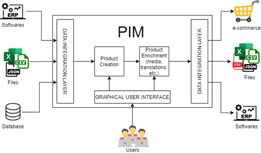
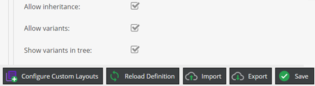
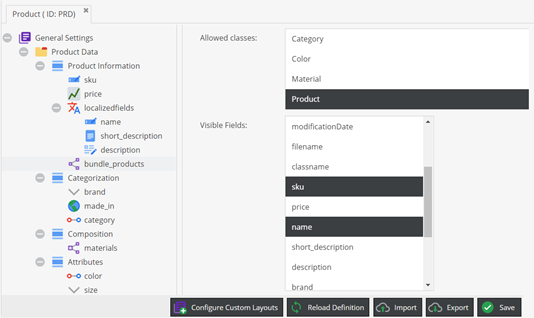
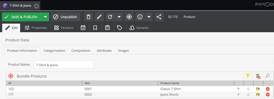
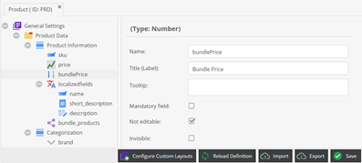
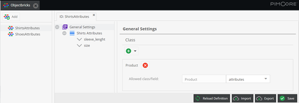
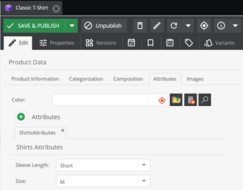
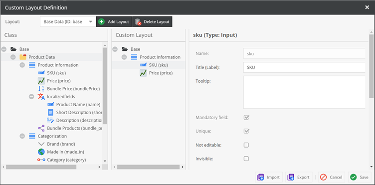
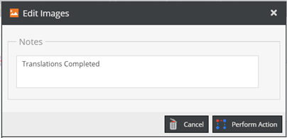

# Implementing Product Information Management

The concept of PIM encompasses a set of technologies and procedures that allow centralized management of product data and their distribution across different channels. In many common scenarios, information relating to products may come from multiple sources, potentially with different data structures, both due to different needs dictated by their distribution channels and through the provision of different technologies in distinct areas within the same company.

The use of a PIM allows you to integrate information from different sources into a single platform, organizing it coherently, with the possibility of redistributing this information in different ways to e-commerce platforms, websites, paper catalogs, and so on. It also allows complete and dynamic management of the product data, including customizing and filtering information related to different types of products, to manage prices and currencies, different units of measurement, multilingual translations, multimedia content, and much more.

The ability to centralize all this information in a single platform allows you to manage products completely independently of any distribution channel; the PIM will be responsible for sending only the information it needs to each channel. This centralized management gives consistency to product information, avoiding the need to replicate data in different platforms and keeping them aligned, reducing design errors. This also brings benefits in terms of the management cost of any catalogs, price lists, and online platforms.

The use of a PIM is essential for companies that need to sell or present their products in different platforms and media, but also for business scenarios in which it is necessary to share information relating to products in different departments or development areas, always keeping the production of such information centralized. The need to have a PIM increases even more as the number of products to manage increases, as the cost of managing and maintaining data is drastically reduced, limiting it to a single platform.

PIM technologies also make it possible to integrate information relating to products alongside them with the management of multimedia content associated with them and to send such content to the various distribution channels.
All these aspects regarding the concept of PIM and its usages are summarized in the following diagram:



As you can see in the previous diagram, products can be imported into a PIM system by uploading files or implementing specific flows to establish an integration with other software or databases. Products can be also created and enriched directly in the PIM environment, through the graphical user interface (GUI).
Product data can then be exported to e-commerce or other software, or properly exported to files.
To summarize, in this section, you learned about the concept of PIM and the benefits that a PIM system brings as regards product data management and distribution. In the following section, we will build a Product entity step by step, defining a Pimcore class that will represent the product concept.

## Defining the Product Entity

In the previous section, you learned about the concept of Product Information Management. As the name suggests, in a PIM system, it’s mandatory to create a class that represents the products, and this is what we are going to do in this section.

Pimcore does not set any constraints as far as the concept of products is concerned, so we can simply create a class named Product and define all the attributes that reflect our needs. Just go through **Settings | Data Objects | Classes**, and create a new class named Product.
If you installed the Pimcore Demo Package, you will find an already defined Product class. Please note that this is just a plausible definition of the concept of a product and that you can add or remove class attributes according to your needs. You can see how a class can look like in the following screenshot:


Let’s describe the various class components that are shown in the previous screenshot. The class is composed of five panels that enclose different attributes representing common concepts for products, and these are outlined here:

- **Product Information**: In this panel, you can find the Stock-Keeping Unit (SKU), which is a unique identifier for products, and the product price. Then, we added the product name and description as localized fields so that you can provide translations.
- **Categorization**: In this panel, you can see some attributes defined to categorize the product. The brand attribute is a custom-defined single select field with common brands as options; there’s also a predefined options list to choose the country where the product was made. The last attribute is a many-to-one relation with another class realized to describe categories.
- **Composition**: In this panel, you can find an advanced many-to-many relation component to relate the product to the materials that compose the product. In this relation, you can set the percentage of the various materials to define the composition.
- **Attributes**: In this panel, we have defined attributes that can be used to represent the product variants, such as color and size. For the color attribute, we have defined a relationship with a dedicated class.
- **Images**: As the name suggests, this panel is designed to contain the product images. In particular, we used a **Fieldcollection** to administer an undefined number of images.
For the sake of completeness, in the following screenshot, you will see the other class definitions:


In the previous screenshot, you can see the definitions for the Category, Material, and Color classes. For the Category class, we have defined a unique code attribute and a couple of localized fields, called name and description. The same structure is made for the Material class, with the addition of another field to define the material typology. For the Color class, an attribute to set the **hexadecimal (hex)** value was added.
In the following screenshot, you can see an example of a created product:


As you can see in the previous screenshot, the structure of the created product reflects the class definition. To better organize the contents, objects of the various classes are divided into the corresponding subfolders.
To summarize, in this section, we have seen how to define a Product entity. We have presented a possible implementation of the product concept, but this concept has no fixed definition in terms of attributes, so you can choose to create attributes that better reflect your needs. Besides, we have defined other secondary classes to relate the products to other concepts such as categories, materials, and colors. This is useful for keeping this information linked to a product without the need to replicate them in all products.
In the following section, you will learn how to create product variants in order to create configurable products.

## Creating Product Variants

In the previous section, you have seen how to define a Product entity and an example of product object creation. In this section, you will learn how to enable the inheritance for the Product class to create product variants and define configurable products. Later in this section, we will see some **PHP: Hypertext Preprocessor (PHP)** code examples that will show how to practically use variants during development.

To enable inheritance for the Product class, open the class definition and select the General Settings root element. You can enable class inheritance and allow the variants’ creation by selecting the checkboxes that you see in the following screenshot:



As you can see in the previous screenshot, three checkboxes can be enabled, as follows:

- **Allow inheritance**: If checked, this property enables inheritance among objects in a tree-structured way. The child objects can be instances of the same class or may belong to a different class.
- **Allow variants**: If checked, this enables the possibility to create object variants. The variant definition is a particular kind of inheritance. The variant class cannot be chosen, but the class is forced to be the same as the parent object.
- **Show variants in tree**: If enabled, this property allows you to see the variants in the object tree.
  Once you have enabled these checkboxes, you must click on the Save button to apply the changes. After having enabled variants for the class, variants can be created for products. To create a variant, just right-click on a previously created product, select **Add Variant**, and type the variant name.
  In the following screenshot, you will see an example of a configurable product with variants defined:


As you can see in the previous screenshot, enabling the corresponding property lets the product variants be shown in the object tree. You can recognize product variants by the different specific icons in the tree structure.
The variants inherit all property values from the parent, but it’s possible to override those properties in each variant. In this specific example, we have used the Color attribute to create a configurable product with different variants.
Now that you learned how to create product variants in the Pimcore interface, let’s see how to practically use variants in code, looking at some coding examples.

A key aspect concerning variants is the object Type. This is a system property defined for objects of all classes; this property cannot be filled manually, but it’s automatically defined when we create an element. There are three different object types, outlined as follows:
- **folder**: This type is assigned when we create a folder in the Data Objects section.
- **object**: This type is assigned when we create an object instance of a class.
- **variant**: This type is assigned when we create an object variant.

When coding in Pimcore, it’s important to know that all native methods that perform searches for lists of objects always consider only folder and object types, so it’s necessary to explicitly specify that you want to retrieve variants. Through the following examples, we will see how to do this.

**Parent PHP class**

In this first example, you will learn how to create a parent PHP class for the Product class and how to create a method to retrieve the product variants. The creation of this class is not strictly related to the concept of variants, but it’s a feature that is worth discovering and that can be useful in different scenarios.
The Concrete class is a PHP class that is originally extended by all Pimcore classes and that contains all the common methods for all the classes, such as the save and the `getById()` operations, to cite a couple of them.

In the following code snippet, you will see an example product parent class with a defined method to retrieve product variants:
```php
<?php

namespace App\Model;
use Pimcore\Model\DataObject;

class AbstractProduct extends DataObject\Concrete
{
    /**
    * @return self[]
    */
    public function getVariants(): array
    {
        $variantType = self::OBJECT_TYPE_VARIANT; //variant
        $variants = $this->getChildren(array($variantType));
        return $variants;
    }
}
```
As you can see in the previous code snippet, this class extends the previously mentioned Concrete class. In this class, we have created a *getVariants* method that invokes the original *getChildren* method, specifying the need to retrieve objects of type variant. This is necessary because, as we said in the previous section, all listing methods consider only objects and folders if no types are directly specified.
Once the PHP class is created, we must properly set the corresponding property in the Product class, as you can see in the following screenshot:


As you can see in the previous screenshot, you may write the complete class namespace in the Parent PHP Class input. Once you have filled that in, you must click on the Save button to apply the changes.

After having defined the parent PHP class, you can call the `getVariants()` method for each product object instance, as you can see in the following code snippet:

```php
<?php
use Pimcore\Model\DataObject;

    $product = DataObject\Product::getById(1);
    $variants = $product->getVariants();
```

In the previous code snippet, you can see that since the Product class extends the previously created `AbstractProduct`  class, every product object can use the defined `getVariants()` method.

The *getChildren* method that we have seen in this example is just one particular case of object listing. In the following example, we will see how to retrieve variants in common listing methods.

#### Object Listing

In the previous example, we have seen how to retrieve the variants of a specific product, using the methods that retrieve the product children. In this example, we will see how to retrieve variants in generic listing methods.
In the following code snippet, you can see how product variants can be retrieved on listing queries:

```php
<?php

use Pimcore\Model\DataObject\Product;
use Pimcore\Model\DataObject\AbstractObject;

    $list = new Product\Listing();
    $list->setObjectTypes([AbstractObject::OBJECT_TYPE_VARIANT]);
    $variants = $list->load();
```

In the previous code snippet, you can see how to initialize a product listing. For listing objects, there is a specific method to set the object types that you want to retrieve. This method is the one that is used internally by the `getChildren()` method you have seen in the previous example. The load method returns an array of objects that respect the listing conditions.

In these first two examples, you have learned how to retrieve existing variants. In the following example, you will see how to create a new variant instead.

#### Creating a new Variant

In the previous examples, you learned how to query for existing variants. In this example, you will learn how to create a product variant.

In the following code snippet, you will see how to create a variant for an existing product:

```php
<?php
use Pimcore\Model\DataObject\Product;
use Pimcore\Model\DataObject\AbstractObject;

    $tshirt = Product::getByName("Classic T-Shirt", "en", 1);

    $orange = new Product();
    $orange->setKey("Orange");
    $orange->setParent($tshirt);
    $orange->setType(AbstractObject::OBJECT_TYPE_VARIANT);

    $orange->save();
```

As you can see in the previous code snippet, you first of all have to get the product object. The retrieved product must be declared as the parent of the new product variant. Then, it’s necessary to explicitly set the product type to declare that the created product is a variant.

In the example, you will note the use of the *getByName* method. This kind of method is automatically generated for each class attribute at class-definition save. The first argument is the value to search for, the second one is for localized fields (the language for which the value must be searched), and the third one is the limit parameter. If the limit is 1, a single object is returned; otherwise, the return type is an instance of the class listing.

To summarize, in this section, you learned how to enable variants for the Product class and how to create product variants. Then, through some code examples, you learned how to retrieve existing variants and how to create new ones.

In the following section, you will learn how to create bundled products and how to create a service that listens to events fired after certain operations are made—for example, to automatically calculate one or more product field values when a product is saved.

## Creating a Bundle Product

In the previous section, you learned how to enable and create product variants and how to practically use them in code examples. In this section, you will learn how to define bundle products.

In marketing, the concept of Product Bundling is a practice of offering a set of individual products or services together as one combined product or service package. Typically, bundle products are intended to be kits or, more generically, a group of coherent products, with the advantage of a discounted price if bought together instead of buying them separately.

Through this chapter, we will first see how to modify our previously created Product class to define bundle products. Then, we will discover how to automatically perform operations on product save to calculate the bundle price.

### Defining bundle products

In this section, you will learn how to modify the Product class to be able to define bundle products. The easiest solution is to create a self-referenced relation attribute with the Product class itself. This will let you choose the products that will form the bundle from the previously created products.

To add this attribute, you need to perform the following instructions:
1. Open the Product class definition.
2. Right-click on the Product Information panel and select Add Data Component | Relation | Many-to-Many Object Relation.
3. Write bundle_products as the attribute name and Bundle Products as the attribute title.
4. In the Allowed Classes list, select the Product class.
5. In the Visible Fields list, select the class fields that you want to show in the relation—for example, sku and name.
6. Click on the Save button to apply the changes.

In the following screenshot, you can see what the Product class should look like after these operations:



As you can see in the previous screenshot, the new attribute is added at the bottom of the panel, and the desired visible fields are selected.

Now that we have created this attribute, we can create a bundle product. To do that, simply create a new product object, then use the previously created relation attribute to select a couple of products that will compose the bundle product. Once you have selected these products they will appear in the relationship, as you can see in the following screenshot:



As you can see in the previous screenshot, only the previously selected product fields are visible in the relation attribute.
Now that we have defined which are the products that compose our bundle, we may want to automatically calculate the bundle price based on the price of the selected products, so we need to open the class definition and add a new numeric attribute to store the bundle price, as you can see in the following screenshot:



In the previous screenshot, you can see that this attribute is marked as Not editable, and this means that we need a method to calculate the bundle price.

To summarize, in this section, you learned how to alter the Product class to define bundle products. In the following section, you will learn how to create a listener class that listens for an event fired by the product save operation, which will allow you to automatically calculate the bundle price.

### Creating an Event Listener

In the previous section, you learned how to define bundle products. In common scenarios, the price of a bundle product is less than the sum of the individual price of the products it’s composed of. It may be useful to automatically calculate the price of a bundle product with a predefined rule, instead of manually inserting this value.

In this section, you will learn how to create an event listener to capture events fired on the product save. The saving of an object is just one of the events that could be listened to in Pimcore, which includes all create, read, update, and delete (CRUD) operations on objects, assets, and documents, operations on users, the opening of search or grid lists, and many others.
To create an event listener, you first need to register a new class in the `config/services.yaml` file, as you can see in the following code snippet:

```yaml
services:
    App\EventListener\DataObjectListener:
        tags:
          - { name: kernel.event_listener, event: pimcore.dataobject.postUpdate, method: onObjectPostUpdate }
```

As you can see in the previous snippet, a new service can be defined by adding the class namespace. In the tags attribute, we must define one or more tags of our service. Each tag is composed of three properties, outlined as follows:

- **name**: The name of the tag. We must provide the **kernel.event_listener** fixed value to let the service be correctly recognized as an event listener.
- **event**: Used to specify which event we want to listen to. In our case, we are interested in listening to the *postUpdate* event for objects. This event, as the name suggests, is fired after an object is saved.
  -**method**: In this property, we must put the name of the method of our class that will be called automatically when an event is fired.
  For event listeners, each defined tag represents a specific event, so you must add one tag for each event that you want your service to listen to.
  Let’s now see how to implement the defined service to calculate the price of our bundle product. In the following code snippet, you will see a possible implementation:

```php
<?php
namespace App\EventListener;

use Pimcore\Event\Model\DataObjectEvent;
use Pimcore\Model\DataObject\Product;

class DataObjectListener 
{
    public function onObjectPostUpdate (DataObjectEvent $e) 
    {
        $obj = $e->getObject();
    
        if ($obj instanceof Product) {
            $bundleProducts = $obj->getBundle_products();
            $currentPrice = $obj->getBundlePrice();
        
            if (count($bundleProducts) >0) {
                $bundlePrice = 0;
        
                foreach($bundleProducts as $product){
                    $price = $product->getPrice()->getValue();
                    $bundlePrice += $price;
                }
                
                //substract the 20% of the sum
                $bundlePrice = round($bundlePrice*0.8,2);
        
                //Add this check to avoid circular saves
                if ($bundlePrice != $currentPrice) {
                    $obj->setBundlePrice($bundlePrice);
                    $obj->save();
                }
            }
        }
    }
}
```

Let’s analyze the previous code snippet, to understand the key aspects. First of all, you may note that we have defined a method named `onObjectPostUpdate`, which is the name defined in the `services.yaml` file.

This method takes the fired event as an argument, and from this event, we can extract the object that fired the event itself. As you may note, we must check for the object class to do the operatives part only if the object is a product.

For each product that composes the bundle, we sum the product price, and in the end, we decrease this sum by 20%. Please note that this is just an example and that you can define your own rule.

To avoid a circular loop on product saves, we save the product only in cases where the new calculated price is different from the previous one. If we omit this check, the save operation made on this service will fire the event again.

To summarize, in this section, you learned the concept of product bundling and how to change the Product class by adding attributes that allow you to define bundle products. Later, you learned how to create an event listener service to capture events fired by operations on objects, such as the saving of a product. In the provided example, you have seen how to automatically calculate the price of a bundle product.

In the following section, you will learn how to extend the Product class to manage different types of products without the need to create a specific class for each product.

## Managing different Product Types

In the previous section, you learned how to define bundle products. In this section, you will learn how to manage different types of products without creating a different class for each product type. If you need to manage a heterogeneous set of products, such as shirts and shoes, you will probably need specific attributes to better represent these concepts.
Surely, we could create two different classes for shirts and shoes, but we will need to define redundant fields for both classes to describe properties that are shared between them—for example, the title, price, description, and so on.

With *Objectbricks*, we just need to create little sets of attributes to describe specific fields and allow our class to dynamically add these bricks. As the name suggests, class objects can be composed of one or more bricks added to the common attributes.
Before creating *Objectbrick* definitions, we need to create an attribute in the Product class to accommodate the various bricks. To create this attribute, just right-click on a panel component inside the class definition and select **Add Data Component | Structured | Objectbricks**, fill in the attribute name, and click on the Save button to apply the changes. In the following screenshot, you can see an example of this:



As you can see in the previous screenshot, we have created an attribute of the *Objectbricks* type. As an optional property, we can set the maximum number of bricks that can be attached to each object.
Now that we have defined the attribute in the Product class, we can define one or more *Objectbricks*. To do that, just go through **Settings | Data Objects  |  Objectbricks**. To add a new *Objectbrick* definition, you just need to click on the Add button, write the name of your brick, and click on the OK button. In the following screenshot, you can see an example of a created *Objectbrick*:


As you can see in the previous screenshot, the *Objectbrick* definition panel is the same as the class creation one. Besides, for Objectbricks, we can select the classes and the specific attributes to attach the *Objectbrick* to. In this example, we have attached the Objectbrick to the Product class, and we have selected the previously created attribute.

Once the Objectbricks are defined, we can attach them to the product objects. In the following screenshot, you can see what the Objectbrick looks like in the product object:



As you can see in the previous screenshot, in the product objects, the *Objectbricks* appear as a specific section. You can attach one or more *Objectbricks* to every object since the defined limit is reached, and every kind of *Objectbrick* can be attached once within the same objects.
To summarize, in this section, you learned how to manage different types of products using *Objectbricks*. *Objectbricks* can be considered as subsets of attributes that can be attached to classes to extend the class concept with extra attributes. For the Product class, for example, we can think about creating specific attributes for shirts, shoes, and so on.

In the next section, you will learn how to configure a workflow that will let you control the product information completeness step by step.

## Working with workflows

A workflow consists of a sequence of processes and tasks that represent the work that must be done to reach a common goal. Typically, we may think about workflows as a graph.
Pimcore Workflow Management provides configuration of multiple workflows on Assets, Documents, and *DataObjects*, to support data maintenance processes, element life cycles, and various other processes. Pimcore workflows are based on the Symfony workflow component and extend it with specific features. Before starting the configuration of a Pimcore workflow, let’s describe the basics concepts of the Symfony workflow component, as follows:

1. **Workflow Type 'Workflow'**: This is the default type of workflow and allows you to model a workflow net that is a subclass of a Petri net. For this kind of workflow, an element can be in several states of the workflow at the same time.
2. **Workflow Type 'State Machine'**: A state machine is a subset of a workflow and its purpose is to hold a state of your model. A state machine cannot be in more than one place simultaneously.
3. **Place**: A place is a step in a workflow and describes a characteristic or status of an element. Depending on the place, an element may appear in a specific view—for example, to have a focus on translations only. We will have a look at how to create a custom layout for a Pimcore class in the following section.
4. **Marking Store**: The marking store stores the current place(s) for each element.
5. **Transition**: A transition describes the action that is performed to move from one place to another. Transitions may be allowed or not, depending on additional criteria, and may require additional notes and information entered by the user.
6. **Transition Guard**: Defines a criterion that defines if a transition is currently allowed or not.
   By reading the following sections, you will learn how to properly configure a Pimcore workflow. We will start by defining a custom layout for the Product class and will then see how to set up a workflow that will guide the completion of product information.

### Configuring a Custom Layout

As mentioned before, in the various places of a workflow we can show a custom view for the element. This is made possible by configuring custom layouts on the corresponding class.
To create a custom layout, just open the class definition and click on the Configure custom layouts button. When that button is clicked, a new modal window is opened, and you can add a new custom layout or load a previously created one. To create a new layout, just click on the Add button. In the modal that will open, you can write the new layout name and identifier (ID), as you can see in the following screenshot:


As you can see in the previous screenshot, to add a new custom layout you just need to fill in the Name and Unique identifier fields and click on the OK button to confirm.

Once you have initialized the custom layout, you can specify which attributes you want to show in the layout itself. In the following screenshot, you can see how this configuration can be done:



As you can see in the previous screenshot, the configuration modal is composed of two main panels. In the left panel, you will find the previously defined class structure, while in the right panel you can drag and drop the attributes you want to show in the custom layout from the left panel.
For each attribute, you can decide to change some properties, such as the possibility to edit the attribute itself. Once you have configured the custom layout, you can click on the Save button to apply the changes.
Now that you have seen how to configure custom layouts, let’s see how to use them in a workflow configuration.
### Configuring a Pimcore Workflow

In the previous section, you learned how to configure custom layouts for Pimcore classes. In this section, you will learn how to configure Pimcore workflows and how to use the previously created custom layouts.
As with many other services, Pimcore workflows must be defined in the **config.yaml** file of the Pimcore project or the same file of a specific bundle. In this section, you will learn how to properly configure a workflow.
In the following code snippet, you will see how to initialize the workflow configuration:

```yaml
pimcore:
    workflows:
        product_workflow:
            label: 'Product Workflow'

            type: 'state_machine'

            supports:
              - 'Pimcore\Model\DataObject\Product'

            marking_store:
                type: single_state
                arguments:
                  - marking
```

As you can see in the preceding snippet, to initialize a workflow you must add the `workflows` keyword under the `pimcore` keyword. Then, you must add a unique ID for the workflow, which is `product_workflow` in our example.
At the lower level, you can define some parameters, which are provided here:

1. **label**: The workflow title.
2. **type**: The workflow type, which can be workflow or state_machine, as described in the chapter introduction.
3. **supports**: One or more classes to which the workflow is applied.
4. **marking_store**: For state_machine workflows, you can specify which attribute of the class must be used to store the workflow state. If that attribute is a picklist attribute, you can let the class dynamically create picklist options reading the workflow states by defining the options provider, as you can see in the following screenshot:


As you can see in the previous screenshot, you can fill in the options provider class name and specify the workflow name as the options provider data. The options provider class will automatically read the workflow states, which you can configure with the places keyword, as you can see in the following snippet:
```yaml
pimcore:
    workflows:
        product_workflow:
            places:
                base_data:
                    label: 'Base Data'
                    color: '#ffd700'
                    permissions:
                      - objectLayout: basedata
````

As you can see in the previous code snippet, you can add one or more states behind the places keyword. For each state, you must specify a unique ID and define a label and a color that will be used to highlight the label text. If you want to restrict the visible class attributes for a particular state, you may specify a previously defined custom layout in the *objectLayout* keyword behind permissions.

The last step in the workflow configuration is to define transitions between different states. You can see how to define transitions in the following code snippet:
```yaml
pimcore:
    workflows:
        product_workflow:
            transitions:
                product_images:
                    from: [ translations, enrichment ]
                    to: images
                    guard: subject.checkTranslationsCompleted()
                    options:
                        label: 'Edit Images'
                        notes:
                        commentEnabled: true
                        commentRequired: false
                        iconClass: 'pimcore_icon_image'
```

As you can see in the previous snippet, the transitions must be defined behind the transitions keyword. For each transition, you must define a unique ID; then, you must specify one or more states from which the transition can start and one destination state only. In the following screenshot, you can see how a transition can be invoked:


As you can see in the previous screenshot, a grouped button is automatically injected into the object editor to let you select the available transitions.

If needed, you can also specify a guard function that is automatically invoked when the workflow is placed in one of the from states. If the guard function does not pass, it will not be possible to apply the transition and move to the destination state. In this specific example, you can let the user edit the images only after the transitions are completed. A transition guard must be a function of the object, so the best solution is to create this function in the parent PHP class that we mentioned in the Creating product variants section.

Optionally, you can also specify some extra options on a transition to set up a custom icon for the transition and to let the user write a note when the transition is invoked, as you can see in the following screenshot:



As you can see in the previous screenshot, when the user clicks on the transition action, a modal will open and the user can write a comment that will be stored in the Notes & Events section inside the object, and then click on the Perform Action button to complete the transition.

To summarize, in this section, you learned how to configure a Pimcore workflow. By defining custom layouts, you can force users to fill in product information step by step, to ensure data completion. In particular, you learned how to define places for the workflow and how to configure workflow transitions.

## Summary

In this tutorial, you learned the concept of Product Information Management by defining a Product entity and providing practical examples. In the first section of the chapter, you first learned what a PIM is and which are its main features. Then, you learned how to create and configure a Product class, according to your needs.

After having defined the Product class, you learned how to enable inheritance for the class and how to define product variants for an existing product. Through practical code examples, you also learned how to retrieve variants on listings and how to create new product variants.
Later in this tutorial, you learned about the concept of product bundling and how to add new fields to the Product class to let you define bundle products. Then, you learned how to create an event listener service to listen to events fired by the objects—for example, to catch the product saving. 

In particular, you have seen a code example showing how to calculate the price of a bundle product.
After that, you learned how to use Objectbricks to extend the Product class, attaching groups of attributes useful to define specific concepts. This is useful if you want to represent different kinds of products without creating a class for each kind, to avoid the redundancy of common attributes.

In the last section, you learned how to configure custom layouts for Pimcore classes and how to use them in Pimcore workflow configurations. Through a concrete example, you learned how to configure a workflow to fill in product information step by step.
## Learn more
This was a sample chapter from the book _Modernizing Enterprise CMS Using Pimcore by Daniele Fontani, Marco Guiducci, Francesco Minà available at Packt Publishing (2021)_. You can purchase the full book [here](https://www.packtpub.com/product/modernizing-enterprise-cms-using-pimcore/9781801075404).