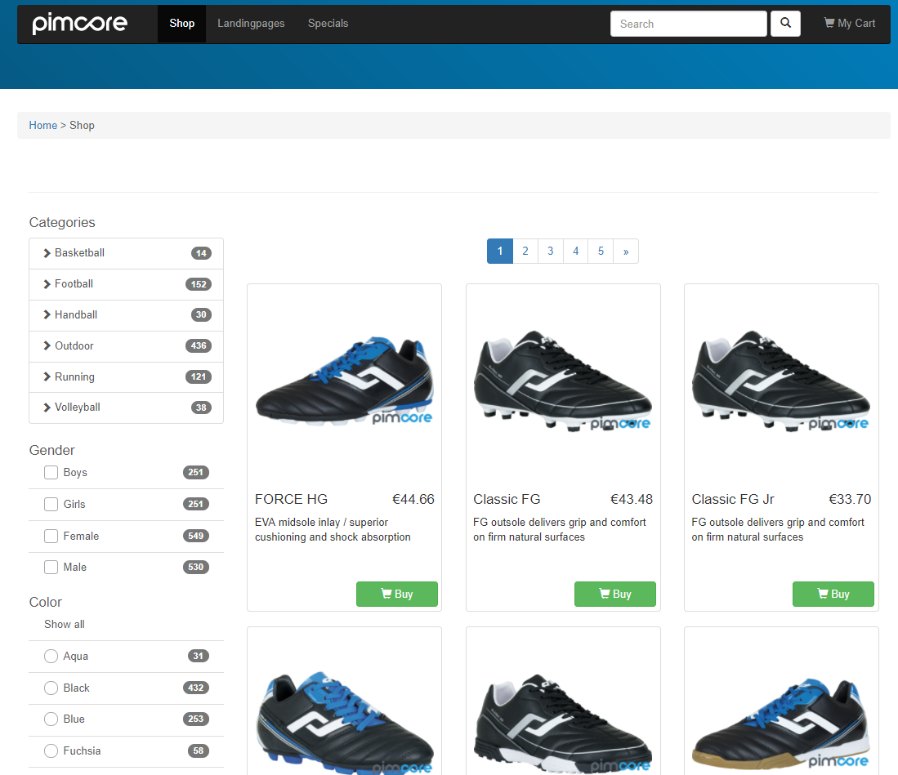

# Tracking with Enhanced Ecommerce

In ecommerce projects you typically want to track the shopping experience of your customers.
Pimcore supports standard ecommerce trackers, that can be leveraged to implement (product) 
event tracking in a standardized way.

As some tracking events occur very dynamically, they often require additional Javascript (JS).
So the final solution will be typically a mix of the standard ecommerce tracking 
implementation, and some project-specific JS customizations.

Subsequently you find a best-practice standard implementation for 
the [Google Enhanced Ecommerce](https://developers.google.com/analytics/devguides/collection/analyticsjs/enhanced-ecommerce) 
tracking, which you can use as a skeleton for you own implementations.

#### Google Enhanced ECommerce Tracking Implementation Example

##### Setup
 * Ensure that the Google Enhanced ECommerce Tracker is added to your ecommerce framwork configuration (yml). 
 * Download and install [ECommerce Funnel js](downloads/ecommerceFunnel.js).
 * Add [ECommerce Funnel js](downloads/ecommerceFunnel.js) on each page of your website.
 
 Example:
 
 ```
  $.loadScript('/static/js/seo/ecommerceFunnel.js').done(function (){
         ecommerceFunnel.init()
     });
 
 ``` 

##### Product Overview Page Implementation


In order to access the relevant tracking data, you need to (1) save the
attributes either directly in the code, or (2) in a kind of reusable repository in
your JS code.

Example (1):
Code of one grid item within the product overview page.
```
<div class="product-item">
    <a href="link-to-product-detail-page-p123" 
    class="js-ec-productclick js-ec-productimpression"
        data-ecproductid="47292"
        data-ecproductname="Toptrike Dreirad"
        data-ecproductbrand="DREAMBRAND"
        data-ecvariant="blue"
        data-ecprice="119.99"
        data-eccategory="Trekkingbikes"
    >
        <figure>
            
        </figure>    
        ...
    </a>
</div>
```

Together with the JS file, this codes triggers
* product impressions (support for pagination; based on the ```js-ec-productclick``` attribute).
* product clicks (based on the ```js-ec-productclick``` attribute). 
Note that when a product (impression) is clicked, a product click event must
be sent to the Google framework. The next page must not be loaded before.

##### Product Detail  Page
As the product detail page is called directly and not via AJAX, 
we do not need additional JS anymore. We can track the event directly
in PHP with the help of the TrackingManager:

```
$trackingManager = \OnlineShop\Framework\Factory::getInstance()->getTrackingManager();
$trackingManager->trackProductView($product);
```

###### Cart Items
Example: Adding an item to a cart via AJAX
```
$('body').on('submit', '.js-add-to-cart', function(e) {
            e.stopPropagation();
            e.preventDefault();
            $.ajax({
                type: "POST",
                url: $('.js-add-to-cart').attr('action'),
                data: $(this).serialize()
            }).done(function(response) {
                if (response.status == 'OK') {
                    $('.js-add-to-cart-error-box').html(response.msg);
                    funnel.ecommerceExecuteAjaxCode(response.trackingCode);
                } else {
                   alert('Error happened on js-add-to-cart!');
                }
            });
});
```
On the server-side in your PHP code:
```
 // 1) get cart
 // 2) add item to cart or increment item count ($qty)
 // 3) track enhanced Google action. 
       $trackingManager = \OnlineShop\Framework\Factory::getInstance()->getTrackingManager();
       $trackingManager->trackProductActionRemove($product,$qty);
       $respObj = [];
       $respObj['status'] = "OK";
       $respObj['trackingCode'] = Pimcore\Google\Analytics::getCode();
```

The code (PHP server-side) for removing items from the cart looks like this:
```
 // 1) get cart
 // 2) remove item quantity ($qty)
 // 3) track enhanced Google action. 
       $trackingManager = \OnlineShop\Framework\Factory::getInstance()->getTrackingManager();
       $trackingManager->trackProductActionAdd($product,$qty);
       $respObj = [];
       $respObj['status'] = "OK";
       $respObj['trackingCode'] = Pimcore\Google\Analytics::getCode();
```

###### Checkout
The pattern for the tracking of each step is the same and can be done server-side in PHP:
```
$trackingManager = \OnlineShop\Framework\Factory::getInstance()->getTrackingManager();
$trackingManager->trackCheckoutStep("payment-step", $cart, 1, ["param1" => "visa", "param2" => "known-customer", "param3" => "..."]);
```

After the order submission there is one more step required:
```
$trackingManager->trackCheckoutComplete($order);
```


##### Important Notes

In most cases it will be necessary to create your custom TrackingItemBuilder, where you can place additional 
mappings between your custom product object and the tracking item, such as brand, tax, variant information etc.!

You might also want to add additional events after each Ecommerce event if you combine your approach with the
Google data layer library.
