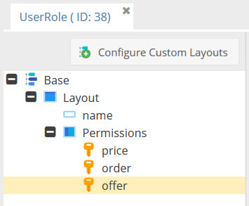

# Build Role & Rights System for Frontends

A common use case for Pimcore applications are portals with user logins and a complex permission structure like for
 example b2b portals. 
 
One way of archiving this is to leverage Symfony Security functionality with access control configuration
and ACLs as described [here](http://symfony.com/doc/current/security.html).
   
But, it might be handy to empower admin users to configure and maintain user permissions themselves. And therefore, 
Pimcore data objects are also a great choice.
Just create an user object and define permissions directly on it or via relations to other permission role objects 
 that are assigned to the user object. 
 
So how to integrate Pimcore objects, a roles & rights system and Symfony best practise to implement complex permission
  structures for Frontends based on Pimcore? 


**Solution**

##### Setup User Authentication with Symfony Security and Pimcore Objects 

See the [Pimcore docs](../19_Development_Tools_and_Details/10_Security_Authentication/01_Authenticate_Pimcore_Objects.md) 
for how to integrate Pimcore objects with Symfony Security in general. Here you see how to authenticate against a Pimcore
user object. 


##### Configure User Permissions with Pimcore Objects
Use the [Frontend Permission Toolkit](https://github.com/pimcore/frontend-permission-toolkit) for configuring permissions
directly within the user objects by using the new data type `permissionResource`.


A `permissionResource` represents one specific user right (e.g. login, show prices, order, etc.) and can have the 
values `allow`, `deny` and `inherit`.
- `allow`: User has this permission.
- `deny`: User doesn't have this permission.
- `inherit`: Permission is inherited from linked other permission objects (see next). 

In addition to configure `permissionResources` directly in the user object, it is possible to create additional object
classes (e.g. `UserRole`) and link object with the type `UserRole` to user objects. 

A `UserRole` might look look similar to the following example and contain `permissionResources` for itself. 


The userRole objects can have `permissionResources` with he name like these in the user object (in this case values are 
merged as described below), or can have additional `permissionRessources`.  

To link userRole objects to user objects, use the new data types `Permission Objects` or `Permission Href` instead of 
default relation data types. This allows the Frontend Permission Toolkit Service to recursively resolve the permissions
of a given user object. 

To complex permission structures can be set up with Pimcore objects. 


The Frontend Permission Toolkit Service provides two methods for working with permissions:
  - `Service::getPermissions`: 
     - Returns an array of all permissions for the given object (e.g. user object), automatically merges all 
       `permissionResources` of objects related to the given object with `Permission Objects` or `Permission Href`.
     - Merging: When permission is set to `allow` / `deny` directly in the object, this is used. Otherwise optimistic 
       merging is used, means once one permission is allowed, it stays that way. PermissionResources are matched by their 
       field name. 
  - `Service::isAllowed`: checks if given object (e.g. user object) is allowed for given the resource
  
   
##### Integrate User Permissions in your Frontend Implementation     

There are several ways how to integrate the configured user permissions into the Frontend: 

1) Use the Frontend Permission Toolkit Service in your application code to check if user is allowed for a certain resource: 
```php
    //get user object from Symfony
    $userObject = $this->get('security.token_storage')->getToken()->getUser();

    //get permission service from container
    $permissionService = \Pimcore::getContainer()->get("bundle.frontendpermissiontoolkit.service");
    
    if($permissionService->isAllowed($userObject, "order")) {
        //do some stuff, show some stuff, whatever ...
    }
       
```


2) Integrate `permissionResources` to Symfony Security as Roles: 
There are several ways to integrate the object `permissionResource` permissions into the Symfony Security system. 
One would be to implement a custom voter as described [here](http://symfony.com/doc/current/security/voters.html). 
The simplest (but maybe not prettiest) way would be to return all allowed `permissionResources` of an user object as roles
of this user. In this case you can access this information everywhere in the Synfony framework. For details see docs in the
[Frontend Permission Toolkit](https://github.com/pimcore/frontend-permission-toolkit#integration-with-symfony-security). 


3) Integrate `permissionResources` to documents and Pimcore navigation: 
For details see docs in the [Frontend Permission Toolkit](https://github.com/pimcore/frontend-permission-toolkit#integration-with-pimcore-navigation). 
