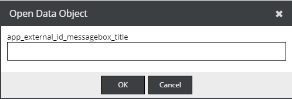

# Open By External Id

There are 2 different approaches:

1) You can either hook directly into the the default Pimcore id resolver by using [this](https://pimcore.com/docs/6.x/Development_Documentation/Extending_Pimcore/Event_API_and_Event_Manager.html#page_Hook-into-the-Open-Document-Asset-Data-Object-dialog) event

2) Or add an independent menu entry and a shortcut similar to the default Open Data Object (ctrl + shift + o) to the admin ui.





Create a bundle with a Pimcore Backend Interface java script extension as described 
[here](../../Development_Documentation/20_Extending_Pimcore/13_Bundle_Developers_Guide/06_Plugin_Backend_UI.md). 

```javascript

pimcore.plugin.sample = Class.create(pimcore.plugin.admin, {

    pimcoreReady: function (params, broker) {
        
        var shortcutKey = 'l';
        var endPoint = '/admin/find-by-external-id';


        var messageBoxTitle = t('app_external_id_messagebox_title');
        var messageBoxText = t('app_external_id_messagebox_errormessage');
        var menuTitle = t('app_external_id_menu_title');
        

        var openMessageBox = function() {
            Ext.MessageBox.prompt(t("open_data_object"), messageBoxTitle, function(btn, text){
                if(btn == 'ok'){
                    Ext.Ajax.request({
                        url: endPoint,
                        method: "post",
                        params: {
                            'external-id': text
                        },
                        success: function(response){
                            var res = Ext.decode(response.responseText);
                            if(res) {
                                pimcore.helpers.openElement(res, 'object');
                            } else{
                                pimcore.helpers.showNotification(t("error"), messageBoxText, "error");
                            }
                        }
                    });
                }
            })
        };

        var toolbar = pimcore.globalmanager.get("layout_toolbar");
        var fileMenu = toolbar.fileMenu;
        if(fileMenu) {
            fileMenu.insert(4, {
                text: menuTitle,
                iconCls: 'pimcore_icon_object pimcore_icon_overlay_go',
                cls: 'pimcore_main_menu',
                handler: openMessageBox
            });
        }

        new Ext.KeyMap(document, {
            key: shortcutKey,
            fn: openMessageBox,
            ctrl:true,
            alt:false,
            shift:true,
            stopEvent:true
        });
                
    }
});
```

Create a controller to find your DataObject

```php
namespace AppBundle\Controller\Admin;


use Symfony\Component\HttpFoundation\JsonResponse;
use Symfony\Component\HttpFoundation\Request;

class BackendController
{
    /**
     * @param Request $request
     * @Route("/admin/find-by-external-id")
     */
    public function findByWordpressId(Request $request) {
        if($id = (int)$request->get('external-id')) {
            if($object = MyObject::getByExternalId($id)) {
                return new JsonResponse($object->getId());
            }
        }

        return new JsonResponse(0);
    }
}

```