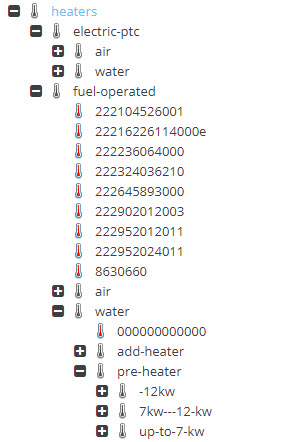

# Object Data Inheritance in Action

[Object Data Inheritance](../05_Objects/01_Object_Classes/05_Class_Settings/25_Inheritance.md) is a powerful feature to minimize the data maintenance effort for editors.

In our [e-commerce demo](https://github.com/pimcore/demo-ecommerce) we use data inheritance for fashion products with different colors and sizes - meaning
we have a generic article with all the generic information (like names, descriptions, material, gender assignment, specific
attributes etc.) and we have color and size variants that inherit all the data from it and overwrite just color and size.
    

This already massively reduces the data maintenance effort, since all the generic information needs to be entered and updated only once per generic article. 

**Reducing Maintenance Effort even more with Virtual Products**

In lots of domains, data maintenance effort can be reduced even more. Products from the same category, manufacturer, type or series, share a lot of common attributes - like assigned categories, assigned manufacturer, values for technical
attributes, maybe even images etc. 

To take advantage of data inheritance for these use cases too, we recommend the concept of virtual products. 
Virutal products are objects of the same type as products, with a special flag set. 

This flag is a normal object attribute and defines that these products are data containers only and are not considered 
in output channels like product listings and exports.
 
Using virtual products, complex product hierarchies can be constructed and data can be maintained in a single place for minimal data maintenance effort. 

With the [Custom Icons](../05_Objects/01_Object_Classes/05_Class_Settings/07_Custom_Icons.md) feature, 
icons can be modified for virtual products, like in this example grey icons for virtual products, colored icons for real
products.

With [Custom Layouts](../05_Objects/01_Object_Classes/05_Class_Settings/15_Custom_Layouts.md) and 
the tips of [Showing Custom Layouts based on Object Data](/04_Showing_Custom_Layouts_based_on_Object_Data.md) it is even  
possible to deliver a different object editor mask for virtual products with additional explanation texts and showing
only attributes that should be modified on the current level by the editor.
