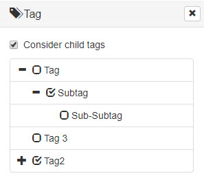

# Using Pimcore Tags for Filtering in Frontend

The [Pimcore Tags](../18_Tools_and_Features/09_Tags.md) functionality is primarily designed
 as Pimcore Backend UI functionality for tagging and filtering elements. Nevertheless sometimes it can be quite useful to implement custom frontend filtering functionality based on the Pimcore
 Tags. 
 
 
 
 

 
Following code snippets should give you a head start to do so: 
 

#### Preparing Data for Template
Preparation of data for your template strongly depends on our template and how you want to visualize the tag hierarchy. 
 
For example you can build a tag tree based on [bootstrap treeview](https://github.com/jonmiles/bootstrap-treeview/). 


 
 
To do so you can use something similar to following snippets: 
 
```php
<?php 

//prepare data for template in your controller 
$tagList = new \Pimcore\Model\Element\Tag\Listing();

//select parent node for tags or use all root tags.
if ($this->getParam("node")) {
    $tagList->setCondition("parentId = ?", intval($request->get("node")));
} else {
    $tagList->setCondition("ISNULL(parentId) OR parentId = 0");
}
$tagList->setOrderKey("name");
$tags = [];
foreach ($tagList->load() as $tag) {
    $tags[] = $this->convertTagToArray($tag, $request->get('tags-filter'));
}
$this->view->tagTree = $tags; 
```

```php
<?php 
/**
*  Function to convert tags to an array that is expected by bootstrap tree view
*/
protected function convertTagToArray(\Pimcore\Model\Element\Tag $tag, $assignedTagIds)
{
    $tagArray = [
        "id" => $tag->getId(),
        "text" => $tag->getName()
    ];
    $state = [];
    $state["checked"] = array_search($tag->getId(), $assignedTagIds) !== false;
    $tagArray["state"] = $state;
    $children = $tag->getChildren();
    foreach ($children as $child) {
        $childrenNodes = $this->convertTagToArray($child, $assignedTagIds);
        if($this->hasCheckedNodes($childrenNodes)) {
            $tagArray["state"]["expanded"] = true;
        }
        $tagArray['nodes'][] = $childrenNodes;
    }
    return $tagArray;
}

protected function hasCheckedNodes($nodesArray) {
    $it = new \RecursiveIteratorIterator(
        new \ParentIterator(new \RecursiveArrayIterator($nodesArray)),
        \RecursiveIteratorIterator::SELF_FIRST
    );
    foreach ($it as $key => $value) {
        if ($key == 'state' && $value['checked']) {
            return true;
        }
    }
    return false;
}

```


```javascript
// template script to set up bootstrap treeview 

$tree = $('#filter-tag-tree');
$tree.treeview({data: <?=json_encode($this->tagTree)?>, showCheckbox: true, levels: 1});

```


#### Filtering Elements based on Tags
     
For filtering elements based on tags some advanced queries on the element listing are necessary. Have a look at the following example
for filtering and asset listing. Listings for other elements work the same way. 

Important to know: 
- Tags and their hierarchy are stored in the table `tags`.
- The table `tags` also has the column `idPath` which is useful for filtering for tags including their child tags.
- Tag assignment to elements is stored in the table `tags_assignment`.


```php
<?php
    public function filterForTags(Asset\Listing $listing, Request $request)
    {
        // get tags IDs to filter for - e.g. from request param
        $values = $request->get('tags-filter');
        $values = is_array($values) ? $values : explode(',', $values);

        if($values)
        {
            $conditionParts = [];
            foreach ($values as $tagId) {

                //decide if child tags should be considered or not
                if ($request->get("considerChildTags") == "true") {
                    $tag = \Pimcore\Model\Element\Tag::getById($tagId);
                    if ($tag) {
                        //get ID path of tag or filtering the child tags
                        $tagPath = $tag->getFullIdPath();
                        
                        $conditionParts[] = "id IN (
                            SELECT cId FROM tags_assignment INNER JOIN tags ON tags.id = tags_assignment.tagid 
                            WHERE 
                                ctype = 'asset' AND 
                                (id = " . intval($tagId) . " OR idPath LIKE " . $listing->quote(Db::get()->escapeLike($tagPath) . "%") . ")
                        )";
                    }
                } else {
                    $conditionParts[] = "id IN (
                        SELECT cId FROM tags_assignment WHERE ctype = 'asset' AND tagid = " . intval($tagId) . 
                    ")";
                }
            }


            if (count($conditionParts) > 0) {
                $condition = implode(" AND ", $conditionParts);
                $listing->addConditionParam($condition);
            }
        }
        return $listing; 
    }

```
