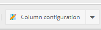
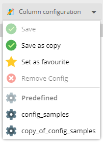
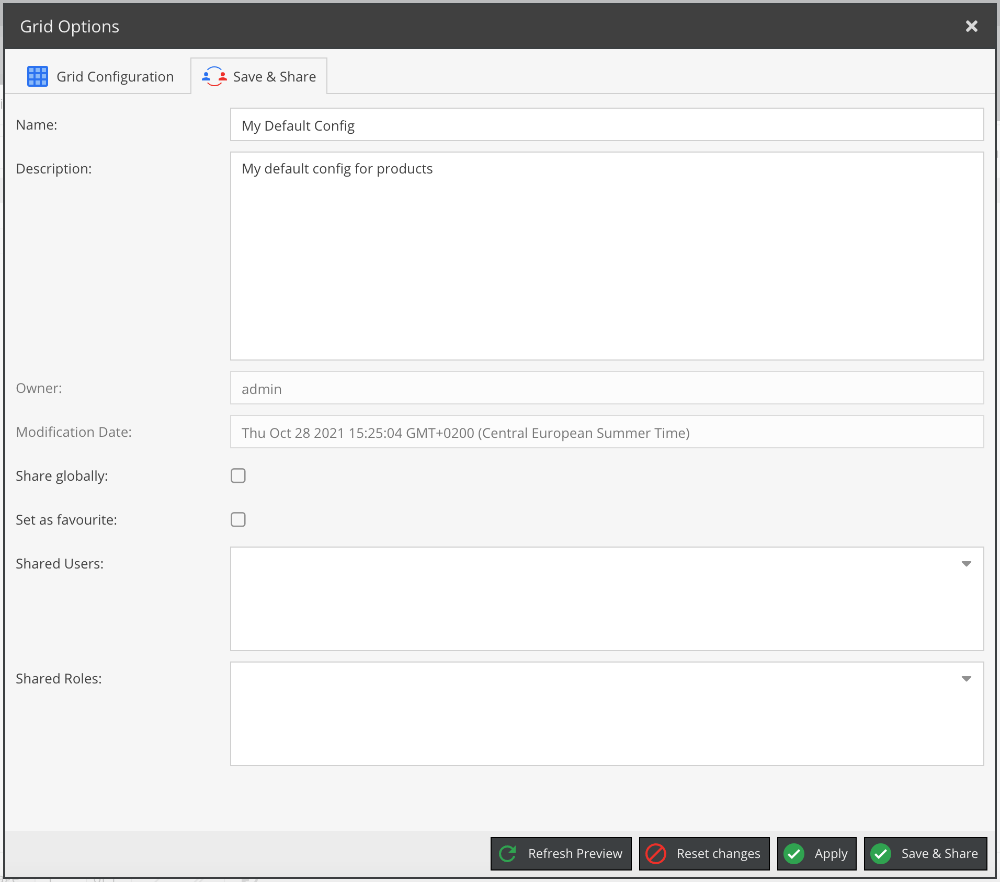
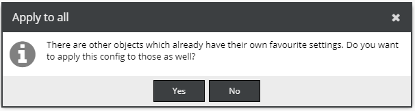

# Grid Configuration

You can use the object grid configurator button to adapt the grid to your needs,
i.e. add additional columns, change the column order or column width.

For experienced users there is an option to assemble custom columns using special operators as described in detail in 
* [Grid Configuration Operators](./02_Grid_Configuration_Operators.md)

## Saving & Sharing

You can define a favourite config for each object folder and share it with your friends.

Note that the shared config will always be owned by you. If you delete it then it will be also gone for all
users you shared it with. If you are not the owner of a view you want to share you have to copy it first.

Sharing can be accomplished via the `Save & Share' tab in the configurator window.

## Favourites

You can define a preferred config on folder level. If there is another object with a different setting you will have the option
to apply the setting to all folders or just leave it as it is.

