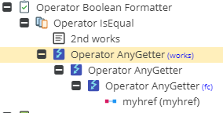
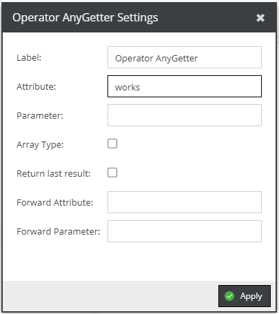

# AnyGetter

The AnyGetter aims to allow to get virtually everyting.

Let us assume that you want to first get the related href (in this case an object). 

After that, you want to grab the field collection (fc), get the second item (not shown) and display the `works' field.

Please be aware that for fieldcollections there is a special operator which does exactly something like that!

