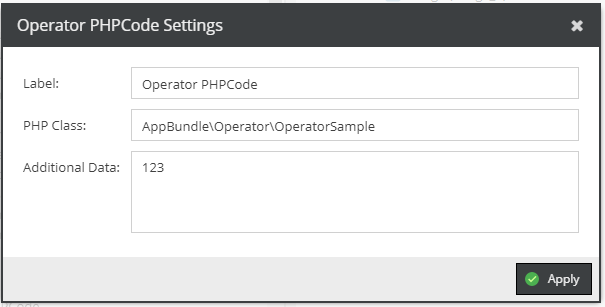

# PHP Code


Allows you to provide a custom getter implementation.



Sample implementation.
```php
<?php

namespace AppBundle\Operator;

use Pimcore\Model\DataObject\GridColumnConfig\Operator\AbstractOperator;
use Pimcore\Model\DataObject\GridColumnConfig\ResultContainer;

class OperatorSample extends AbstractOperator
{
    public function __construct($config, $context = null)
    {
        parent::__construct($config, $context);
        $this->additionalData = $config->additionalData;
    }

    public function getLabeledValue($element)
    {
        $childs = $this->getChilds();

        $result = new ResultContainer();
        $result->setValue($element->getId() . " huhu " .  count($childs) . " " . $this->additionalData);
        return $result;
    }
}
```


