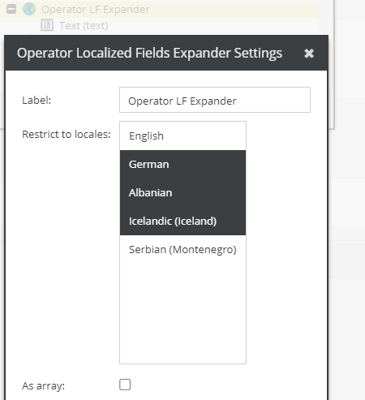

# LFExpander

Not directly meant for the grid view. Will create a separate column for each of the selected locales in the CSV Export.

Sample Config: 
    

The option "as array" collects all localized values and returns the result as array whereas without this option it will simply return the child value for the current locale if used in the grid view context.

