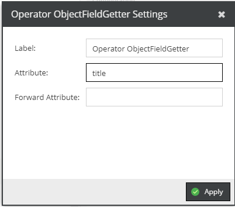

# ObjectField Getter

 
 
Get a specific field of an object.

If nested, you can replace the child operator's element (which originally is the object) by the result of the `forward attributes` getter.
 
 
 

 
 
 

