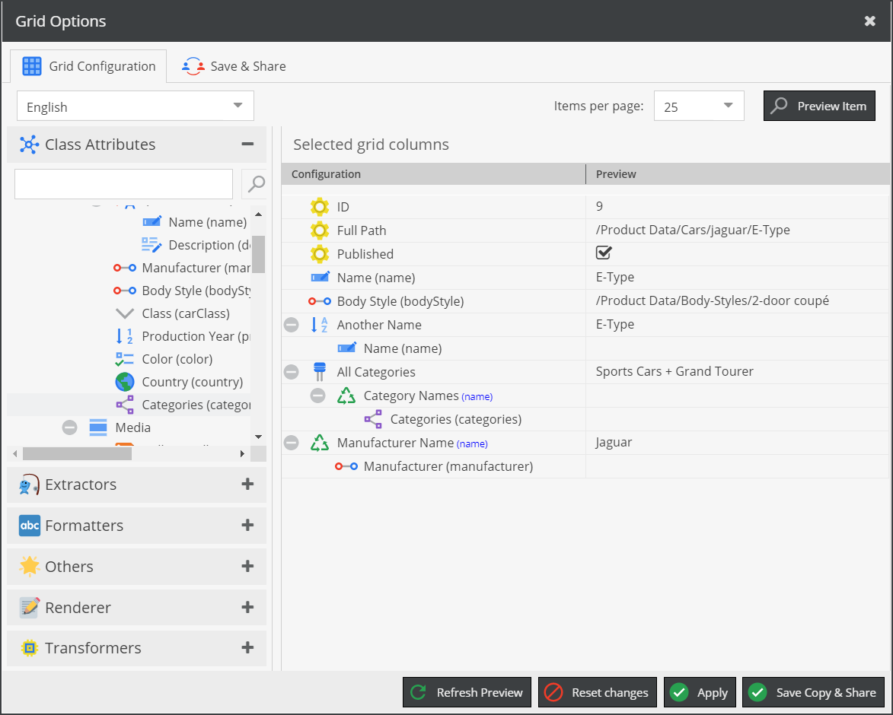
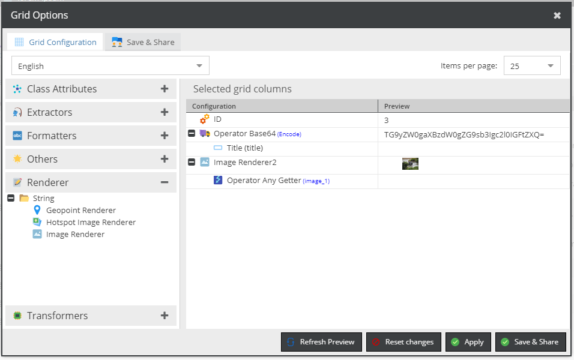
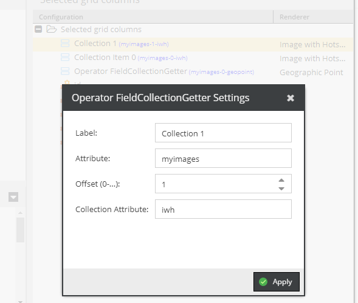

# Grid Column Configuration Operators (Experimental)

> This is an experimental feature and subject to change without notice.

Grid Configuration Operators allow you to add special columns to your grid which first are somehow assembled or converted using operators listed below.

Please note that the portfolio of available operators (and how they work in detail) may change until release 5.1.0).

## Grid renderer

By default the string representation of the result value is displayed. 

This can be changed by defining an alternative renderer. In the following example, the image of the second collection item would be rendered as Hotspotimage.

## Operator Overview

* [Anonymizer](./Operators/Anonymizer.md) 
* [AnyGetter](./Operators/AnyGetter.md)
* [Arithmetic](./Operators/Arithmethic.md)
* [AssetMetadata](./Operators/AssetMetadataGetter.md)
* [Base64](./Operators/Base64.md)
* [Boolean](./Operators/Boolean.md)
* [Boolean Formatter](./Operators/BooleanFormatter.md)
* [CaseConverter](./Operators/CaseConverter.md)
* [CharCounter](./Operators/CharCounter.md)
* [Concatenator](./Operators/Concatenator.md)
* [ElementCounter](./Operators/ElementCounter.md)
* [FieldCollectionGetter](./Operators/FieldCollectionGetter.md)
* [IsEqual](./Operators/IsEqual.md)
* [JSON Encode/Decode](./Operators/JSON.md)
* [LFExpander](./Operators/LFExpander.md)
* [LocaleSwitcher](./Operators/LocaleSwitcher.md)
* [Merge](./Operators/Merge.md)
* [PHP Serialize/Unserialize](./Operators/PHP.md)
* [PHPCode](./Operators/PHPCode.md)
* [RequiredBy](./Operators/RequiredBy.md)
* [StringContains](./Operators/StringContains.md)
* [StringReplace](./Operators/StringReplace.md)
* [Substring](./Operators/Substring.md)
* [Text](./Operators/Text.md)
* [TranslateValue](./Operators/TranslateValue.md)
* [Trimmer](./Operators/Trimmer.md)

  
