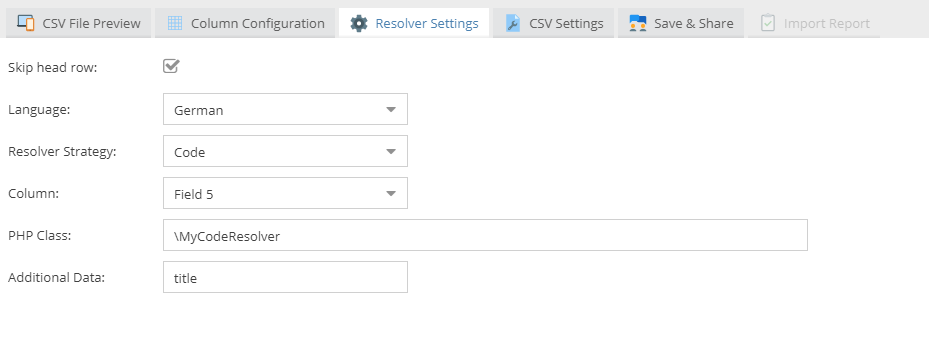

# Code Resolver

Resolves the objects via your custom piece of code.



Sample implementation:

```php
<?php

use Pimcore\DataObject\Import\Resolver\AbstractResolver;

class MyCodeResolver extends AbstractResolver
{
    /**
     * Id constructor.
     */
    public function __construct($config)
    {
        parent::__construct($config);
        $this->params = $config->resolverSettings->params;
    }

    /**
     * @param $parentId
     * @param $rowData
     *
     * @return static
     *
     * @throws \Exception
     */
    public function resolve($parentId, $rowData)
    {
        $idColumn = $this->getIdColumn();
        $cellData = $rowData[$idColumn];

        $list = new Pimcore\Model\DataObject\News\Listing();
        $list->setCondition("title = " . $list->quote($cellData));
        $list->setLimit(1);
        $list = $list->load();
        if ($list) {
            $object = $list[0];
            return $object;
        }
        return null;
    }

}
```
