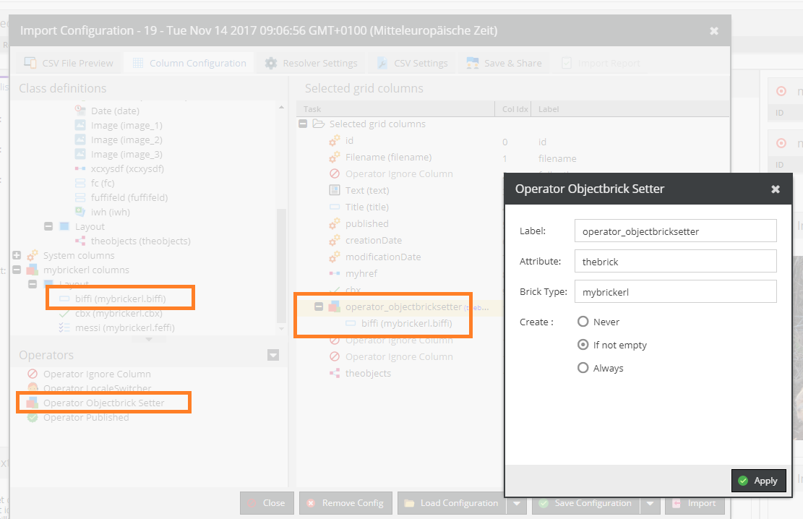

# Operator Brick Setter

Allows to set a brick field and create the brick itself if needed.

Note: you can directly drag and drop a brick field from the class definition tree.

* `Attribute`: the object attribute
* `Brick Type`: the brick type

Mode:
* `Never`: Never create the brick. If there CSV data for that brick an error will occur.
* `If not empty`: Create brick if CSV data is not empty
* `Always`: Always create the brick

