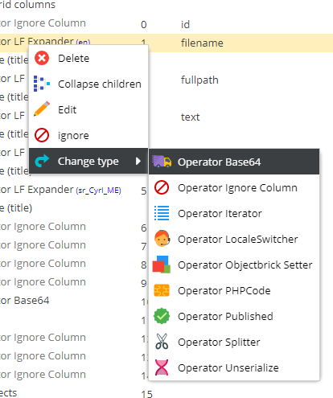
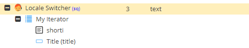

# Operator Overview

## General

Change the type by either dropping a operator on a `Ignore` node or via the node's context menu.

## Basic Settings

- `Mode`: `Default` means that the CSV data goes throw the data type's CSV processor. `Direct` sets the CSV data directly. This can be useful if the data has been processed or manipulated by another import operator already.
- `Do not overwrite`: Do not overwrite existing object data.
- `Skip empty values`: Skip empty CSV values. 

Operators can then be used to change the way how the data is processed.

## Simple example

## Overview 

* [Operator Ignore](./01_Ignore.md)
* [Operator Published](./02_Published.md)
* [Operator Locale Switcher](./03_LocaleSwitcher.md)
* [Operator Objectbrick Setter](./04_BrickSetter.md)
* [Operator PHPCode](./05_PHPCode.md)
* [Operator Iterator](./06_Iterator.md)
* [Operator Splitter](./07_Splitter.md)
* [Operator Unserialize](./08_Unserialize.md)
* [Operator Base64](./09_Base64.md)
* ...

