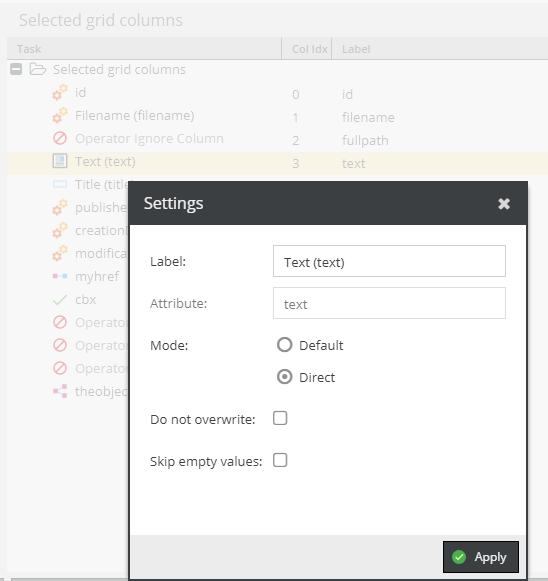

# Operator Overview

There a few basic settings:

- `Mode`: `Default` means that the CSV data goes throw the data type's CSV processor. `Direct` sets the CSV data directly. This can be useful if the data has been processed or manipulated by another import operator already.
- `Do not overwrite`: Do not overwrite existing object data.
- `Skip empty values`: Skip empty CSV values. 

Operators can then be used to change the way how the data is processed.

## Simple example

TBD

## Overview 

* [Operator Ignore](./01_Ignore.md)
* [Operator Published](./02_Publish.md)
* [Operator Published](./03_LocaleSwitcher.md)
* ...

